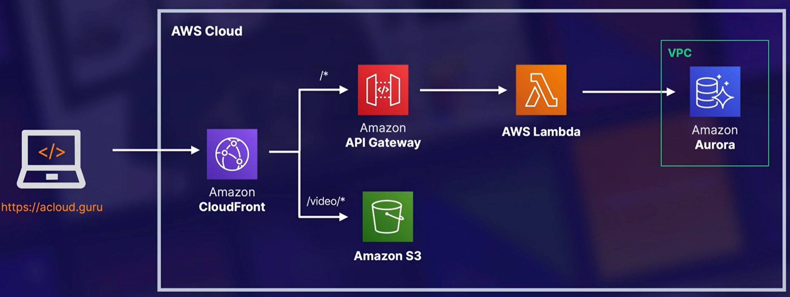
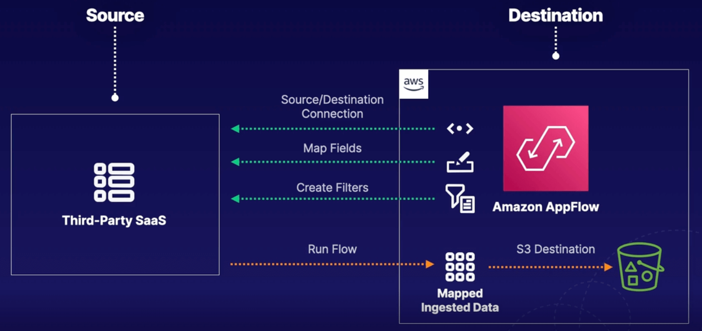

# Chapter 13. Decoupling Workflows

<!-- TOC -->

- [Chapter 13. Decoupling Workflows](#chapter-13-decoupling-workflows)
  - [Decoupling Workflows Overview](#decoupling-workflows-overview)
    - [Tight vs Loose Coupling](#tight-vs-loose-coupling)
  - [Poll-Based Messaging with SQS](#poll-based-messaging-with-sqs)
    - [SQS Settings](#sqs-settings)
  - [Sidelining Messages with Dead-Letter Queues](#sidelining-messages-with-dead-letter-queues)
    - [Dead-Letter Queues](#dead-letter-queues)
    - [Exam Tips](#exam-tips)
  - [Ordered Messages with SQS FIFO](#ordered-messages-with-sqs-fifo)
    - [Standard Order vs FIFO Order](#standard-order-vs-fifo-order)
  - [Push-Based Messaging with SNS Topics](#push-based-messaging-with-sns-topics)
    - [SNS Settings](#sns-settings)
  - [Fronting Applications with API Gateway](#fronting-applications-with-api-gateway)
    - [API Gateway Features](#api-gateway-features)
  - [Executing Batch Workloads Using AWS Batch](#executing-batch-workloads-using-aws-batch)
    - [AWS Batch Components](#aws-batch-components)
    - [Fargate or EC2 Compute Environments](#fargate-or-ec2-compute-environments)
    - [AWS Lambda vs Batch](#aws-lambda-vs-batch)
    - [Managed and Unmanaged Compute Environments](#managed-and-unmanaged-compute-environments)
  - [Brokering Messages with Amazon MQ](#brokering-messages-with-amazon-mq)
    - [SNS with SQS vs MQ](#sns-with-sqs-vs-mq)
    - [Configuring Brokers](#configuring-brokers)
  - [Coordinating Distributed Apps with AWS Step Functions](#coordinating-distributed-apps-with-aws-step-functions)
    - [Step Function Workflows](#step-function-workflows)
    - [States and State Machines](#states-and-state-machines)
    - [State Types](#state-types)
  - [Ingesting Data from SaaS Applications to AWS with Amazon AppFlow](#ingesting-data-from-saas-applications-to-aws-with-amazon-appflow)
    - [AppFlow Terms and Concepts](#appflow-terms-and-concepts)
    - [AppFlow Use Cases](#appflow-use-cases)
    - [Exam Tips](#exam-tips)

<!-- /TOC -->

---
## Decoupling Workflows Overview

### Tight vs Loose Coupling

Tight coupling means that one instance (FE) talks directly to another instance (BE), while loose coupling means that the FE talks indirectly to the BE via ELB.

However, an ELB requires the BE instances to be active and online all the time. Alternative AWS services can be used to replace the ELB, when our BE instances are not active at all times.

* Simple Queue Service (SQS)

* Simple Notification Service (SNS)

* API Gateway

---
## Poll-Based Messaging with SQS

SQS is a messaging queue that **allows asynchronous processing of work**, where one resource will write a message to an SQS queue, and then another resource will retrieve that message from SQS.

### SQS Settings

* Delivery Delay - Default is zero, but can be set up to 15 minutes.

* Message Size - **Can send up to 256 KB of text** in any format.

* FIFO or Standard Order - Default is Standard without ordering.

* Encryption - Default is enabled to be encrypted in transit by default, while at rest encrpytion requires a KMS key.

* Access Policy - A resource policy can be added to a queue, similar to S3.

* Message Retention - Default is 4 days, but can be set up to 14 days.

* Polling Type - [**Long**|**Short**] Long polling isn't the default, but it should be, which means a long waiting time before polling the SQS queue for messages.

* Queue Depth - This can be a trigger for autoscaling.

* Visibility Timeout - Ensure proper handling of messages by the receiver, where a message remains in the queue while SQS waits for a response from the first receiver by locking it for 30 seconds, but no other receivers can view it. If there is no response after the visibility timeout has expired, the message is unlocked, otherwise it is removed from the queue.

* Dead-letter Queue - Enable this if you want undeliverable messages to be sent to a custom SQS queue.

---
## Sidelining Messages with Dead-Letter Queues

Consider an edge scenario, where a message in the SQS queue has an invalid format, which wasn't validated by the frontend instance that sent it. A backend instance would poll for that message, and visibility timeout would lock it for 30 seconds, however there isn't any response from the backend as it failed to process the message.

Hence, after the visibility timeout had expired, the message would be unlocked and another backend instance would poll for that message, and a new visibility timeout would lock it for 30 seconds. This cycle would repeat itself for as long as the message retention period (up to a maximum of 14 days), where the message will be deleted forever.

### Dead-Letter Queues

A dead-letter queue is used to sidelined any invalid messages from the main SQS queue. The benefit is that the main queue is not blocked by any invalid messages, and this will allow subsequent valid messages to be processed by the backend.

In order to enable dead-letter queue:
1. You have to create a main queue and a secondary (dead-letter) queue.
2. In the main queue settings, enable the Dead-Letter Queue option, and select your secondary queue.
3. Under Dead-Letter queue, for **Maximum receives**, set a value between 1 and 1000.
  - This is the number of times the main queue will set the visibility timeout for a message, before sidelining it to the dead-letter queue.

### Exam Tips

* It is important to **set up a CloudWatch alarm to monitor queue depth**.

* You can set up SQS dead-letter queues for both SQS queues and SNS topics.

---
## Ordered Messages with SQS FIFO

### Standard Order vs FIFO Order

|               Standard               |                     FIFO                      |
|:------------------------------------:|:---------------------------------------------:|
|        At-least once delivery        |          First-in-first-out delivery          |
|         Best-effort ordering         |              Guaranteed ordering              |
|         Possible duplicates          |                 No duplicates                 |
| Near unlimited transactions per sec  |             300 messages per sec              |
| No message group or deduplication ID | Requires a message group and deduplication ID |
|              Lower cost              |                  Higher cost                  |

---
## Push-Based Messaging with SNS Topics

SNS is a push-based messaging that **proactively broadcast messages to multiple endpoints subscribed to it**, which can be used to alert a system or a person.

### SNS Settings

* Subscribers - message endpoints, e.g. Kinesis Data Firehose, email, Lambda, SQS etc.
  - Only SQS can use FIFO order.
  - Email requires an opt in from each recipient.
  - There is no retry for a failed message delivery, except for HTTP(S).

* Message Size - **Can send up to 256 KB of text** in any format.

* FIFO or Standard Order - FIFO only supports SQS as a subscriber.

* Encryption - Default is enabled to be encrypted in transit by default, while at rest encrpytion requires a KMS key.

* Access Policy - A resource policy can be added to a topic, similar to S3.

* Dead-letter Queue - Enable this if you want undeliverable messages to be sent to a custom SQS queue.

---
## Fronting Applications with API Gateway

AWS API Gateway is a fully managed service that **allows you to easily publish, create, maintain, monitor and secure your API**.

### API Gateway Features

* Security - Allows you to easily **protect your application endpoints by attaching a WAF**, where you can perform:
  - Rate-limiting
  - Blocking specific countries
  - Filtering malicious behavior
  - Implement DDoS protection

* Versioning - Supports versioning, using stages, of your API.

* Ease of use - Easily build out the calls that will trigger other AWS services in your account.

---
## Executing Batch Workloads Using AWS Batch

AWS Batch:

* **Runs any batch computing workloads** (on EC2 or ECS/Fargate).

* **Removes any heavy lifting for configuration and management of infrastructure** for computing.

* **Automatically provisions accurately sized compute resources** based on number of jobs submitted, and optimizes the distribution of workloads.

* **Skips any installaation and maintenance of batch computing software**, so you can focus on obtaining and analyzing the results.

### AWS Batch Components

There are four main components:

* **Jobs** - Units of work, e.g. shell scripts, executables, Docker images etc., that are submitted to AWS Batch.

* **Job Definitions** - Specify how your jobs are to be run, essentially the blueprint for the resources in the job.

* **Job Queues** - Jobs get submitted to specific queues and reside there until scheduled to run in a compute environment.

* **Compute Environment** - Set of managed or unmanaged compute resources used to run your jobs.

### Fargate or EC2 Compute Environments

**Fargate** is the recommended way of launching most AWS Batch jobs. However, sometimes EC2 may be the best choice.

|         Fargate         |           EC2           |
|:-----------------------:|:-----------------------:|
|      Standard AMI       |  Custom AMI (only EC2)  |
| Less compute intensive  |   Compute > 16 vCPUs    |
| Less memory consumption |    Memory > 120 GiB     |
| Slower jobs deploy rate | Higher jobs deploy rate |
| Non-GPU or Graviton CPU |   GPU or Graviton CPU   |
|   Non-linuxParameters   |  linuxParameters usage  |

### AWS Lambda vs Batch

|        Lambda         |                Batch                |
|:---------------------:|:-----------------------------------:|
| Time limit <= 15 mins |       No execution time limit       |
|  Limited disk space   |         No disk space limit         |
|   Limited runtimes    | No runtimes limit as it uses Docker |

### Managed and Unmanaged Compute Environments

|             Managed Compute             |          Unmanaged Compute           |
|:---------------------------------------:|:------------------------------------:|
| AWS manages capacity and instance types |      User manage own resources       |
|       User-defined compute specs        |     AMI must meet ECS AMI specs      |
|     EC2 instances uses VPC subnets      | Good choice for complex environments |
| Default is the latest AMI or custom AMI |    Prefer managed over unmanaged     |
|    Leverage Fargate, Spot instances     |                                      |

---
## Brokering Messages with Amazon MQ

Amazon MQ is a message broker service **allowing easier migration of existing applications to the AWS Cloud**.

* Variety - leverages multiple programming languages, OS, and messaging protocols.

* Engine Types - supports both Apache ActiveMQ and Rabbit MQ.

* Managed Service - leverage existing applications without managing and maintaining your own system.

### SNS with SQS vs MQ

|          SNS with SQS           |                 AWS MQ                 |
|:-------------------------------:|:--------------------------------------:|
| When creating new applications  |  When migrating existing applications  |
|     Simpler to use, with HA     |      More configuration required       |
| Publicly accessible without VPC | Requires a private networking, ie. VPC |
|    Offers topics and queues     |        Offers topics and queues        |
| Integrations with AWS resources |          No AWS integrations           |

### Configuring Brokers

* Single-instance Broker - One MQ broker lives within one AZ, used for dev environments. RabbitMQ has a NLB in front.

* Highly Available - MQ offers HA architectures to minimize downtime.

* MQ for ActiveMQ - One instance remain active, with standby deployments.

* MQ for RabbitMQ - Cluster deployments of three broker nodes across multiple AZs, sitting behind a NLB.

---
## Coordinating Distributed Apps with AWS Step Functions

**AWS Step Functions** is a serverless orchestration service which allows you to combine AWS Lambda service with other AWS services to build business logic.

* Graphical Console - easier application workflow views.

* Components - main components are state machines and tasks.

* State Machine - a particular workflow with different event-driven steps.

* Task - specific states within a workflow (state machine) representing a single unit of work.

* States - Every single step within a workflow is considered a state.

* Executions - instances where you run your workflows in order to perform your tasks.

* Integrations - many AWS services integration available, e.g. Lambda, Batch, SNS etc.

### Step Function Workflows

There are two different types of workflows:

|                           Standard                            |                           Express                            |
|:-------------------------------------------------------------:|:------------------------------------------------------------:|
|                    Exactly-once execution                     |               At-least-once workflow execution               |
|                      Runs up to one year                      |                     Runs up to 5 minutes                     |
| Useful for long-running workflows that need auditable history |             Useful for high-event-rate workflows             |
|            Rates up to 2,000 executions per second            |                                                              |
|             Pricing based on per state transition             | Pricing based on number of executions, durations, and memory |

### States and State Machines

* Flexible - Leverage states to either make decisions based on input, perform certain actions, or pass output.

* Language - States and workflows are defined in Amazon States Language, similar to JSON format.

* States - States are elements within your state machines. They are referred to by a user-defined name, e.g. each step in an order workflow is considered a state.

### State Types

* Pass - passes any input directly to its output, no work done.

* Task - Single unit of work performed, e.g. Lambda, Batch and SNS.

* Choice - Adds branching logic to state machines.

* Wait - Creates a specified time delay within the state machine.

* Succeed - Stops execution successfully.

* Fail - Stops execution and marks them as failed.

* Parallel - Runs parallel branches of executions within state machines.

* Map - Runs a set of steps based on elements of an input array.

---
## Ingesting Data from SaaS Applications to AWS with Amazon AppFlow

* Managed Service - fully managed integration service for exchanging data between SaaS apps and AWS services.

* Ingest Data - pulls data records from third-party SaaS vendors and stores them in Amazon S3.

* Bi-Directional - two-way data transfers with limited combinations.

### AppFlow Terms and Concepts

* Flow - flows transfer data between sources and destinations, a variety of SaaS applications are supported.

* Data Mapping - how your source data is mapped to your destination data.

* Filters - criteria to control which data is transferred.

* Trigger - how the flow is started, i.e. on-demand, on-event, on-schedule.

### AppFlow Use Cases

* Transferring Salesforce records to Amazon Redshift.

* Ingesting and analyzing Slack conversations in S3.

* Migrating Zendesk and other help desk support tickets to Snowflake.

* Transferring aggregate data on a scheduled basis to S3 (up to 100 GB per flow).

* Solutions needing managed and fast transfer of SaaS or third-party vendor data into AWS services.