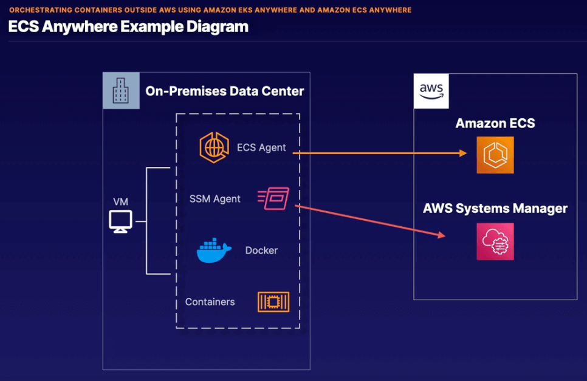

# Chapter 15. Serverless Architecture

<!-- TOC -->

- [Chapter 15. Serverless Architecture](#chapter-15-serverless-architecture)
  - [Serverless Overview](#serverless-overview)
    - [Benefits](#benefits)
    - [Exam Tips](#exam-tips)
  - [Computing with Lambda](#computing-with-lambda)
    - [Building a Function](#building-a-function)
    - [Exam Tips](#exam-tips)
  - [AWS Serverless Application Repository](#aws-serverless-application-repository)
    - [Publish and Deploy](#publish-and-deploy)
  - [Container Overview](#container-overview)
    - [Container Terminology](#container-terminology)
    - [Exam Tips](#exam-tips)
  - [Running Containers in ECS or EKS](#running-containers-in-ecs-or-eks)
    - [Why Elastic Container Service ECS?](#why-elastic-container-service-ecs)
    - [Using Kubernetes K8s](#using-kubernetes-k8s)
    - [ECS vs EKS](#ecs-vs-eks)
    - [Exam Tips](#exam-tips)
  - [Removing Servers with Fargate](#removing-servers-with-fargate)
    - [What is Fargate?](#what-is-fargate)
    - [EC2 vs Fargate as the underlying resource for AWS ECS or AWS EKS](#ec2-vs-fargate-as-the-underlying-resource-for-aws-ecs-or-aws-eks)
    - [Exam Tips](#exam-tips)
  - [Amazon EventBridge CloudWatch Events](#amazon-eventbridge-cloudwatch-events)
    - [Creating a Rule](#creating-a-rule)
    - [Exam Tips](#exam-tips)
  - [Storing Custom Docker Images in Amazon Elastic Container Registry ECR](#storing-custom-docker-images-in-amazon-elastic-container-registry-ecr)
    - [ECR Components](#ecr-components)
    - [ECR Features](#ecr-features)
      - [Lifecycle Policies](#lifecycle-policies)
      - [Image Scanning](#image-scanning)
      - [Sharing](#sharing)
      - [Cache Rules](#cache-rules)
      - [Tag Mutability](#tag-mutability)
    - [ECR Integration](#ecr-integration)
    - [Exam Tips](#exam-tips)
  - [Using Open-Source Kubernetes in Amazon EKS Distro EKS-D](#using-open-source-kubernetes-in-amazon-eks-distro-eks-d)
    - [Exam Tips](#exam-tips)
  - [Orchestrating Containers Outside AWS Using Amazon EKS Anywhere and Amazon ECS Anywhere](#orchestrating-containers-outside-aws-using-amazon-eks-anywhere-and-amazon-ecs-anywhere)
    - [EKS Anywhere Concepts](#eks-anywhere-concepts)
    - [ECS Anywhere Concepts](#ecs-anywhere-concepts)
    - [ECS Anywhere Requirments](#ecs-anywhere-requirments)
    - [Exam Tips](#exam-tips)
  - [Auto Scaling Databases On Demand with Amazon Aurora Serverless](#auto-scaling-databases-on-demand-with-amazon-aurora-serverless)
    - [Aurora Serverless Overview](#aurora-serverless-overview)
    - [Aurora Serverless Concepts](#aurora-serverless-concepts)
    - [Popular Use Cases](#popular-use-cases)
  - [Using AWS X-Ray for Application Insights](#using-aws-x-ray-for-application-insights)
    - [AWS X-Ray Overview](#aws-x-ray-overview)
    - [AWS X-Ray Concepts](#aws-x-ray-concepts)
    - [AWS X-Ray Daemon](#aws-x-ray-daemon)
    - [AWS X-Ray Integrations](#aws-x-ray-integrations)
    - [Exam Tips](#exam-tips)
  - [Deploying GraphQL Interfaces in AWS AppSync](#deploying-graphql-interfaces-in-aws-appsync)
    - [Exam Tips](#exam-tips)
  - [Lab 15.1. Triggering AWS Lambda from Amazon SQS](#lab-151-triggering-aws-lambda-from-amazon-sqs)
    - [Introduction](#introduction)
    - [Runbooks](#runbooks)
      - [Create the Lambda function in AWS console](#create-the-lambda-function-in-aws-console)
      - [Create the SQS trigger in your Lambda function](#create-the-sqs-trigger-in-your-lambda-function)
      - [Copy and paste the code into your lambda_function.py and deploy the Lambda.](#copy-and-paste-the-code-into-your-lambda_functionpy-and-deploy-the-lambda)
      - [Test the Lambda function from an EC2 instance.](#test-the-lambda-function-from-an-ec2-instance)
      - [Check that your DynamoDB table has been populated.](#check-that-your-dynamodb-table-has-been-populated)

<!-- /TOC -->

---
## Serverless Overview

### Benefits

* *Ease of use* - AWS handles almost everything for us outside of our code.

* *Event based* - Serverless compute resources can be brought online in response to an event happening.

* *Billing model* - PAYG as you pay for your provisioned resources and the length of runtime.

### Exam Tips

* It is almost always better to select an answer on the text that uses Lambda or containers rather than a traditional operating system.

---
## Computing with Lambda

**Lambda** is a serverless compute service that lets you run code without provisioning or managing the underlying servers.

### Building a Function

* *Runtime* - you'll need to pick from an available runtime or bring your own. This is the environment your code will run in.

* *Permissions* - if your function needs to make an AWS API call, you'll need to attach a role.

* *Networking* - you can optionally define the VPC, subnet, and security groups your functions are a part of.

* *Resources* - you define the amount of available memory etc.

* *Trigger* - you define a trigger that will kick Lambda off if that event occurs.

### Exam Tips

* If you need to automatically do anything that isn't built in to AWS, the answer is most likely going to be to use Lambda to achieve that.

* Lambda can run inside or outside a VPC.

---
## AWS Serverless Application Repository

* *Serverless apps* - allows users to easily find, deploy, or publish their own serverless applications.

* *Sharing is caring* - ability to privately share applications within orgs or publicly.

* *Manifest* - Upload your application code and a manifest file, known as the **AWS SAM** template.

* *Integrations* - deeply integrated with **Lambda** service.

### Publish and Deploy

* *Publish* - publishing apps makes them available for other to find and deploy. Define apps with **AWS SAM** templates, which are similar to CloudFormation templates.

> Note: Published apps are set to private by default and are available only to your AWS account. You must explicitly share if desired.

* *Deploy* - find and deploy published applications. Browse public apps without needing an AWS account, or within the AWS Lambda console.

---
## Container Overview

A container is a standard unit of software that packages up code and all its dependencies, so the application runs quickly and reliably from **one computing environment to another**.

### Container Terminology

| Term       | Description                                                                                                    |
|------------|----------------------------------------------------------------------------------------------------------------|
| Dockerfile | Text document that contains all the commands or instructions that will be used to build an image.              |
| Image      | Immutable file that contains the code, libraries, dependencies, and config files needed to run an application. |
| Registry   | Stores Docker images for distribution. They can be both private and public.                                    |
| Container  | A running copy of the image that has been created.                                                             |

Example Dockerfile:

```Dockerfile
FROM centos:7

# Install dependencies
RUN yum update -y
RUN yum install httpd -y

# Install app
RUN rm -rf /var/www/html/*
ADD code /var/www/html
RUN ln -sf /dev/stdout /var/log/httpd/access_log
RUN ln -sf /dev/stderr /var/log/httpd/error_log

EXPOSE 80

CMD ["/usr/sbin/httpd", "-D", "FOREGROUND"]
```

### Exam Tips

* High Level - You won't have to dive into the specifics of a Dockerfile.
* Ease of Use - Containers help you easily migrate from on-premises to AWS.
* Dev vs Prod - Dev is prod, and prod is dev (but it's a good thing with containers)

---
## Running Containers in ECS or EKS

Orchestration of containers can be an issue for a large number of containers.

### Why Elastic Container Service (ECS)?

* AWS ECS is a proprietary managed service to orchestrate running containers.

* AWS ECS integrates with ELB as containers are appropriately registered with load balances as they come online and go offline.

* AWS ECS integrates with IAM Roles as containers can have individual roles attached to them.

* AWS ECS is extremely easy to setup and scale to handle any workload.

### Using Kubernetes (K8s)

* K8s is an open source alternative to orchestrate running containers.

* K8s can be used on-premises and in the cloud.

* AWS EKS is a managed service to orchestrate running containers using K8s.

### ECS vs EKS

* AWS ECS is best when you're all in on AWS and looking for ease of use.

* AWS EKS is best when you're not all in on AWS but there is more work to configure and integrate with AWS.

### Exam Tips

* AWS ECS is preferred, and if you see containers mentioned, you should think ECS.

* The only exception to this is if the question is asking about K8s or open source, or running container on-premises.

> Note: AWS ECS on-premises is generally available.

---
## Removing Servers with Fargate

AWS ECS or AWS EKS orchestration of containers can be an issue for a large number of containers, as the underlying resources are EC2 instances.

### What is Fargate?

* AWS Fargate is a serverless compute engine for containers that works with both AWS ECS and AWS EKS.

* AWS owns and manages underlying infrastructure for AWS ECS or AWS EKS.

* AWS Fargate requires the use of AWS ECS or AWS EKS.

### EC2 vs Fargate as the underlying resource for AWS ECS or AWS EKS

| EC2                                     | Fargate                                  |
|-----------------------------------------|------------------------------------------|
| You are responsible for underlying OS   | No operating system access               |
| EC2 pricing model                       | Pay based on resources allocated and ran |
| Long-running containers                 | Short-running containers                 |
| Multiple containers share the same host | Isolated environments                    |

### Exam Tips

* Fargate may be mentioned without ECS or EKS reference in the exam.

* Fargate is more expensive, but easier to use, than EC2.

* Lambda is for a single function that has a time limit of 15 minutes.

* EC2 > Fargate > Lambda for containers running a long period of time.

---
## Amazon EventBridge (CloudWatch Events)

AWS EventBridge (formerly known as CloudWatch Events) is a **serverless event bus** that allows you to pass events from a source to an endpoint. Essentially, it's the glue that holds your serverless application together.

### Creating a Rule

1. Define Pattern - Should the rule to be invoked based on an event or a schedule?

2. Select Event Bus - Is this going to be an AWS-based event, custom event, etc?

3. Select Target - What happens after the event, does it trigger a Lambda function, post to an SQS queue, send an email, etc?

4. Tag - You need to tag everything.

5. Sit Back - Wait for the event to happen, or trigger the event manually.

### Exam Tips

* Any AWS API call that happens in AWS can alert a Lambda function, or a variety of different endpoints.

* There's more to EventBridge than rules, but it won't be on the exam.

* This is the fastest way to respond to things happening in your environment through AWS API.

---
## Storing Custom Docker Images in Amazon Elastic Container Registry (ECR)

AWS ECR is a managed container image registry that offers secure, scalable, and reliable infrastructure.

* Private container image repositories with resource-based permissions via IAM.

* Supports Open Container Initiative (OCI) images, artifacts, and Docker images.

> Note: AWS ECR Public is a similar service for public image repositories.

### ECR Components

* Registry - one or more private registries provided to each AWS account.

* Authorization Token - required for pushing and pulling images to and from registries.

* Repository - contains all your images and artifacts.

* Repository Policy - controls all access to repos and images.

* Image - container images that get pushed to and pulled from your repository.

### ECR Features

#### Lifecycle Policies

* Helps management of images in your repositories.

* Defines rules for cleaning up unused images.

* Ability to test your rules before applying them.

#### Image Scanning

* Helps identify software vulnerabilities in your container images.

* Repositories can be set to scan on push.

* Retrieve results of scans for each image.

#### Sharing

* Cross-region support.

* Cross-account support.

* Configured per repository and per region. Each registry is regional for each account.

#### Cache Rules

* Pull through cache rules allow for caching public repos privately.

* AWS ECR periodically reaches out to check current caching status.

#### Tag Mutability

* Prevents image tags from being overwritten

* Configured per repository.

### ECR Integration

* BYO images to leverage AWS ECR.

* AWS ECS or EKS uses container images in ECR.

* Amazon Linux containers can be used locally for software development.

### Exam Tips

Keywords to look for questions related to AWS ECR are:
* managed container image registry
* OCI repositories
* image integration with AWS ECS or AWS EKS

---
## Using Open-Source Kubernetes in Amazon EKS Distro (EKS-D)

AWS EKS-D is a K8s distribution based on and used by AWS EKS, where the only difference is EKS-D is fully managed by you, unlike AWS EKS, which is managed by AWS.

* Same versions and dependencies used in AWS EKS.

* Run EKS-D on-premises or in the cloud.

* You are responsible for upgrading and managing your platform.

### Exam Tips

Keywords to look for questions related to AWS EKS-D are:
* self-managed K8s deployment
* clusters outside of AWS managed services or on-premises

---
## Orchestrating Containers Outside AWS Using Amazon EKS Anywhere and Amazon ECS Anywhere

AWS EKS Anywhere allows you to manage Kubernetes clusters on-premise with the same practices used for AWS EKS. It offers full lifecycle management of multiple K8s clusters and operatees independently of AWS using EKS distro.

### EKS Anywhere Concepts

* Control Plane management - operated completely by the customer.

* Control Plane location - located entirely within a customer data center.

* Cluster updates - done manually via CLI or Flux.

* Curated packages - offer extended core functionalities of K8s cluster.

* Enterprise subscriptions - curated packages require an Enterprise subscription.

### ECS Anywhere Concepts

* Management of container-based apps on-premises.

* No need to install and operate local container orchestration software, meaning more operational efficiency.

* Completely managed orchestration solution.

* No ELB support which makes inbound traffic requirements less efficient.

* New launch type `EXTERNAL` for creating services or running tasks.

### ECS Anywhere Requirments

* You must have the SSM agent, ECS agent, and Docker installed.

* You must first register external instances as SSM Managed Instances.

* Easily create an installation script within the ECS console.

* Scripts contain SSM activation keys and commands for required software.

* Execute scripts on your on-premises VMs or bare-metal servers.

* Deploy containers using the `EXTERNAL` launch type.



### Exam Tips

**EKS Anywhere**

* This service is not commonly featured on the exam.

* Based on the EKS Distro, it allows you to run EKS K8s clusters on-premises.

* Distro allows customers to maintain similar operational efficiency to AWS EKS.

* Everything is managed by you, including control plane management and location.

**ECS Anywhere**

* It is a feature within AWS ECS service itself.

* It allows for AWS-managed container orchestration on-premises.

* You must have SSM Agent, ECS agent, and Docker installed.

* Execute scripts containing required steps, and use the `EXTERNAL` launch type.

---
## Auto Scaling Databases On Demand with Amazon Aurora Serverless

Two terms to be able to differentiate:

* Aurora Provisioned

* Aurora Serverless

### Aurora Serverless Overview

* On-Demand - auto scaling configuration for the AWS Aurora database service.

* Automate - automation of monitoring workloads and adjusting capacity of databases.

* Billing - charged only for resources consumed by DB clusters.

* Budget Friendly - stay within budget via the auto scaling and per-second billing features.

### Aurora Serverless Concepts

1. Aurora Capacity Units (ACUs): Measurements on how your clusters scale.

2. Set a minimum and maximum of ACUs for scaling requirements - can be zero.

3. Allocated quickly by AWS-managed warm pools.

4. Each ACU is a combination of about 2 GiB of memory, matching CPU, and networking capability.

5. Same data resiliency as Aurora provisioned: six copies of data across three AZs.

6. Multi-AZ deployments for establishing Highly Available clusters.

### Popular Use Cases

* Variable Workloads - unpredictable or sudden activity.

* Multi-Tenant Apps - let the service manage database capacity for each individual app.

* New Apps - unsure what database instance needs are required.

* Dev and Test - development or testing of new features.

* Mixed-Use Apps - app might serve more than one purpose with different traffic spikes.

* Capacity Planning - easily swap from provisioned to serverless or vice versa.

---
## Using AWS X-Ray for Application Insights

### AWS X-Ray Overview

* App Insights - collects application data for viewing, filtering, and gaining insights about requests and responses.

* Downstream - view calls to downstream AWS resources and other microservices, APIs or databases.

* Traces - receives traces from your applications for allowing insights.

* Multiple Options - integrated services can add tracing headers, send trace data, or run the X-Ray daemon.

### AWS X-Ray Concepts

* Segments - data containing resource names, request details, and other information.

* Subsegments - segments providing more granular timing information and details.

* Service graph - graphical representation of interacting services in requests.

* Traces - trace ID tracks paths of requests and traces collect all segments in a request.

* Tracing header - extra HTTP header, namely `X-Amzn-Trace-Id`, containing sampling decisions and trace ID.

### AWS X-Ray Daemon

AWS X-Ray daemon is a software application that listens on UDP port 2000, and works along with the AWS X-Ray SDKs. It collects raw segment data and sends it to the AWS X-Ray API.

### AWS X-Ray Integrations

* EC2 - install and run agent

* ECS - install within tasks

* Lambda - simple on/off toggle and is built-in and available for functions

* Elastic Beanstalk - configuration option

* API Gateway - added to stages as desired

* SNS and SQS - view time taken for messages in queues and topics

### Exam Tips

* Application Insights - any exam question on this topic, think AWS X-Ray.

* Traces, tracing headers, and segments.

* Many AWS integrations available.

* App request insights, viewing response times of downstreamn resources, and HTTP response analysis.

---
## Deploying GraphQL Interfaces in AWS AppSync

* Robust, scalable GraphQL interface for application developers.

* Combines data from multiple sources, e.g. Dynamo and Lambda.

* Enables data interaction for developers.

* GraphQL - data language that enables apps to fetch data from servers.

* Seamless integration with React, ReactNative, iOS, and Android.

### Exam Tips

* Scalable GraphQL interface for application developers.

* Keywords include GraphQL, fetching application data, declarative coding, and frontend app data fetching.

---
## Lab 15.1. Triggering AWS Lambda from Amazon SQS

### Introduction

You will use SQS to trigger a Lambda function, which will process messages from the SQS queue and insert the message data as records into a DynamoDB table.

### Runbooks

1. Create the Lambda function in AWS console.

2. Create the SQS trigger in your Lambda function.

3. Copy and paste the code into your `lambda_function.py` and deploy the Lambda.

4. Test the Lambda function from an EC2 instance.

5. Check that your DynamoDB table has been populated.

<details>
<summary>Click here to start Lab 15.1.</summary>

#### 1. Create the Lambda function in AWS console

1. Navigate to AWS console > Lambda and Click the **Create function** button.

2. Under Basic Information, enter the following values for each field:

* **Function name**: `SQSDynamoDB`
* **Runtime**: **Python 3.9**
* **Architecture**: `x86_64`

3. Under **Permissions**, expand **Change default execution role** and select **Use an existing role**.

4. Under **Existing role**, select `lambda-execution-role` from the dropdown menu.

5. Click the **Create function** button.

#### 2. Create the SQS trigger in your Lambda function

1. Click the **+ Add Trigger** button.

2. Under **Trigger configuration** > Select a source > SQS.

3. Under **SQS queue** > search bar > Messages.

4. Ensure that the checkbox next to Activate trigger is checked.

5. Click **Add**.

#### 3. Copy and paste the code into your `lambda_function.py` and deploy the Lambda.

1. Click the **Code** tab, and double-click on `lambda_function.py`.

2. Copy and paste the code below.

```py
from datetime import datetime
import json
import os
import boto3

dynamodb = boto3.resource('dynamodb')

def lambda_handler(event, context):
    # Count items in the Lambda event 
    no_messages = str(len(event['Records']))
    print("Found " +no_messages +" messages to process.")

    for message in event['Records']:

        print(message)

        # Write message to DynamoDB
        table = dynamodb.Table('Message')

        response = table.put_item(
            Item={
                'MessageId': message['messageId'],
                'Body': message['body'],
                'Timestamp': datetime.now().isoformat()
            }
        )
        print("Wrote message to DynamoDB:", json.dumps(response))
```

3. Click the **Deploy** button.

#### 4. Test the Lambda function from an EC2 instance.

1. Navigate to your AWS Console > SQS > Click Messages.

2. Click the **Monitoring** tab.

3. Navigate to your AWS Console > EC2.

4. Under **Resources** > Instances (running) > click the existing instance.

5. Click **Connect** button at top > enter User Name `cloud_user`.

6. click **Connect** to open a shell.

7. In the shell, type the following commands, and enter password when prompted:

```sh
su - cloud_user
ls
cat send_message.py
./send_message.py -q Messages -i 0.1
```

8. After a few seconds, hit **Ctrl+C** to stop the command from continuing to run.

```py
#!/usr/bin/env python3.7
# -*- coding: utf-8 -*-
import argparse
import logging
import sys
from time import sleep
import boto3
from faker import Faker

parser = argparse.ArgumentParser()
parser.add_argument("--queue-name", "-q", required=True,
                    help="SQS queue name")
parser.add_argument("--interval", "-i", required=True,
                    help="timer interval", type=float)
parser.add_argument("--message", "-m", help="message to send")
parser.add_argument("--log", "-l", default="INFO",
                    help="logging level")
args = parser.parse_args()

if args.log:
    logging.basicConfig(
        format='[%(levelname)s] %(message)s', level=args.log)

else:
    parser.print_help(sys.stderr)

sqs = boto3.client('sqs')

response = sqs.get_queue_url(QueueName=args.queue_name)

queue_url = response['QueueUrl']

logging.info(queue_url)

while True:
    message = args.message
    if not args.message:
        fake = Faker()
        message = fake.text()

    logging.info('Sending message: ' + message)

    response = sqs.send_message(
        QueueUrl=queue_url, MessageBody=message)

    logging.info('MessageId: ' + response['MessageId'])
    sleep(args.interval)
```

#### 5. Check that your DynamoDB table has been populated.

1. Navigate to your previous browser tab with the **Messages** monitoring, you should see a spike in the table **Number of Messages Received**.

2. Navigate to your AWS Console > DynamoDB > Tables > Message table.

3. Click on **Explore table items**, and review the list of items that were inserted from your script, sent to SQS, triggered Lambda, and inserted into the DynamoDB database.

</details>