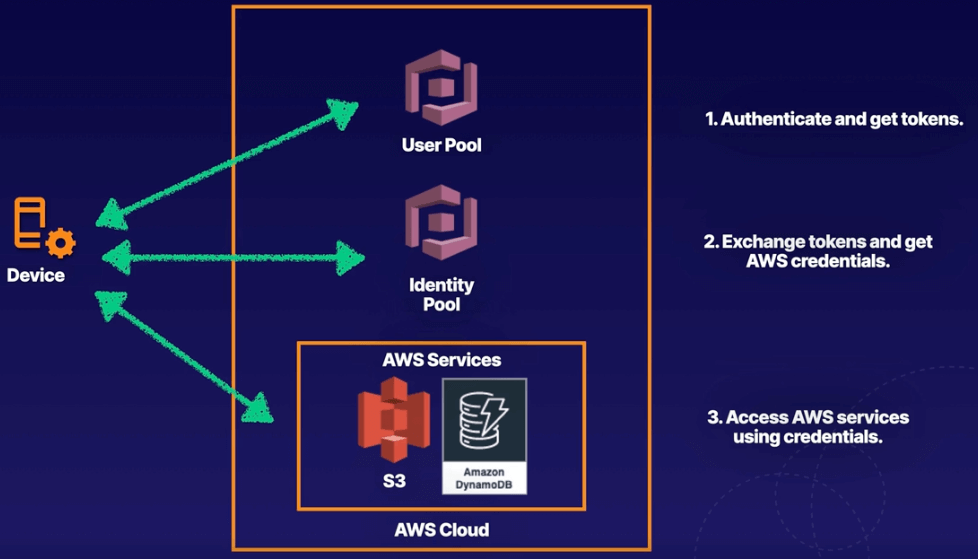

# Chapter 16. Security

<!-- TOC -->

- [Chapter 16. Security](#chapter-16-security)
  - [DDoS Overview](#ddos-overview)
    - [Layer 4 Attacks](#layer-4-attacks)
    - [Amplication Attacks](#amplication-attacks)
    - [Layer 7 Attacks](#layer-7-attacks)
  - [Logging API Calls with CloudTrail](#logging-api-calls-with-cloudtrail)
    - [What is logged?](#what-is-logged)
    - [Exam Tips](#exam-tips)
  - [Protecting Applications with Shield](#protecting-applications-with-shield)
    - [Exam Tips](#exam-tips)
  - [Filtering Traffic with AWS WAF](#filtering-traffic-with-aws-waf)
    - [Behaviours and Conditions](#behaviours-and-conditions)
    - [Exam Tips](#exam-tips)
  - [Guarding Your Network with GuardDuty](#guarding-your-network-with-guardduty)
    - [GuardDuty Features](#guardduty-features)
    - [Threat Detection with AI](#threat-detection-with-ai)
    - [GuardDuty Costs](#guardduty-costs)
  - [Centralizing WAF Management via AWS Firewall Manager](#centralizing-waf-management-via-aws-firewall-manager)
    - [Manage Security across Multiple Accounts](#manage-security-across-multiple-accounts)
    - [Benefits](#benefits)
    - [Exam Tips](#exam-tips)
  - [Monitoring S3 Buckets with Macie](#monitoring-s3-buckets-with-macie)
    - [Personally Identifiable Information PII](#personally-identifiable-information-pii)
    - [Automated Analysis of Data](#automated-analysis-of-data)
    - [Macie Alerts](#macie-alerts)
    - [Exam Tips](#exam-tips)
  - [Securing Operating Systems with Inspector](#securing-operating-systems-with-inspector)
    - [Assessment Findings and Types](#assessment-findings-and-types)
    - [How Does It Work?](#how-does-it-work)
  - [Managing Encryption Keys with KMS and CloudHSM](#managing-encryption-keys-with-kms-and-cloudhsm)
    - [Generating a CMK](#generating-a-cmk)
    - [Key Rotation](#key-rotation)
    - [Key Policies](#key-policies)
    - [CloudHSM](#cloudhsm)
  - [Storing Your Secrets in Secrets Manager](#storing-your-secrets-in-secrets-manager)
    - [What can be stored?](#what-can-be-stored)
    - [Automatic Rotation](#automatic-rotation)
    - [Exam Tips](#exam-tips)
  - [Storing Your Secrets in Parameter Store](#storing-your-secrets-in-parameter-store)
    - [Costs & Limitations](#costs--limitations)
    - [Exam Tips](#exam-tips)
  - [Temporarily Sharing S3 Objects Using Presigned URLs or Cookies](#temporarily-sharing-s3-objects-using-presigned-urls-or-cookies)
    - [Presigned URLS and Access](#presigned-urls-and-access)
    - [Presigned Cookies](#presigned-cookies)
  - [Advanced IAM Policy Documents](#advanced-iam-policy-documents)
    - [Amazon Resource Names ARNs](#amazon-resource-names-arns)
    - [IAM Policies](#iam-policies)
    - [Permission Boundaries](#permission-boundaries)
    - [Exam Tips](#exam-tips)
  - [AWS Certificate Manager ACM](#aws-certificate-manager-acm)
  - [Auditing Continuously with AWS Audit Manager](#auditing-continuously-with-aws-audit-manager)
    - [Exam Tips](#exam-tips)
  - [Downloading Compliance Documents from AWS Artifact](#downloading-compliance-documents-from-aws-artifact)
    - [Exam Tips](#exam-tips)
  - [Authenticating Access with AWS Cognito](#authenticating-access-with-aws-cognito)
    - [Features](#features)
    - [Use Cases](#use-cases)
    - [User Pools & Identity Pools](#user-pools--identity-pools)
    - [How it Works Broadly](#how-it-works-broadly)
    - [Cognito Sequence](#cognito-sequence)
  - [Analyzing Root Cause Using Amazon Detective](#analyzing-root-cause-using-amazon-detective)
    - [Sources and Use Cases](#sources-and-use-cases)
    - [Exam Tips](#exam-tips)
  - [Protecting VPCs using AWS Network Firewall](#protecting-vpcs-using-aws-network-firewall)
    - [Benefits and Use Cases](#benefits-and-use-cases)
    - [Exam Tips](#exam-tips)
  - [Leveraging AWS Security Hub for Collecting Security Data](#leveraging-aws-security-hub-for-collecting-security-data)
  - [Lab 11.1. Using Secrets Manager to Authenticate with an RDS Database Using Lambda](#lab-111-using-secrets-manager-to-authenticate-with-an-rds-database-using-lambda)
    - [Introduction](#introduction)

<!-- /TOC -->

---
## DDoS Overview

A Distributed Denial of Service (DDoS) attack is an attack that attempts to make your website or application unavailable to your end users. This can be achieved by multiple mechanisms, such as large packet floods, by using a combination of reflection and amplification techniques, or by using large botnets.

### Layer 4 Attacks

A Layer 4 DDoS attack is often referred to as a **SYN flood**. It works at the transport layer (TCP).

To establish a TCP connection a 3-way handshake takes place. The client sends a SYN packet to a server, the server replies with a SYN-ACK, and the client then responds to that with an ACK. After the 3-way handshake is complete the TCP connection is established. After this applications begin sending data using Layer 7 (application layer protocol), such as HTTTP etc.

A **SYN flood** uses the built in patience of the TCP stack to overwhelm a server by sending a large number of SYN packets and then ignoring the SYN-ACKs returned by the server. This causes the server to use up resources waiting for a set amount of time for the anticipated ACK that should come from a legitimate client.

### Amplication Attacks

Amplication / reflection attacks can include things such as NTP, SSDP, DNS, CharGEN, SNMP attacks etc. This is where an attacker may send a third-party server, such as an NTP server, a request using a spoofed IP address.


That server will then respond to that request with a greater payload than the initial request, usually 28-54 times larger than the request, to the spoofed IP address. For example, if the attacker sends a packet with a spoofed IP address of 64 bytes, the NTP server would respond with up to 3,456 bytes of traffic.

Attackers can coordinate this and use multiple NTP servers a second to send legitimate NTP traffic to the target.

### Layer 7 Attacks

A Layer 7 attack occurs where a web server receives a flood of GET or POST requests, usually from a botnet or a large number of compromised computers.

---
## Logging API Calls with CloudTrail

**AWS CloudTrail** increases visibility into your user and resource activity by recording AWS Management Console actions and API calls. You can identify which users and accounts called AWS, the source IP address from which the calls were made, and when the calls occurred.

Think of CloudTrail as CCTV monitoring for your AWS account. It logs all API calls made to your AWS account and stores these logs in S3.

### What is logged?

- Metadata around API calls
- The identity of the API caller
- The time of the API call
- The source IP address of the API caller
- The request parameters
- The response elements returned by the service

Things that are not logged include RDP, SSH traffic etc.

### Exam Tips

What CloudTrail allows:

* After-the-fact incident investigation

* Near real-time intrusion detection

* Industry and regulatory compliance

---
## Protecting Applications with Shield

**AWS Shield** is basically a free DDoS protection for AWS customers on ELB, AWS CloudFront, and Route53. It protects against SYN/UDP floods, amplification/reflection attacks, and other Layer 3/4 attacks.

**AWS Shield Advanced** provides enhanced protections against larger and more sophisticated attacks. It offers always-on, flow-based monitoring of network traffic and active application monitoring to provide near real-time notifications of DDoS attacks.

It also gives you 24/7 access to the DDoS Response Team (DRT) to help manage and mitigate application-layer DDoS attacks, and prevents your AWS bill from cost spikes due to ELB, AWS CloudFront, and Route53 during a DDoS attack.

The cost of Shield Advanced is $3,000 USD per month.

### Exam Tips

If you see a scenario question talking about DDoS mitigation or protection against Layer 3/4 attacks, think of **AWS Shield**. In addition, **Shield Advanced** costs $3,000 USD per month but will give you a dedicated 24/7 DDoS Response Team.

---
## Filtering Traffic with AWS WAF

**AWS WAF** is a Web Application Firewall (WAF) that lets you monitor and control the HTTP and HTTPS requests that are forwarded to AWS CloudFront or an ALB. You can configure conditions such as what IP addresses are allowed to make request or what query string parameters need to be passed for the request to be allowed.

The ALB or CloudFront will either allow this request to be received or give an *HTTP 403 status code*.

AWS WAF operates at *Layer 7* and protects against Layer 7 attacks where a web server receives a flood of GET or POST requests.

### Behaviours and Conditions

At its most basic level, AWS WAF allows:
- *Allows all requests* except the ones you specify.
- *Blocks all requests* except the ones you specify.
- *Count the requests* that match the properties you specify.

You can define conditions by using characteristics of web requests such as:

* *IP addresses* that requests originate from

* *Country* that requests originate from

* *Values* in request headers

* *Presence of SQL code* that is likely to be malicious (known as **SQL injection**)

* *Presence of a script* that is likely to be malicious (known as **cross-site scripting**)

* *Strings that appear in requests* - either specific strings or strings that match regex patterns

### Exam Tips

If you see a scenario question talking about Layer 7 attacks, think of **AWS WAF**. Also, WAF can block Layer 7 DDoS attacks as well as things like **SQL injections**, **cross-site scripting**, as well as *specific countries* and *IP addresses*.

---
## Guarding Your Network with GuardDuty

**GuardDuty** is a threat detection service that uses AI to continuously monitor for malicious behaviour such as:

* Unusual API calls, from a known malicious IP

* Attempts to disable CloudTrail logging

* Unauthorized deployments

* Compromised instances

* Reconnaissance by would-be attackers

* Port scanning, failed logins

### GuardDuty Features

* Alerts appear in the GuardDuty console and CloudWatch Events.

* Receives feeds and updates a database from third parties like **Proofpoint** and **CrowdStrike**, as well as **AWS Security**, about malicious domains and IP addresses etc.

* Monitors CloudTrail logs, VPC Flow Logs, and DNS logs.

* Centralize threat detection across multiple AWS accounts.

* Automated response using CloudWatch Events and Lambda.

* Machine learning and anomaly detection.

### Threat Detection with AI

It takes approximately 7 to 14 days to set a baseline for what is normal behaviour on your account. Once active, you will see findings on the GuardDuty console and in CloudWatch Events only if the AI detects anomaly behaviour it considers a threat.

CloudWatch Events can be used to trigger a Lambda function to address a threat if necessary.

### GuardDuty Costs

You get 30 days free and subsequent charges are based on:
- Quantity of CloudTrail Events
- Volume of DNS and VPC Flow Logs data

---
## Centralizing WAF Management via AWS Firewall Manager

**Firewall Manager** is a security management service in a single panel that allows you to centrally set up and manage firewall rules across multiple AWS accounts and applications in **AWS Organizations**.

### Manage Security across Multiple Accounts

You can create new AWS WAF rules for your ALBs, API Gateways, and CloudFront distributions. You can also mitigate DDoS attacks using **Shield Advanced** for your ALBs, Elastic IP addresses, CloudFront distributions etc.

### Benefits

* Simplified management of WAF rules across all your AWS accounts.

* Ensure compliance of existing and new applications.

### Exam Tips

If you see a scenario about multiple AWS accounts and resources that need to be secured centrally, think **AWS Firewall Manager**.

---
## Monitoring S3 Buckets with Macie

**Macie** uses AI and pattern matching to discover sensitive data, such as Personally Identifiable Information (PII), Personal Health Information (PIH), financial data etc, stored in S3. It also alerts you to unencrypted buckets, public buckets, and shared buckets with AWS accounts outside of your **AWS Organizations**.

Macie is compliant with both HIPAA and GDPR frameworks.

### Personally Identifiable Information (PII)

* Personal data used to establish an individual's identity

* This data could be exploited by criminals, used in identity theft and financial fraud, such as:
  - Home address
  - Email address
  - Social security number
  - Passport number
  - Driver's license number
  - Date of birth
  - Phone number
  - Bank account number
  - Credit card number etc

### Automated Analysis of Data

### Macie Alerts

* You can filter and search Macie alerts in the AWS console.

* Alerts sent to **Amazon EventBridge** can be integrated with your security incident and event management (SIEM) system.

* Can be integrated with **AWS Security Hub** for a broader analysis of your organization's security posture.

* Can also be integrated with other AWS services, such as Step Functions, to automatically take remediation actions.

### Exam Tips

If you see a scenario about PII and how to prevent it from being accidentally leaked in S3, think of Macie.

---
## Securing Operating Systems with Inspector

**AWS Inspector** is an automated security assessment service that helps improve the security and compliance of applications deployed on AWS. It assesses VPC and applications for vulnerabilities or deviations from best practices.

### Assessment Findings and Types

After performing an assessment, Inspector produces a detailed list of security findings prioritized by level of severity. These findings can be reviewed directly or as part of detailed assessment reports that are available via the Inspector console or API.

There are two types of assessment:

* Network assessment - Analysis of network configuration, such as open ports etc, where the Inspector agent is not required.

* Host assessment - Analysis of vulnerable software (CVE), host hardening (CIS Benchmarks), and security best practices, where the Inspector agent is required.

### How Does It Work?

1. Create assessment target in Inspector console.
2. Install agents on EC2 instances.
  - AWS will automatically install the agent for instances that allow SSM Run Command.
3. Create assesment template.
4. Perform assessment run.
5. Review findings against rules.

---
## Managing Encryption Keys with KMS and CloudHSM

**AWS Key Management Service (KMS)** is a managed service that makes it easy for you to create and control the encryption keys used to encrypt your data. KMS is integrated with other AWS services, such as EBS, S3, RDS etc, to make it simple to encrypt your data with encryption keys you manage.

A **Customer Master Key (CMK)** is a logical representation of a master key. The CMK includes metadata, such as key ID, creation date, description, and key state. It also contains the key material used to encrypt and decrypt data.

You control the lifecycle of the CMK as well as who can use or manage it.

A **Hardware Security Module (HSM)** is a physical computing device that safeguards and manages digital keys and perform encryption and decryption functions. An HSM contains one or more secure cryptoprocessor chips.

### Generating a CMK

There are three ways to generate a CMK:

* *AWS creates the CMK for you*. The key material for a CMK is generated within HSMs managed by AWS KMS.

* *Import key material* from your own key management infrastructure and associate it with a CMK.

* *Have the key material generated* and used in an **AWS CloudHSM** cluster as part of the custom key store feature in AWS KMS.

### Key Rotation

You can choose to have AWS KMS automatically rotate CMKs every year, provided that those keys were generated within AWS KMS HSMs. Automatic key rotation is not supported for *imported keys*, *asymmetric keys*, or keys generated in **AWS CloudHSM** cluster using the AWS KMS custom key store feature.

### Key Policies

The primary way to manage access to your AWS KMS CMKs is with policies. Policies are documents that describe who has access to what. Policies that are attached to an IAM identity are called *identity-based policies* (or *IAM policies*), and policies attached to other kinds of resources are called *resource-based policies*.

In AWS KMS, you must attach resource-based policies to your CMKs. These are called *key policies*. All KMS CMKs have a key policy.

There are three ways to control permissions:

* *Use the key policy*. The full scope of access to the CMK is defined in a single key policy.

* *Use IAM policies in combination with the key policy*. Controlling access this way enables you to manage all the permissions for your IAM identities in IAM.

* *Use grants in combination with the key policy*. Controlling access this way enables you to allow access to the CMK in the key policy, as well as allow users to delegate their access to others.

### CloudHSM

**AWS CloudHSM** is a cloud-based HSM that enables you to easily generate and use your own encryption keys on the AWS Cloud. It is a physical device, entirely dedicated to you, that can be deployed in a highly available fashion.

**KMS vs CloudHSM**

* Shared tenancy of underlying hardware vs Dedicated HSM to your organization

* Automatic key rotation vs No automatic key rotation

* Automatic key generation vs Full control of hardware, users, groups, keys, etc

---
## Storing Your Secrets in Secrets Manager

**Secrets Manager** is a service that securely stores, encrypts, and rotates your database credentials and other secrets.

* Encryption in transit and at rest using KMS

* Automatically rotates credentials

* Apply fine-grained access control using IAM policies

* Costs money but is highly scalable

### What can be stored?

- RDS credentials
- Credentials for non-RDS databases
- Any other type of secret, provided you can store it as a key-pair value, eg. SSH keys, API keys etc.

### Automatic Rotation

If you enable rotation, Secrets Manager *immediately* rotates the secret once to test the configuration.

### Exam Tips

Ensure all of your applications that use these credentials are updated to retrieve the credentials from this secret using Secrets Manager API *before* enabling credential rotation, as Secrets Manager *immediately* rotates the secret once you enable rotation.

---
## Storing Your Secrets in Parameter Store

**Parameter Store** is a capability of **Systems Manager** that provides secure, hierarchical storage for configuration data management and secrets management.

You can store values as plain text or encrypted data. For example, you can store data such as passwords, database strings, AMI ID etc.

### Costs & Limitations

**Parameter Store** is free, but there are two limitations:

* Maximum number of parameters you can store is 10,000.

* No key rotation.

### Exam Tips

In the exam, if you get scenario based questions regarding minimizing cost of storing secrets, think of **Parameter Store**. However, if you need to store more than 10,000 values, or require key rotation, or the ability to generate passwords using CloudFormation, think of **Secrets Manager**.

---
## Temporarily Sharing S3 Objects Using Presigned URLs or Cookies

All objects in S3 are private by default. However, the owner can optionally share objects with others by *creating a presigned URL*, using their own credentials to grant time-limited permission to download the objects.

### Presigned URLS and Access

When you create a presigned URL for an S3 object, you must provide:
- your credentials
- a bucket name
- an object key
- indicate the HTTP method (or GET to download)
- expiration date and time.

Anyone who receives the presigned URL can then access the object.

### Presigned Cookies

When you want to provide access to multiple S3 objects, you can provide a presigned cookie. The cookie will be saved on the user's computer, and they will be able to browse the entire contents of the restricted content.

---
## Advanced IAM Policy Documents

### Amazon Resource Names (ARNs)

ARNs all begin with `arn:<PARTITION>:<SERVICE>:<REGION>:<ACCOUNT_ID>:`:
- **PARTITION**: either `aws` or `aws-cn` (AWS China).
- **SERVICE**: AWS service, eg. `s3`, `ec2` etc.
- **REGION**: AWS region, eg. `ap-southeast-1` etc.
- **ACCOUNT_ID**: AWS Account ID is a 12-digit unique number.

And end with:
- `resource`
- `resource_type/resource`
- `resource_type/resource/qualifier`
- `resource_type/resource:qualifier`
- `resource_type:resource`
- `resource_type:resource:qualifier`

Examples:
- `arn:aws:iam::123456789012:user/ryan`
- `arn:aws:s3:::my_awesome_bucket/image.png`
- `arn:aws:dynamodb:*:123456789012:table/orders`
- `arn:aws:ec2:us-east-1:123456789012:instance/*`

> Note: In the above example, the `iam` service is a global service, hence **REGION** has been omitted from its ARN. Similarly, both **REGION** and **ACCOUNT_ID** have been omitted for the `s3` service.

### IAM Policies

* JSON document that defines permissions as a list of statements

* Identity-based policy is where we define users and groups

* Resource-based policy is where we define resources

```json
{
  "Version": "2012-10-17",
  "Statement": [
    {
      "Sid": "SpecificTable",
      "Effect": "Allow",
      "Action": [
        "dynamodb:DescribeTable",
        "dynamodb:Get*"
      ],
      "Resource": "arn:aws:dynamodb:*:*:table/MyTable"
    }
  ]
}
```

* No effect until attached, where an effect is either **Allow** or **Deny**

* Each statement matches an **AWS API request**

### Permission Boundaries

- Used to *delegate administration* to other users
- *Prevent privilege escalation* or unnecessarily broad permissions
- *Control maximum permissions* an IAM policy can grant

Use cases:
- Developers *creating roles* for Lambda functions
- Application owners *creating roles* for EC2 instances
- Admininstrators *creating ad-hoc users*

### Exam Tips

- Not explicitly allowed == implicitly denied
- Explicit deny supercedes everything else
- Only attached policies have effect
- AWS joins all applicable policies
- AWS managed policies vs customer managed policies

---
## AWS Certificate Manager (ACM)

**AWS Certificate Manager** allows you to create, manage, and deploy public and private SSL certificates for use with other AWS services. It integrates with other services, such as ELB, CloudFront distributions, and API Gateway.

Benefits of ACM:

* Free - No more paying for SSL certificates as both public and private certificates are provided for free.

* Automatic renewal - ACM can automate the renewal of your SSL certificate and then automatically update the new certificate with your integrated services, such as ELB etc.

* Easy to set up - Removes a lot of manual process, such as generating a key pair or creating a certificate signing request (CSR).

---
## Auditing Continuously with AWS Audit Manager

**Audit Manager** allows you to continuously audit your AWS usage to make sure you stay compliant with industry standards and regulations. It is an automated service that produces reports specific to auditors for PCI compliance, GPDR etc.

Uses cases for Audit Manager:

* *Transition from manual to automated* for evidence collection

* *Continuous audting and compliance* for automated reports

* *Internal risk assessment* for validating internal policies from prebuilt or customized frameworks

### Exam Tips

If you see a scenario question about HIPAA or GDPR compliance that asks about continuous auditing or automated auditing reports, think of **Audit Manager**.

---
## Downloading Compliance Documents from AWS Artifact

**Artifact** is a single source you can visit to get the compliance-related information that matters to you.

There are a huge number of compliace reports available such as:
- AWS Service Organization Control (SOC) reports
- Payment Card Industry (PCI) reports
- GPDR reports
- HIPAA reports
- ISO reports etc

### Exam Tips

This comes up in the exam quite a bit and is often used as a distractor. If you see a question about audits and the need to download compliance reports, think of **Artifact**.

---
## Authenticating Access with AWS Cognito

**Cognito** provides *authentication*, *authorization*, and *user management* for your web and mobile apps in a single service without the need for custom code. Your users can sign in directly with a username and password, or through a third-party, eg. Facebook etc.

### Features

* *Sign-up and sign-in* options for your apps

* *Access for guest* users

* *Acts as an identity broker* between your application and web ID providers, so you don't need to write any custom code

* *Synchronizes user data* across multiple devices

* *Recommended for all mobile apps* that call AWS services

### Use Cases

* *Authentication* - users can sign in using a user pool

* *Third-party* - users can authenticate using identity pools that require and identity provider (IdP) token, eg. Facebook etc

* *Access server-side resources* - A signed-in user is given a token that allows them access to resources that you specify

* *Access AWS AppSync Resources* - A signed-in user can be given access to AppSync resources with tokens received from a user or identity pool in Cognito

### User Pools & Identity Pools

*User pools* (for authentication) are directories of users that provide sign-up and sign-in options for your application users.

*Identity pools* (for authorization) allow you to give your users roles and permissions to other AWS services. You can use identity pools and user pools either separately or together.

### How it Works Broadly


1. Device sends a *login request* to our Login Provider.
2. Device then sends a *GetID request* to our **Cognito**, which *validates the request* against the Login Provider to make sure you are an authorized user.
3. Device then sends a *GetOpenIdToken request* to our **Cognito**, which *validates the request* against the Login Provider.
4. Device then sends a *AssumeRoleWithWebIdentity request* to our AWS Security Token Service (STS), which *validates the request* against our **Cognito**.

### Cognito Sequence



1. Device sends a *login request* from app, which *authenticate and get token* from a user pool in **Cognito**.
2. Device then sends a *token exchange request* from app, which exchanges the token and get AWS credentials from an identity pool in **Cognito**.
3. Device then *accesses AWS services* using returned credentials.

---
## Analyzing Root Cause Using Amazon Detective

**Detective** allows you to analyze, investigate, and quickly identify the root cause of potential security issues or suspicious activities. It uses AI, statistical analysis, and graph theory to build a linked set of data that enables you to quickly figure out the root cause of your security issues.

### Sources and Use Cases

Detective uses a number of sources within your AWS account to automatically create an overview of your users, resources, and interactions between them over time:
- VPC Flow Logs
- CloudTrail logs
- EKS audit logs
- GuardDuty findings

Use cases:

* *Triage security findings* - if you have a suspicious activity, you can quickly access if it is in fact real or a false positive

* *Threat hunting* - you can be proactive and go threat hunting

### Exam Tips

Do not confuse with **Inspector**, which is an automated vulnerability management service that continually scans EC2 and container workloads for software vulnerabilities and unintended network exposure.

**Inspector** is used for code inspection, while **Detective** uses AI for root cause analysis.

---
## Protecting VPCs using AWS Network Firewall

**Network Firewall** is a managed service that makes it easy to deploy physical firewall protection across your VPCs. It includes a firewall rules engine that give you complete control over your network traffic.

### Benefits and Use Cases

* *Managed infrastructure* - you don't need to worry about managing the physical servers

* *Works with Firewall Manager* - you can centrally manage security policies across existing and newly created accounts and VPCs

* Intrusion prevention system* - you can actively inspect traffic flow

Use cases:

* *Filter internet traffic* - you can use methods like access control list (ACL) rules, stateful inspection, protocol detection, and intrusion prevention to filter your internet traffic

* *Filter outbound traffic* - you can create outbound filter rules using the URL or domain name, IP address, and content

* *Inspect VPC-to-VPC traffic* - you can automatically inspect traffic moving from one VPC to another

### Exam Tips

If you see a scenario question about filter network traffic before it reaches your internet gateway, or if you require intrusion prevention system or any hardware firewall requirements, think of **Network Firewall**.

---
## Leveraging AWS Security Hub for Collecting Security Data

**Security Hub** is a single place to view all your security alerts from services such as **GuardDuty**, **Inspector**, **Macie**, and **Firewall Manager** across multiple accounts.

Use cases:

* *Conduct Cloud Security Posture Management (CSPM) - use automated checks that comply with common frameworks to help reduce your risk

* *Correlate security findings to discover new insights* - aggregate all your security findings in one place to more easily identify threats and alerts

---
## Lab 11.1. Using Secrets Manager to Authenticate with an RDS Database Using Lambda

<details>
<summary>Click here to start Lab 11.1.</summary>

### Introduction

</details>