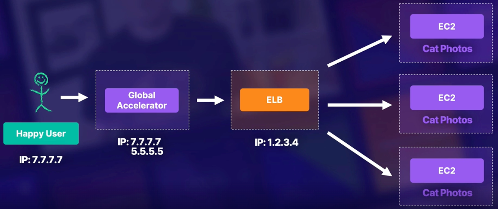

# Chapter 18. Caching

<!-- TOC -->

- [Chapter 18. Caching](#chapter-18-caching)
  - [Caching Overview](#caching-overview)
    - [Where to Cache](#where-to-cache)
    - [Caching Solutions](#caching-solutions)
  - [Global Caching with CloudFront](#global-caching-with-cloudfront)
    - [CloudFront Important Settings](#cloudfront-important-settings)
  - [Fixing IP Caching with Global Accelerator](#fixing-ip-caching-with-global-accelerator)
    - [Global Accelerator Features](#global-accelerator-features)
  - [Caching Your Data with ElastiCache and DAX](#caching-your-data-with-elasticache-and-dax)
    - [AWS ElastiCache](#aws-elasticache)
    - [Memcached vs Redis](#memcached-vs-redis)
    - [AWS DynamoDB Accelerator DAX](#aws-dynamodb-accelerator-dax)
    - [ElastiCache vs DAX](#elasticache-vs-dax)

<!-- /TOC -->

---
## Caching Overview

* Everywhere - cache everything.

* Speed - there are other benefits than decreasing latency.

* Internal vs External - know which type to use in each situation.

* Hybrid Support - CloudFront works for both AWS and on-premises architecture.

### Where to Cache

* External - cache data that is going to be distributed to our users, e.g. images etc.

* Internal - important tools that require speed up, e.g. databases etc.

### Caching Solutions

There are four caching solutions (two external, two internal):

* CloudFront (external)

* Global Accelerator (external)

* ElastiCache (internal)

* DAX (internal) - built specifically for DynamoDB

---
## Global Caching with CloudFront

AWS CloudFront is a fast content delivery network (CDN) service that securely delivers data, videos, applications, and APIs to customers globally. It helps **reduce latency and provide higher transfer speeds using AWS edge locations**.

### CloudFront Important Settings

* Security - defaults to HTTPS connections with the ability to add custom SSL certificate, e.g. allows you to put a HTTPS connection in front of an S3 bucket. You can also attach a WAF to CloudFront.

* Global Distribution - you cannot pick specific locations.

* Endpoint Support - can be used to front AWS endpoints along with non-AWS applications.

* Expiring Content - you can force an expiration of content from the cache before the TTL expires.

* Domain Name - an AWS sub-domain name will be assigned to each CloudFront resource, e.g. `https://xxxx.cloudfront.net`.

---
## Fixing IP Caching with Global Accelerator

AWS Global Accelerator is a networking service, in front of your application's LB, that sends your users' traffic through AWS global network infrastructure. It can **increase performance and help deal with IP caching**.

### Global Accelerator Features

* Static IP - provides two static IPs that routes to the ELB in front of your application. You can also BYO IP.

* Endpoints - supports multiple endpoints across regions of ALB, NLB, EC2 or Elastic IP.

* Domain Name - an AWS sub-domain name will be assigned to each Global Accelerator resource, e.g. `https://xxxx.awsglobalaccelerator.com`.

* Orchestration - routes external user to region based on proximity to the specified endpoints.

* Masks Complex Architecture - changes in ELB's IP does not impact users.

* Speed - traffic is routed through AWS global network infrastructure.

* Weighted Pools - create weighted groups behind the IPs to A/B test out new features or handle failure in your environment.

---
## Caching Your Data with ElastiCache and DAX

### AWS ElastiCache

AWS ElastiCache is a managed version of two open-source caches: Memcached and Redis. Neither of these tools are specific to AWS, but by using ElastiCache you avoid a lot of common issues you might encounter in deployment.

* No longer perform management tasks such as hardware, software, setup, configuration, and failure recovery.

* Have access to monitoring metrics associated with your nodes.

* Cost-efficient and resizable hardware capacity.

* ElastiCache for Redis has improved reliability and efficiency, and features cluster resizing, supports encryption, and is HIPAA eligible and PCI DSS compliant.

* ElastiCache for Memcached features auto discovery, by simplifying the way an application connects to a cluster.

### Memcached vs Redis

Memcached is designed for simplicity while Redis offers a rich set of features that make it effective for a wide range of use cases.

|             Memcached              |               Redis                |
|:----------------------------------:|:----------------------------------:|
|    Low latency, in-memory cache    |    Low latency, in-memory cache    |
| Support many programming languages | Support many programming languages |
|       Simple data structures       |      Advanced data structures      |
|           Multithreaded            |          Single threaded           |
|           No Replication           |            Replication             |
|             No Pub/Sub             |              Pub/Sub               |
|           No Geospatial            |             Geospatial             |
|     Simple DB caching solution     |        DB caching solution         |
|       Not a database itself        |    A standalone NoSQL database     |
|  No failover or multi-AZ support   |   Failover and multi-AZ support    |
|             No backups             |         Backups available          |

### In-Memory Data Store

The primary purpose of an in-memory data store is to provide minimal latency and inexpensive access to copies of data. An example is queries that involve joins across multiple tables, by caching such query results you can quickly retrieve the data multiple times without having to re-execute the query.

* Speed and Expense - a slow and expensive query is a candidate for caching.

* Data and Access Pattern - a query result that is relatively static and frequently accessed is a candidate for caching.

* Staleness - cached data is stale data, hence determine your application's tolerance for stale data.

### AWS DynamoDB Accelerator (DAX)

* DynamoDB - supports DynamoDB only.

* In-Memory Cache - reduce DynamoDB response times from millseconds to microseconds.

* Location - cache is highly available and lives inside your VPC.

* Control - you determine the node size and count for the cluster, TTL for the data, and maintenance window for changes and updates.

### ElastiCache vs DAX

|       ElastiCache       |         DAX          |
|:-----------------------:|:--------------------:|
| More flexibility on RDS | Specific to DynamoDB |

---
## Reference

* [Comparing Redis and Memcached](https://aws.amazon.com/elasticache/redis-vs-memcached)
* [Common ElastiCache Use Cases and How ElastiCache Can Help](https://docs.aws.amazon.com/AmazonElastiCache/latest/mem-ug/elasticache-use-cases.html)