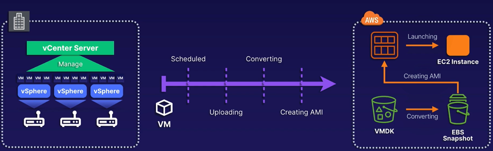

# Chapter 20. Migration

<!-- TOC -->

- [Chapter 20. Migration](#chapter-20-migration)
  - [Migrating Data with AWS Snow Family](#migrating-data-with-aws-snow-family)
    - [AWS Snow Family](#aws-snow-family)
  - [Storage Gateway](#storage-gateway)
    - [File Gateway](#file-gateway)
    - [Volume Gateway](#volume-gateway)
    - [Tape Gateway](#tape-gateway)
  - [AWS DataSync](#aws-datasync)
    - [DataSync vs Storage Gateway](#datasync-vs-storage-gateway)
  - [AWS Transfer Family](#aws-transfer-family)
  - [Moving to the Cloud with AWS Migration Hub](#moving-to-the-cloud-with-aws-migration-hub)
    - [Migration Phases](#migration-phases)
    - [Server Migration Service SMS](#server-migration-service-sms)
    - [Database Migration Service DMS](#database-migration-service-dms)
  - [Migrating Workloads to AWS Using AWS Application Discovery Service or AWS Application Migration Service MGN](#migrating-workloads-to-aws-using-aws-application-discovery-service-or-aws-application-migration-service-mgn)
    - [AWS Application Directory Service](#aws-application-directory-service)
    - [Discovery Types](#discovery-types)
    - [AWS Application Migration Service MGN](#aws-application-migration-service-mgn)
    - [AWS MGN RTO and RPO](#aws-mgn-rto-and-rpo)
  - [Migrating Databases from On-Premises to AWS with AWS Database Migration Service DMS](#migrating-databases-from-on-premises-to-aws-with-aws-database-migration-service-dms)
    - [AWS DMS How It Works](#aws-dms-how-it-works)
    - [AWS DMS Important Concepts](#aws-dms-important-concepts)
    - [AWS Schema Conversion Tool SCT](#aws-schema-conversion-tool-sct)
    - [Migration Types](#migration-types)
    - [AWS DMS via Snowball](#aws-dms-via-snowball)

<!-- /TOC -->

---
## Migrating Data with AWS Snow Family

* Internet - using your existing connection is convenient but potentially very slow and could be a security risk.

* Direct Connect - this can be faster and more secure, but not always practical if it's not needed after the migration

* Physical - bundle your data and physically deliver it to AWS, bypassing the Internet entirely.

### AWS Snow Family

The AWS Snow Family is a set of secure appliances that provide petabyte-scale data collection processing solutions at the edge and **migrate large-scale data into and out of AWS**. In reality, it is just a set of physical hard drives that AWS ships to and from you, with a turnaround of about a week.

* Snowcone - the smallest device with 8 TB storage, 4 GB memory, and 2 vCPUs. Suitable for IoT devices.

* Snowball - the default device with 48-81 TB storage, and several memory, vCPU, and vGPU flavors. Suitable for off-the-grid compute or a one-time migration to AWS.

* Snowmobile - the largest device with 100 PB storage. Suitable for large on-premises data centres.

---
## Storage Gateway

AWS Storage Gateway is a hybrid cloud storage service that helps you **merge on-premises resources with the cloud**. It can help with a one-time migration or a long-term pairing of your architecture with AWS.

### File Gateway

* NFS or SMB mount fileshare to S3 bucket.

* Keep a local copy of recently used files in cache.

* Extend on-premises storage.

### Volume Gateway

* iSCSI mount disk volumes to S3 bucket

* Cache or stored mode

* Create EBS snapshots.

### Tape Gateway

* Replace physical tapes with a virtual tape to S3 bucket.

* Encrypted communication.

---
## AWS DataSync

AWS DataSync is an agent-based solution for migrating on-premises storage to AWS. It allows you to easily **move data between NFS and SMB shares and AWS storage solutions**.

* Use Case - used primarily for one-time migrations.

* Agent Based - an agent needs to be installed on-premises to get it into AWS.

* Endpoints - S3, EFS, and FSx are all supported destination storage for your data.

### DataSync vs Storage Gateway

|      DataSync      |   Storage Gateway   |
|:------------------:|:-------------------:|
| One-time migration |   Continuous sync   |
| Cloud architecture | Hybrid architecture |

---
## AWS Transfer Family

The AWS Transfer Family allows you to easily **move files in and out of S3 or EFS using SFTP, FTPS, or the FTP**.

* Legacy - excels with bringing legacy application storage to the cloud.

* Protocols - FTPS, FTP, SFTP.

* DNS - the DNS entry stays the same, but the location for the storage becomes S3.

The AWS Transfer Family excels when you have a collection of older applications using protocols that cannot be changed. You can easily "trick" these applications into using S3 storage.

---
## Moving to the Cloud with AWS Migration Hub

AWS Migration Hub gives you a single place to **track the progress of your application migration to AWS**. It integrates with both Server Migration Service (SMS) and Database Migration Service (DMS).

* Single Pane - console to discover existing servers, plan your migration, and track migration statuses.

* Visualize - visualize connection and server/database statuses of your migrations.

* Options - group servers into application groups or start migrations immediately.

* Supported Tools - integrates with AWS SMS or AWS DMS.

* Leverages Other Services - only discovers and plans migrations, and works with the supported tools to actually do the migrations.

### Migration Phases

1. Discovery - find servers and databases to plan your migrations.

2. Migrate - connect tools to Migration Hub, and begin migrating.

3. Track - follow migration statuses and progress.

### Server Migration Service (SMS)

* Automate - automates migrating on-premises servers to AWS.

* Supported VMs - supports vSphere, Hyper-V, SCVMM, and Azure VMs.

* Incremental - incremental replications of server VMs over to AWS AMIs that can be deployed on EC2 instances.

**SMS Use Cases**

* Simplify Migrations - SMS manages all complex parts of migration to AWS, i.e. volume replication are handled automatically.

* Multi-Server Migrations - track progress of chosen server groups, and schedule replication intervals however you please.

* Incremental Testing - incremental migrations allow for quick testing of your migrated servers.

* Wide Support - supports a majority of common operating systems.

* No Downtime - minimizes downtimes that occur during traditional migration efforts.

### Database Migration Service (DMS)

---
## Migrating Workloads to AWS Using AWS Application Discovery Service or AWS Application Migration Service (MGN)

### AWS Application Directory Service

* Plan - **helps plan migrations to AWS** via collection of usage and configuration data from on-premises servers.

* Simplify - **simplifies migrations and tracks migration statuses**, integrates with AWS Migration Hub.

* Track - helps you easily view discovered servers, group them by application, and **track each application migration**.

### Discovery Types

AWS Application Directory Service offers two types of discoveries:

* Agentless - completed by deploying the Agentless Collector OVA file within the VMware vCenter, which helps you to identify hosts and VMs in vCenter, including metrics.

* Agent Based - deploy agent to each VM and physical hosts, which helps you to collect data, info, network, metrics etc.

### AWS Application Migration Service (MGN)

* Lift and Shift - automated lift-and-shift service for migrating applications to AWS.

* Flexible - used for physical, virtual or cloud servers to avoid disruptions.

* Replicate - replicates source servers to AWS, and automatically converts and launches on AWS for non-disruptive cutovers.

### AWS MGN RTO and RPO

* Recovery Time Objective (RTO) - typically in minutes; dependent on OS boot time.

* Recovery Point Objective (RPO) - measured in the sub-second range.

---
## Migrating Databases from On-Premises to AWS with AWS Database Migration Service (DMS)

* Migration Tool - allows for migration of databases, warehouses, NoSQL, and other data stores.

* Cloud or On-Premises - migrate data between AWS and on-premises.

* One-Time or Ongoing - option to perform one-time migration or continuously replicate ongoing changes.

* Conversion Tools - the SCT allows for translating database schemas to new platforms.

* AWS Benefits - you gain the advantages of AWS: cost, efficiency, security etc.

### AWS DMS How It Works

* DMS is a server running replication software.

* **Create source and target connections for loading from and to**.

* **Schedule tasks to run on the DMS server to move data**.

* AWS creates the tables and primary keys automatically (if they do not exist on the target).

* **Optionally, create your target tables beforehand** if desired.

* Leverage the SCT for creating some or all of your tables, indexes etc.

* Source and target data stores are referred to as endpoints.

### AWS DMS Important Concepts

* Same Engine - migrate between source and target endpoints with the same engine types.

* Different Engine - also migrate between source and target endpoints with different engines.

* Must be AWS - one endpoint must be an AWS service, it cannot be used exclusively outside of AWS.

### AWS Schema Conversion Tool (SCT)

* Convert - leverage SCT to convert existing database schemas from one engine to another.

* Engine Types - convert many types of relational databases, including both OLAP and OLTP.

* Support Targets - any RDS engine type, Amazon Aurora, Redshift etc.

* EC2 and S3 - use the converted schemas with databases running on EC2 or data stored in S3.

### Migration Types

There are three different migration types:

* Full Load - all existing data is moved from source to target in parallel. Without CDC, there is no guarantee of transactional integrity of the target database.

* Full Load and Change Data Capture (CDC) - full load plus CDC captures changes to source tables during migration.

* CDC Only - only replicate the data changes from the source database.

### AWS DMS via Snowball

* Snowball - AWS DMS via Snowball have the same benefits and limitations as AWS Snowball, e.g. 81 TB storage, slow Internet etc.

* SCT - can leverage SCT to extract data from Snowball devices and into S3.

* Converted Data - AWS DMS can load the converted data from S3 and migrate to the target database.

* CDC Compatible - able to leverage CDC for capturing changes when extracting data to store in S3.
