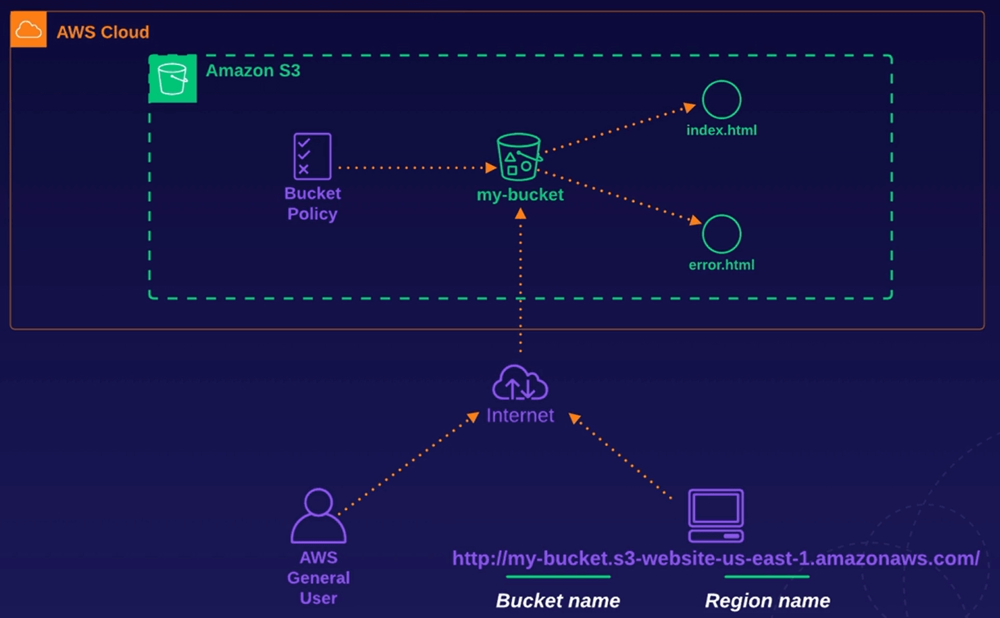

# Chapter 4. Simple Storage Service (S3)

<!-- TOC -->

- [Chapter 4. Simple Storage Service S3](#chapter-4-simple-storage-service-s3)
  - [S3 Overview](#s3-overview)
    - [Key-Value Store](#key-value-store)
    - [S3 Standard](#s3-standard)
    - [Tiered Storage](#tiered-storage)
    - [Securing Your Data](#securing-your-data)
  - [Securing Your Bucket with S3 Block Public Access](#securing-your-bucket-with-s3-block-public-access)
    - [Object ACLs vs Bucket Policies](#object-acls-vs-bucket-policies)
  - [Hosting a Static Website Using S3](#hosting-a-static-website-using-s3)
  - [Versioning Objects in S3](#versioning-objects-in-s3)
  - [S3 Storage Classes](#s3-storage-classes)
    - [S3 Standard](#s3-standard)
    - [S3 Standard-Infrequent Access S3 Standard-IA](#s3-standard-infrequent-access-s3-standard-ia)
    - [S3 One Zone-Infrequent Access](#s3-one-zone-infrequent-access)
    - [S3 Intelligent Tiering](#s3-intelligent-tiering)
    - [S3 Glacier](#s3-glacier)
    - [Glacier Instant Retrieval](#glacier-instant-retrieval)
    - [Glacier Flexible Retrieval](#glacier-flexible-retrieval)
    - [Glacier Deep Archive](#glacier-deep-archive)
  - [Lifecycle Management with S3](#lifecycle-management-with-s3)
  - [S3 Object Lock and Glacier Vault Lock](#s3-object-lock-and-glacier-vault-lock)
    - [S3 Object Lock Modes](#s3-object-lock-modes)
      - [Governance Mode](#governance-mode)
      - [Compliance Mode](#compliance-mode)
    - [Retention Periods](#retention-periods)
    - [Legal Holds](#legal-holds)
    - [Glacier Vault Lock](#glacier-vault-lock)
  - [Encrypting S3 Objects](#encrypting-s3-objects)
    - [Types of Encryption](#types-of-encryption)
    - [Enforcing Server-Side Encryption](#enforcing-server-side-encryption)
  - [Optimizing S3 Performance](#optimizing-s3-performance)
    - [S3 Prefixes Explained](#s3-prefixes-explained)
    - [S3 Limitations when using SSE-KMS](#s3-limitations-when-using-sse-kms)
    - [S3 Multipart Uploads](#s3-multipart-uploads)
    - [S3 Byte-Range Downloads](#s3-byte-range-downloads)
  - [Backing up Data with S3 Replication](#backing-up-data-with-s3-replication)
  - [Lab 4.1. Set Up Cross-Region S3 Bucket Replication](#lab-41-set-up-cross-region-s3-bucket-replication)
    - [Introduction](#introduction)
    - [Runbooks](#runbooks)
      - [Create an S3 Bucket and Enable Replication](#create-an-s3-bucket-and-enable-replication)
      - [Test Replication and Observe Results](#test-replication-and-observe-results)
  - [Lab 4.2. Creating Amazon S3 Buckets, Managing Objects, and Enabling Versioning](#lab-42-creating-amazon-s3-buckets-managing-objects-and-enabling-versioning)
    - [Introduction](#introduction)
    - [Runbooks](#runbooks)
      - [Create a Public and Private Amazon S3 Bucket](#create-a-public-and-private-amazon-s3-bucket)
      - [Enable Versioning on the Public Bucket and Validate Access to Different Versions of Files with the Same Name](#enable-versioning-on-the-public-bucket-and-validate-access-to-different-versions-of-files-with-the-same-name)
    - [Lab 4.3. Create a Static Website Using Amazon S3](#lab-43-create-a-static-website-using-amazon-s3)
      - [Create S3 Bucket](#create-s3-bucket)
      - [Enable Static Website Hosting](#enable-static-website-hosting)
      - [Apply Bucket Policy](#apply-bucket-policy)

<!-- /TOC -->
    - [S3 One Zone-Infrequent Access](#s3-one-zone-infrequent-access)
    - [S3 Intelligent Tiering](#s3-intelligent-tiering)
    - [S3 Glacier](#s3-glacier)
    - [Glacier Instant Retrieval](#glacier-instant-retrieval)
    - [Glacier Flexible Retrieval](#glacier-flexible-retrieval)
    - [Glacier Deep Archive](#glacier-deep-archive)
  - [Lifecycle Management with S3](#lifecycle-management-with-s3)
  - [S3 Object Lock and Glacier Vault Lock](#s3-object-lock-and-glacier-vault-lock)
    - [S3 Object Lock Modes](#s3-object-lock-modes)
      - [Governance Mode](#governance-mode)
      - [Compliance Mode](#compliance-mode)
    - [Retention Periods](#retention-periods)
    - [Legal Holds](#legal-holds)
    - [Glacier Vault Lock](#glacier-vault-lock)
  - [Encrypting S3 Objects](#encrypting-s3-objects)
    - [Types of Encryption](#types-of-encryption)
    - [Enforcing Server-Side Encryption](#enforcing-server-side-encryption)
  - [Optimizing S3 Performance](#optimizing-s3-performance)
    - [S3 Prefixes Explained](#s3-prefixes-explained)
    - [S3 Limitations when using SSE-KMS](#s3-limitations-when-using-sse-kms)
    - [S3 Multipart Uploads](#s3-multipart-uploads)
    - [S3 Byte-Range Downloads](#s3-byte-range-downloads)
  - [Backing up Data with S3 Replication](#backing-up-data-with-s3-replication)
  - [Lab Exercises](#lab-exercises)
    - [Lab 4. Create a Static Website Using Amazon S3](#lab-5-create-a-static-website-using-amazon-s3)
      - [Create S3 Bucket](#create-s3-bucket)
      - [Enable Static Website Hosting](#enable-static-website-hosting)
      - [Apply Bucket Policy](#apply-bucket-policy)

<!-- /TOC -->

---
## S3 Overview

* Unlimited storage of objects up to 5 TB in size
  - Key-value store
* Universal namespace (all AWS accounts share the S3 namespace)
  - Example S3 URL: https://BUCKET.s3.REGION.amazonaws.com/
* When you upload a file to an S3 bucket, you will receive an `HTTP 200` code if the upload was successful
* Strong read-after-write consistency
  - Example: After a write of a new object (PUT), you can immediately perform a read request on the latest version of the object

### Key-Value Store

* Key: name of the object
  - Example: `ralph.jpg`
* Value: the data itself
* Version ID: important for storing multiple versions of the same object
* Metadata: Data about the data you are storing
  - Example: `content-type`, `last-modified`, etc

### S3 Standard

* Data is spread across multiple devices and facilities to ensure availablity and durability
  - At least 3 different availability zones (AZs)
  - Built for service availability of 99.95% to 99.99% depending on the S3 tier
  - Designed for 99.999999999% (9 decimal places) durability for data stored in S3

### Tiered Storage

* S3 offers a range of storage classes designed for different use cases
* Lifecycle management: define rules to automatically transition objects to a cheaper storage tier or delete objects
* Versioning: all versions of an object are stored and can be retrieved, including deleted objects

### Securing Your Data

* Server-Side Encryption: set a default encryption on a bucket to encrypt all new objects when they are stored
* Access Control Lists (ACLs): define which AWS accounts or groups are granted access and the type of access
* Bucket Policies: specify what actions are allowed or denied

> Note: Use ACLs for granular access permissions on individual objects

## Securing Your Bucket with S3 Block Public Access

### Object ACLs vs Bucket Policies

* Object ACLs work on an individual *object* level
* Bucket policies work on an entire *bucket* level
* Buckets are private by default (you have to either enable object ACLs or bucket policies in order to make the bucket and its objects public)

## Hosting a Static Website Using S3

You can use S3 to host static websites, such as `.html`sites. However, dynamic websites, such as those that require database connections, cannot be hosted on S3.

* S3 scales automatically to meet demand, e.g. a large number of requests

S3PublicPolicy:

```json
{
  "Version": "2012-10-17",
  "Statement": [
    {
      "Sid": "PublicReadGetObject",
      "Effect": "Allow",
      "Principal": "*",
      "Action": [
        "s3:GetObject",
      ],
      "Resource": [
        "arn:aws:s3:::BUCKET_NAME/*"
      ]
    }
  ]
}
```

`index.html`:

```html
<html>
	<title>
		<head>Hello Cloud Gurus</head>
	</title>
	<body>
		<div align="center">
			<h1>Hello Cloud Gurus!</h1>
			
		</div>
	</body>
</html>
```

`error.html`:

```html
<html>
	<title>
		<head>Error Cloud Gurus</head>
	</title>
	<body>
		<div align="center">
			<h1>Sorry Cloud Gurus, there has been an error!</h1>
			
		</div>
	</body>
</html>
```

## Versioning Objects in S3

You can enable versioning in S3 so you can have multiple versions of an object within S3.

Advantages of versioning:

* All versions of an object are stored in S3. This includes all writes and even if you delete an object.
  - Older versions of an object are private by default, even if you have a bucket policy that enables all objects to be public.
  - Older versions of an object can be made public individually.
* Can be a great backup tool.
* Once enabled, versioning cannot be disabled (only suspended).
* Can be integrated with lifecycle rules.
* Can support MFA, e.g. if you delete an object.
* Once you delete an object, it becomes a hidden object (delete marker).
  - You can restore an object by deleting its delete marker.

## S3 Storage Classes

> Exam Tip: You need to know what S3 storage classes are used for different scenarios


### S3 Standard

* High Availability and Durability
  - Data is stored redundantly across multiple devices in multiple facilities (>=3 AZs)
  - 99.99% availability
  - 99.999999999% durability (nine decimal places)
* Designed for frequent access
* Suitable for most workloads
  - Default storage class
  - Use cases include websites, content distribution, mobile and gaming applications, and big data analytics, e.g. multimedia files


### S3 Standard-Infrequent Access (S3 Standard-IA)

* High Availability and Durability
  - Data is stored redundantly across multiple devices in multiple facilities (>=3 AZs)
  - 99.99% availability
  - 99.999999999% durability (nine decimal places)
* Designed for less frequent access but requires rapid access when needed
* You pay to access the data
  - There is a low per-GB storage price and a per-GB retrieval fee
* Use cases include long-term storage, backups, and as a data store for disaster recovery files

### S3 One Zone-Infrequent Access

* 99.5% availability and 99.999999999% durability (nine decimal places)
* Like S3 Standard-IA, but data is stored redundantly within a single AZ
* Costs 20% less than S3 Standard-IA
* Use cases include non-critical, long-lived, infrequently accessed data

### S3 Intelligent Tiering

* High Availability and Durability
  - Data is stored redundantly across multiple devices in multiple facilities (>=3 AZs)
  - 99.99% availability
  - 99.999999999% durability (nine decimal places)
* Automatically moves your data to the most cost-effective tier based on how frequently you access each object
* Optimization cost
  - Monthly fee of $0.0025 per 1,000 objects


### S3 Glacier

* High Availability and Durability
  - Data is stored redundantly across multiple devices in multiple facilities (>=3 AZs)
  - 99.99% availability
  - 99.999999999% durability (nine decimal places)
* Really cheap storage
* Use for archive data
* You pay each time you access your data
* Optimized for data that is very infrequently accessed


### Glacier Instant Retrieval

* Provides long-term data archiving with instant retrieval time for your data

### Glacier Flexible Retrieval

* Provides long-term data archiving that does not require instant retrieval, can be up to 12 hours.
  - Use cases include backup or disaster recovery

### Glacier Deep Archive

* Use cases include data sets for regulatory compliance that are retained for 7 years or longer
* Cheapest storage class
* Retrieval time can be up to 48 hours

## Lifecycle Management with S3

Lifecycle management automates moving your objects between the different storage tiers, thereby minimizing cost. It can be applied to current and previous version of objects.

For example:
* Keep for 30 days in S3 Standard
* After 30 days without access, move to S3 Standard-IA
* After 90 days without access, move to Glacier
  - Glacier Deep Archive requires a minimum of 180 days without access

## S3 Object Lock and Glacier Vault Lock

You can use **S3 Object Lock** to store objects using a write once, read many (WORM) model. It can help prevent objects from being deleted or modified for a fixed amount of time or indefinitely.

You can use S3 Object Lock to meet regulatory requirements that require WORM storage, or add an extra layer of protection against object changes and deletion. Object Lock can be on individual objects or applied across the bucket as a whole.

### S3 Object Lock Modes

#### Governance Mode

In governance mode, users can't overwrite or delete an object version or alter its lock settings unless they have special permissions.

With governance mode, you protect objects against being deleted by most users, but you can still grant some users permission to alter the retention settings or delete the object if necessary.

#### Compliance Mode

In compliance mode, a protected object version can't be overwritten or deleted by any user, including the root user in your AWS account. When an object is locked in compliance mode, its retention mode can't be changed and its retention period can't be shortened.

Compliance mode ensures an object version can't be overwritten or deleted for the duration of the retention period.

### Retention Periods

A retention period protects an object version for a fixed amount of time. When you place a retention period on an object version, Amazon S3 store a timestamp in the object version's metadata to indicate when the retention period expires.

After the retention period expires, the object version can be overwritten or deleted unless you also placed a **legal hold** on the object version.

### Legal Holds

S3 Object Lock also enables you to place a legal hold on an object version. Like a retention period, a legal hold prevents an object version from being overwritten or deleted.

However, a legal hold doesn't have an associated retention period and remains in effect until removed. Legal holds can be freely placed and removed by any user who has the `s3:PutObjectLegalHold` permission.

### Glacier Vault Lock

S3 Glacier Vault Lock allows you to easily deploy and enforce compliance controls for individual S3 Glacier vaults with a vault lock policy. You can specify controls, such as WORM, in a vault lock policy and lock the policy from future edits. 

Once locked, the policy can no longer be changed. In other words, Glacier Vault Lock is a way of applying the WORM model to Glacier.

## Encrypting S3 Objects

### Types of Encryption

1. Encryption in Transit
  - SSL/TLS
  - HTTPS
2. Encryption at Rest: Server-Side Encryption
  - SSE-S3: S3-managed keys, using AES 256-bit encryption
  - SSE-KMS: AWS Key Management Service-managed keys
  - SSE-C: Customer-provided keys
3. Encryption at Rest: Client-Side Encryption
  - You encrypt the files yourself before you upload them to S3

### Enforcing Server-Side Encryption

1. Console
  - The easiest way ti just a checkbox in the console
  - Select the encryption setting on your S3 bucket
2. Bucket Policy
  - Enforce encryption using a bucket policy
  - Create a bucket policy that denies any S3 PUT request that doesn't incude the `x-amz-server-side-encryption` parameter
3. Request Header
  - The `x-amz-server-side-encryption` parameter will be included in the PUT request header 
  - There are two allowed values for this parameter: (1) `AES256` (SSE-S3); or (2) `aws:kms` (SSE-KMS)
  - This tells S3 to encrypt the object at the time of upload, using the specified encryption method

## Optimizing S3 Performance

S3 has extremely low latency as you can get the first byte out of S3 within 100-200 milliseconds. You can also achieve a high number of requests: 3,500 `PUT`/`COPY`/`POST`/`DELETE` and 5,500 `GET`/`HEAD` requests per second per prefix.

### S3 Prefixes Explained

**S3 Prefix** is just the folder path, that excludes the file and bucket names, inside the S3 bucket, e.g. `/folder1/subfolder1/`

You can get better performance by spreading your reads across different prefixes. For example, if you are using two prefixes, you can achieve 11,000 requests per second.

### S3 Limitations when using SSE-KMS

* If you are using SSE-KMS to encrypt your objects in S3, you must keep in mind the KMS limits.
  - When you upload a file, you will call the `GenerateDataKey` in the KMS API
  - When you download a file, you will call the `Decrypt` in the KMS API
  - Uploading/downloading will count toward the KMS quota
  - Currently, you cannot request a quota increase for KMS
  - Region-specific, however, it's either 5,500, 10K or 30K requests per second

### S3 Multipart Uploads

* Recommended for files over 100 MB
* Required for files over 5 GB
* Parallelize uploads (increase efficiency)

### S3 Byte-Range Downloads

* Parallelize downloads by specifying byte ranges
* If there's a failure in the download, it's only for a specific byte range

## Backing up Data with S3 Replication

* You can replicate objects from one bucket to another
  - Versioning must be enabled on both the source and destination buckets
* Objects in an existing bucket are not replicated automatically
  - Once replication is turned on, all subsequent updated objects will be replicated automatically
* Delete markers are not replicated by default
  - However, you can turn on replication of delete markers

---
## Lab 4.1. Set Up Cross-Region S3 Bucket Replication

### Introduction

You will explore how to use Amazon S3 to automatically replicate any object stored in our S3 bucket to a different region on the other side of the country. This process ensures your files remain accessible in any extreme scenario where data loss could possibly occur.

### Runbooks

1. Create an S3 Bucket and Enable Replication.

2. Test Replication and Observe Results.

<details>
<summary>Click here to start Lab 4.1.</summary>

#### 1. Create an S3 Bucket and Enable Replication

1. Navigate to the AWS console > S3 > Click **Create bucket**.

2. Set the following values:
  - For **Bucket name**, enter `appconfigprod2`.
  - For **AWS Region**, select `us-west-2`.

3. Under Copy settings from existing bucket, click Choose bucket > select `appconfigprod1` bucket > click **Choose bucket**.

4. Leave the default settings, and click **Create bucket**.

5. Open the `appconfigprod1` bucket > click Management > click **Create replication rule**.

6. Click **Enable Bucket Versioning**, and set the following values:
  - Under Replication rule configuration, for **Replication rule name**, enter `CrossRegion`.
  - Under Source bucket, in Choose a rule scope, select **Apply to all objects in the bucket**.

7. Under Destination, set the following parameters:
  - Select Choose a bucket in this account > click Browse S3 > select `appconfigprod2` bucket.
  - Click Choose path > click **Enable bucket versioning**.

8. Under IAM role, click the dropdown menu > select **Create new role**.

9. Click **Save**, and when prompted with the Replicate existing objects, choose **No, do not replicate existing objects** > click Submit.

#### 2. Test Replication and Observe Results

1. Open the `appconfigprod1` bucket > click **Upload**.

2. Click **Add file** to upload a file of your choice > click Upload.

3. Open the `appconfigprod2` bucket, and you should see the file you uploaded to `appconfigprod1`.

</details>

---
## Lab 4.2. Creating Amazon S3 Buckets, Managing Objects, and Enabling Versioning

### Introduction

You will create two S3 buckets and verify public vs. non-public access to the buckets. You will also enable and validate versioning based on uploaded objects.

### Runbooks

1. Create a Public and Private Amazon S3 Bucket

2. Enable Versioning on the Public Bucket and Validate Access to Different Versions of Files with the Same Name

<details>
<summary>Click here to start Lab 4.2.</summary>

#### 1. Create a Public and Private Amazon S3 Bucket

** Create a Public Bucket**

1. Navigate to the AWS console > S3 > click **Create bucket**.

2. Set the following values:
  - For **Bucket name**, enter `acg-testlab-public-<random>`.
  - For **Region**, select `us-east-1`.
  - For Object Ownership, select **ACLs enabled** and **Bucket owner preferred**.

3. In the Block Public Access settings for this bucket section, uncheck the box for **Block all public access**.

4. Leave the rest of default settings, and click **Create bucket**.

**Create a Private Bucket**

5. Navigate to the AWS console > S3 > click **Create bucket**.

6. Set the following values:
  - For **Bucket name**, enter `acg-testlab-private-<random>`.
  - For **Region**, select `us-east-1`.

7. Leave the rest of default settings, and click **Create bucket**.

**Upload a File in the Private Bucket**

8. Open the private bucket > click Upload > click **Add files**, and upload the `cat1.jpg`.

9. Leave the rest of default settings, and click **Upload**.

10. Click the uploaded file to view its properties > open the **Object URL** in a new browser tab.
  - Since it's a private bucket, you will see an error message.

**Upload a File in the Public Bucket**

11. Repeat the steps above for the private bucket.
  - You will see an error message because although the bucket is public, the object is not.

12. Back on the `cat1.jpg` page, select Object actions > Make public using ACL > click **Make public**.

13. Open the **Object URL** in a new browser tab.
  - This time the image should load.

#### 2. Enable Versioning on the Public Bucket and Validate Access to Different Versions of Files with the Same Name

1. Open the public bucket > click Properties > in the Bucket Versioning section, click **Edit**.

2. Click **Enable** > click Save changes.

3. Click Objects > click Upload > click **Add files**.

4. Upload `cat2.jpg` as `cat1.jpg` (rename locally).

5. Click the uploaded file > Properties > click Versions.
  - You should see there are two versions of the file `cat1.jpg`.

6. Select Object actions > Make public using ACL > click **Make public**.

7. Click Properties > Open the Object URL in a new browser tab.
  - You should see the new image.

8. Back on the `cat1.jpg` page, click Versions > click the **null** object > Open the Object URL in a new browser tab.
  - You should see the original image.

</details>

---
### Lab 4.3. Create a Static Website Using Amazon S3

<details>
<summary>Click here to start Lab 4.3.</summary>



#### Create S3 Bucket

1. Navigate to AWS Management Console > S3
  - Click Create bucket
  - Set the following values
    - Bucket name: <YOUR_BUCKET_NAME>
    - Region: <YOUR_REGION>
  - Uncheck Block all public access
    - Ensure all four restrictions beneath it are also unchecked
  - Leave all other settings as their defaults
  - Click Create bucket
2. Copy the bucket ARN as you'll need it later
3. Upload both `error.html` and `index.html` into your bucket.

<details>
<summary>Click here to view the file error.html</summary>

```html
<!doctype html>
<html lang="en">

<head>
  <meta charset="utf-8">
  <meta name="viewport" content="width=device-width, initial-scale=1, shrink-to-fit=no">
  <title>Creating a Static Website Using Amazon S3</title>

  <link rel="stylesheet" href="https://stackpath.bootstrapcdn.com/bootstrap/4.3.1/css/bootstrap.min.css"
    integrity="sha384-ggOyR0iXCbMQv3Xipma34MD+dH/1fQ784/j6cY/iJTQUOhcWr7x9JvoRxT2MZw1T" crossorigin="anonymous">

  <style>
    body {
      padding-top: 5rem;
    }

    .starter-template {
      padding: 3rem 1.5rem;
      text-align: center;
    }

    .bd-placeholder-img {
      font-size: 1.125rem;
      text-anchor: middle;
      -webkit-user-select: none;
      -moz-user-select: none;
      -ms-user-select: none;
      user-select: none;
    }

    @media (min-width: 768px) {
      .bd-placeholder-img-lg {
        font-size: 3.5rem;
      }
    }

  </style>
</head>

<body>
  <nav class="navbar navbar-expand-md navbar-dark bg-dark fixed-top">
    <a class="navbar-brand" href="#">My Static Website</a>
    <button class="navbar-toggler" type="button" data-toggle="collapse" data-target="#navbarsExampleDefault"
      aria-controls="navbarsExampleDefault" aria-expanded="false" aria-label="Toggle navigation">
      <span class="navbar-toggler-icon"></span>
    </button>

    <div class="collapse navbar-collapse" id="navbarsExampleDefault">
      <ul class="navbar-nav mr-auto">
        <li class="nav-item active">
          <a class="nav-link" href="#">Home <span class="sr-only">(current)</span></a>
        </li>
        <li class="nav-item">
          <a class="nav-link" href="#">Link</a>
        </li>
        <li class="nav-item">
          <a class="nav-link disabled" href="#" tabindex="-1" aria-disabled="true">Disabled</a>
        </li>
        <li class="nav-item dropdown">
          <a class="nav-link dropdown-toggle" href="#" id="dropdown01" data-toggle="dropdown" aria-haspopup="true"
            aria-expanded="false">Dropdown</a>
          <div class="dropdown-menu" aria-labelledby="dropdown01">
            <a class="dropdown-item" href="#">Action</a>
            <a class="dropdown-item" href="#">Another action</a>
            <a class="dropdown-item" href="#">Something else here</a>
          </div>
        </li>
      </ul>
      <form class="form-inline my-2 my-lg-0">
        <input class="form-control mr-sm-2" type="text" placeholder="Search" aria-label="Search">
        <button class="btn btn-secondary my-2 my-sm-0" type="submit">Search</button>
      </form>
    </div>
  </nav>

  <main role="main" class="container">

    <div class="starter-template">
      <h1>Error</h1>
      <p class="lead">Did you mean to go to <a href="index.html">index.html</a>?</p>
      </p>
    </div>

    <div class="starter-template alert alert-light" role="alert">
      Navigation and search functions are intentionally not implemented.
    </div>

  </main><!-- /.container -->

  <script src="https://code.jquery.com/jquery-3.3.1.slim.min.js" integrity="sha384-q8i/X+965DzO0rT7abK41JStQIAqVgRVzpbzo5smXKp4YfRvH+8abtTE1Pi6jizo" crossorigin="anonymous"></script>
  <script src="https://cdnjs.cloudflare.com/ajax/libs/popper.js/1.14.7/umd/popper.min.js" integrity="sha384-UO2eT0CpHqdSJQ6hJty5KVphtPhzWj9WO1clHTMGa3JDZwrnQq4sF86dIHNDz0W1" crossorigin="anonymous"></script>
  <script src="https://stackpath.bootstrapcdn.com/bootstrap/4.3.1/js/bootstrap.min.js" integrity="sha384-JjSmVgyd0p3pXB1rRibZUAYoIIy6OrQ6VrjIEaFf/nJGzIxFDsf4x0xIM+B07jRM" crossorigin="anonymous"></script>
</body>

</html>
```
</details>

<details>
<summary>Click here to view the file index.html</summary>

```html
<!doctype html>
<html lang="en">

<head>
  <meta charset="utf-8">
  <meta name="viewport" content="width=device-width, initial-scale=1, shrink-to-fit=no">
  <title>Creating a Static Website Using Amazon S3</title>

  <link rel="stylesheet" href="https://stackpath.bootstrapcdn.com/bootstrap/4.3.1/css/bootstrap.min.css"
    integrity="sha384-ggOyR0iXCbMQv3Xipma34MD+dH/1fQ784/j6cY/iJTQUOhcWr7x9JvoRxT2MZw1T" crossorigin="anonymous">

  <style>
    body {
      padding-top: 5rem;
    }

    .starter-template {
      padding: 3rem 1.5rem;
      text-align: center;
    }

    .bd-placeholder-img {
      font-size: 1.125rem;
      text-anchor: middle;
      -webkit-user-select: none;
      -moz-user-select: none;
      -ms-user-select: none;
      user-select: none;
    }

    @media (min-width: 768px) {
      .bd-placeholder-img-lg {
        font-size: 3.5rem;
      }
    }
  </style>
</head>

<body>
  <nav class="navbar navbar-expand-md navbar-dark bg-dark fixed-top">
    <a class="navbar-brand" href="#">My Static Website</a>
    <button class="navbar-toggler" type="button" data-toggle="collapse" data-target="#navbarsExampleDefault"
      aria-controls="navbarsExampleDefault" aria-expanded="false" aria-label="Toggle navigation">
      <span class="navbar-toggler-icon"></span>
    </button>

    <div class="collapse navbar-collapse" id="navbarsExampleDefault">
      <ul class="navbar-nav mr-auto">
        <li class="nav-item active">
          <a class="nav-link" href="#">Home <span class="sr-only">(current)</span></a>
        </li>
        <li class="nav-item">
          <a class="nav-link" href="#">Link</a>
        </li>
        <li class="nav-item">
          <a class="nav-link disabled" href="#" tabindex="-1" aria-disabled="true">Disabled</a>
        </li>
        <li class="nav-item dropdown">
          <a class="nav-link dropdown-toggle" href="#" id="dropdown01" data-toggle="dropdown" aria-haspopup="true"
            aria-expanded="false">Dropdown</a>
          <div class="dropdown-menu" aria-labelledby="dropdown01">
            <a class="dropdown-item" href="#">Action</a>
            <a class="dropdown-item" href="#">Another action</a>
            <a class="dropdown-item" href="#">Something else here</a>
          </div>
        </li>
      </ul>
      <form class="form-inline my-2 my-lg-0">
        <input class="form-control mr-sm-2" type="text" placeholder="Search" aria-label="Search">
        <button class="btn btn-secondary my-2 my-sm-0" type="submit">Search</button>
      </form>
    </div>
  </nav>

  <main role="main" class="container">

    <div class="starter-template">
      <h1>Creating a Static Website Using Amazon S3</h1>
      <p class="lead">In this live AWS hands-on lab, we will create and configure a simple static website. We will go
        through configuring that static website with a custom error page. This will demonstrate how to create very
        cost-efficient website hosting for sites that consist of files like HTML, CSS, JavaScript, fonts, and images.
      </p>
    </div>

    <div class="starter-template alert alert-light" role="alert">
      Navigation and search functions are intentionally not implemented.
    </div>

  </main><!-- /.container -->

  <script src="https://code.jquery.com/jquery-3.3.1.slim.min.js"
    integrity="sha384-q8i/X+965DzO0rT7abK41JStQIAqVgRVzpbzo5smXKp4YfRvH+8abtTE1Pi6jizo" crossorigin="anonymous">
  </script>
  <script src="https://cdnjs.cloudflare.com/ajax/libs/popper.js/1.14.7/umd/popper.min.js"
    integrity="sha384-UO2eT0CpHqdSJQ6hJty5KVphtPhzWj9WO1clHTMGa3JDZwrnQq4sF86dIHNDz0W1" crossorigin="anonymous">
  </script>
  <script src="https://stackpath.bootstrapcdn.com/bootstrap/4.3.1/js/bootstrap.min.js"
    integrity="sha384-JjSmVgyd0p3pXB1rRibZUAYoIIy6OrQ6VrjIEaFf/nJGzIxFDsf4x0xIM+B07jRM" crossorigin="anonymous">
  </script>
</body>

</html>
```
</details>

#### Enable Static Website Hosting

1. Navigate to S3 > <YOUR_BUCKET_NAME> > Properties
  - Find the Static website hosting section
  - Click Edit
  - Set the following values:
    - Static website hosting: Enable
    - Hosting type: Host a static website
    - Index document: index.html
    - Error document: error.html
  - Click Save changes
2. Open the listed endpoint URL in a new browser tab.
  - You'll see a `403 Forbidden` error message

#### Apply Bucket Policy

1. Back in S3, click the Permissions tab
  - In the Bucket Policy section, click Edit
  - In the Policy box, enter the following JSON statement:
```json
{
    "Version": "2012-10-17",
    "Id": "Policy1645724938586",
    "Statement": [
        {
            "Sid": "Stmt1645724933619",
            "Effect": "Allow",
            "Principal": "*",
            "Action": "s3:GetObject",
            "Resource": "<BUCKET_ARN>/*"
        }
    ]
}
```
  - Replace <BUCKET_ARN> with the one you copied earlier
  - Click Save changes
2. Refresh the browser tab with the endpoint URL you opened earlier
  - This time the site should load correctly
3. Add some random string at the end of the URL
  - This will display your `error.html` page.
</details>