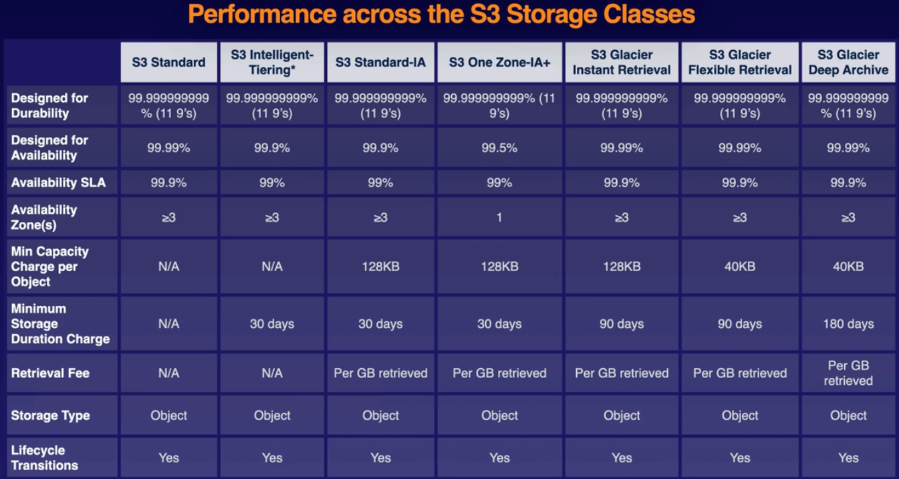

# Chapter 5. Simple Storage Service (S3)

<!-- TOC -->

- [Chapter 5. Simple Storage Service S3](#chapter-5-simple-storage-service-s3)
  - [S3 Overview](#s3-overview)
    - [Key-Value Store](#key-value-store)
    - [S3 Standard](#s3-standard)
    - [Tiered Storage](#tiered-storage)
    - [Securing Your Data](#securing-your-data)
  - [Securing Your Bucket with S3 Block Public Access](#securing-your-bucket-with-s3-block-public-access)
    - [Object ACLs vs Bucket Policies](#object-acls-vs-bucket-policies)
  - [Hosting a Static Website Using S3](#hosting-a-static-website-using-s3)
  - [Versioning Objects in S3](#versioning-objects-in-s3)
  - [S3 Storage Classes](#s3-storage-classes)
    - [S3 Standard](#s3-standard)
    - [S3 Standard-Infrequent Access S3 Standard-IA](#s3-standard-infrequent-access-s3-standard-ia)
    - [S3 One Zone-Infrequent Access](#s3-one-zone-infrequent-access)
    - [S3 Intelligent Tiering](#s3-intelligent-tiering)
    - [S3 Glacier](#s3-glacier)
    - [Glacier Instant Retrieval](#glacier-instant-retrieval)
    - [Glacier Flexible Retrieval](#glacier-flexible-retrieval)
    - [Glacier Deep Archive](#glacier-deep-archive)
  - [Lifecycle Management with S3](#lifecycle-management-with-s3)
  - [S3 Object Lock and Glacier Vault Lock](#s3-object-lock-and-glacier-vault-lock)
  - [Encrypting S3 Objects](#encrypting-s3-objects)
  - [Optimizing S3 Performance](#optimizing-s3-performance)
  - [Backing up Data with S3 Replication](#backing-up-data-with-s3-replication)
  - [Lab Exercises](#lab-exercises)
    - [Lab 5.1.](#lab-51)

<!-- /TOC -->

---
## S3 Overview

* Unlimited storage of objects up to 5 TB in size
  - Key-value store
* Universal namespace (all AWS accounts share the S3 namespace)
  - Example S3 URL: https://BUCKET.s3.REGION.amazonaws.com/
* When you upload a file to an S3 bucket, you will receive an `HTTP 200` code if the upload was successful
* Strong read-after-write consistency
  - Example: After a write of a new object (PUT), you can immediately perform a read request on the latest version of the object

### Key-Value Store

* Key: name of the object
  - Example: `ralph.jpg`
* Value: the data itself
* Version ID: important for storing multiple versions of the same object
* Metadata: Data about the data you are storing
  - Example: `content-type`, `last-modified`, etc

### S3 Standard

* Data is spread across multiple devices and facilities to ensure availablity and durability
  - At least 3 different availability zones (AZs)
  - Built for service availability of 99.95% to 99.99% depending on the S3 tier
  - Designed for 99.999999999% (9 decimal places) durability for data stored in S3

### Tiered Storage

* S3 offers a range of storage classes designed for different use cases
* Lifecycle management: define rules to automatically transition objects to a cheaper storage tier or delete objects
* Versioning: all versions of an object are stored and can be retrieved, including deleted objects

### Securing Your Data

* Server-Side Encryption: set a default encryption on a bucket to encrypt all new objects when they are stored
* Access Control Lists (ACLs): define which AWS accounts or groups are granted access and the type of access
* Bucket Policies: specify what actions are allowed or denied

> Note: Use ACLs for granular access permissions on individual objects

## Securing Your Bucket with S3 Block Public Access

### Object ACLs vs Bucket Policies

* Object ACLs work on an individual *object* level
* Bucket policies work on an entire *bucket* level
* Buckets are private by default (you have to either enable object ACLs or bucket policies in order to make the bucket and its objects public)

## Hosting a Static Website Using S3

You can use S3 to host static websites, such as `.html`sites. However, dynamic websites, such as those that require database connections, cannot be hosted on S3.

* S3 scales automatically to meet demand, e.g. a large number of requests

S3PublicPolicy:

```json
{
  "Version": "2012-10-17",
  "Statement": [
    {
      "Sid": "PublicReadGetObject",
      "Effect": "Allow",
      "Principal": "*",
      "Action": [
        "s3:GetObject",
      ],
      "Resource": [
        "arn:aws:s3:::BUCKET_NAME/*"
      ]
    }
  ]
}
```

`index.html`:

```html
<html>
	<title>
		<head>Hello Cloud Gurus</head>
	</title>
	<body>
		<div align="center">
			<h1>Hello Cloud Gurus!</h1>
			
		</div>
	</body>
</html>
```

`error.html`:

```html
<html>
	<title>
		<head>Error Cloud Gurus</head>
	</title>
	<body>
		<div align="center">
			<h1>Sorry Cloud Gurus, there has been an error!</h1>
			
		</div>
	</body>
</html>
```

## Versioning Objects in S3

You can enable versioning in S3 so you can have multiple versions of an object within S3.

Advantages of versioning:

* All versions of an object are stored in S3. This includes all writes and even if you delete an object.
  - Older versions of an object are private by default, even if you have a bucket policy that enables all objects to be public.
  - Older versions of an object can be made public individually.
* Can be a great backup tool.
* Once enabled, versioning cannot be disabled (only suspended).
* Can be integrated with lifecycle rules.
* Can support MFA, e.g. if you delete an object.
* Once you delete an object, it becomes a hidden object (delete marker).
  - You can restore an object by deleting its delete marker.

## S3 Storage Classes

> Exam Tip: You need to know what S3 storage classes are used for different scenarios


### S3 Standard

* High Availability and Durability
  - Data is stored redundantly across multiple devices in multiple facilities (>=3 AZs)
  - 99.99% availability
  - 99.999999999% durability (nine decimal places)
* Designed for frequent access
* Suitable for most workloads
  - Default storage class
  - Use cases include websites, content distribution, mobile and gaming applications, and big data analytics, e.g. multimedia files



### S3 Standard-Infrequent Access (S3 Standard-IA)

* High Availability and Durability
  - Data is stored redundantly across multiple devices in multiple facilities (>=3 AZs)
  - 99.99% availability
  - 99.999999999% durability (nine decimal places)
* Designed for less frequent access but requires rapid access when needed
* You pay to access the data
  - There is a low per-GB storage price and a per-GB retrieval fee
* Use cases include long-term storage, backups, and as a data store for disaster recovery files

### S3 One Zone-Infrequent Access

* 99.5% availability and 99.999999999% durability (nine decimal places)
* Like S3 Standard-IA, but data is stored redundantly within a single AZ
* Costs 20% less than S3 Standard-IA
* Use cases include non-critical, long-lived, infrequently accessed data

### S3 Intelligent Tiering

* High Availability and Durability
  - Data is stored redundantly across multiple devices in multiple facilities (>=3 AZs)
  - 99.99% availability
  - 99.999999999% durability (nine decimal places)
* Automatically moves your data to the most cost-effective tier based on how frequently you access each object
* Optimization cost
  - Monthly fee of $0.0025 per 1,000 objects


### S3 Glacier

* High Availability and Durability
  - Data is stored redundantly across multiple devices in multiple facilities (>=3 AZs)
  - 99.99% availability
  - 99.999999999% durability (nine decimal places)
* Really cheap storage
* Use for archive data
* You pay each time you access your data
* Optimized for data that is very infrequently accessed


### Glacier Instant Retrieval

* Provides long-term data archiving with instant retrieval time for your data

### Glacier Flexible Retrieval

* Provides long-term data archiving that does not require instant retrieval, can be up to 12 hours.
  - Use cases include backup or disaster recovery

### Glacier Deep Archive

* Use cases include data sets for regulatory compliance that are retained for 7 years or longer
* Cheapest storage class
* Retrieval time can be up to 48 hours

## Lifecycle Management with S3

Lifecycle management automates moving your objects between the different storage tiers, thereby minimizing cost. It can be applied to current and previous version of objects.

For example:
* Keep for 30 days in S3 Standard
* After 30 days without access, move to S3 Standard-IA
* After 90 days without access, move to Glacier
  - Glacier Deep Archive requires a minimum of 180 days without access

## S3 Object Lock and Glacier Vault Lock

## Encrypting S3 Objects

## Optimizing S3 Performance

## Backing up Data with S3 Replication

---
## Lab Exercises

### Lab 5.1.