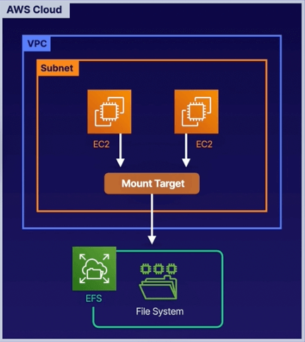

# Chapter 7. Elastic Block Storage (EBS) and Elastic File System (EFS)

<!-- TOC -->

- [Chapter 7. Elastic Block Storage EBS and Elastic File System EFS](#chapter-7-elastic-block-storage-ebs-and-elastic-file-system-efs)
  - [EBS Overview](#ebs-overview)
    - [Solid-State Drives SSD](#solid-state-drives-ssd)
    - [Hard Disk Drive HDD](#hard-disk-drive-hdd)
    - [IOPS vs. Throughput](#iops-vs-throughput)
    - [Exam Tips](#exam-tips)
  - [Volumes and Snapshots](#volumes-and-snapshots)
    - [Tips for Volumes](#tips-for-volumes)
    - [Tips for Snapshots](#tips-for-snapshots)
    - [Exam Tips](#exam-tips)
  - [Protecting EBS Volumes with Encryption](#protecting-ebs-volumes-with-encryption)
    - [Understanding Encryption](#understanding-encryption)
    - [EBS Encryption](#ebs-encryption)
    - [Exam Tips](#exam-tips)
  - [EC2 Hibernation](#ec2-hibernation)
    - [Exam Tips](#exam-tips)
  - [EFS Overview](#efs-overview)
    - [Controlling Performance](#controlling-performance)
    - [Storage Tiers](#storage-tiers)
    - [Exam Tips](#exam-tips)
  - [FSx Overview](#fsx-overview)
    - [FSx for Windows vs. EFS](#fsx-for-windows-vs-efs)
    - [FSx for Lustre](#fsx-for-lustre)
    - [Exam Tips](#exam-tips)
  - [Amazon Machine Images: EBS vs. Instance Store](#amazon-machine-images-ebs-vs-instance-store)
    - [Amazon EBS vs Instance Store](#amazon-ebs-vs-instance-store)
    - [Instance Store Volumes](#instance-store-volumes)
    - [EBS Volumes](#ebs-volumes)
    - [Exam Tips](#exam-tips)
  - [AWS Backup](#aws-backup)

<!-- /TOC -->

---
## EBS Overview

There are different use cases for each type of Elastic Block Storage (EBS), which are storage volumes or virtual hard disk that you can attach to your EC2.

* Production workloads: Designed for mission-critical workloads

* Highly available: Automatically replicated within a single AZ to protect against hardware failures

* Scalable: Dynamically increase capacity and change the volume type with no downtime or performance impact to your live systems

EBS Volume Types:

### Solid-State Drives (SSD)

* General Purpose SSD (`gp2`): 
  - 3 IOPS per GiB, up to a max of 16,000 IOPS per volume
  - `gp2` volumes smaller than 1 TB can burst up to 3,000 IOPS
  - Good for boot volumes or development and test applications that are not latency sensitive
  - Up to 99.9% durability

* General Purpose SSD (`gp3`):
  - Predictable 3,000 IOPS baseline performance and 125 MiB/s regardless of volume size
  - Ideal for application that require high performance at a low cost, such as MySQL, Cassandra, virtual desktops, and Hadoop analystics
  - Customers looking for higher performance can scale up to 16,000 IOPS and 1,000 MiB/s for an additional fee
  - The top performance of `gp3` is four times faster than max throughput of `gp2` volumes
  - Up to 99.9% durability

> Exam Tip: You are not required to memorize IOPS or throughput metrics, nor be given a scenario where you need to choose between `gp2` or `gp3`. However, always choose `gp3` because it's faster.

* Provisioned IOPS SSD (`io1`):
  - Up to 64,000 IOPS per volume, 50 IOPS per GiB
  - Use if you need more than 16,000 IOPS
  - Designed for I/O-intensive applications, large databases, and latency-sensitive workloads
  - Up to 99.9% durability

* Provisioned IOS SSD (`io2`):
  - Latest generation higher durability and more IOPS than `io1`, but at the same price
  - 500 IOPS per GiB, up to 64,000 IOPS per volume
  - 99.999% durability, instead of up to 99.9%
  - I/O-intensive apps, large databases, and latency-sensitive workloads

### Hard Disk Drive (HDD)

* Throughput Optimized HDD (`st1`):
  - Low-cost HDD volume
  - Baseline throughput of 40 MB/s per TB
  - Ability to burst up to 250 MB/s per TB
  - Maximum throughput of 500 MB/s per volume
  - Frequently accessed, throughput-intensive workloads
  - Big data, data warehouses, ETL, and log processing
  - A cost-effective way to store mountains of data
  - Cannot be a boot volume
  - Up to 99.9% durability

* Cold HDD (`sc1`):
  - Lowest cost HDD option
  - Baseline throughput of 12 MB/s per TB
  - Ability to burst up to 80 MB/s per TB
  - Maximum throughput of 250 MB/s per volume
  - A good choice for colder data requiring fewer scans per day
  - Good for applications that need the lowest cost and performance is not a factor
  - Cannot be a boot volume
  - Up to 99.9% durability

### IOPS vs. Throughput

IOPS:
- Measures the number of read and write operations per second
- Important metric for quick transactions, low-latency apps, transactional workloads
- The ability to action reads and writes very quickly
- Choose Provisioned IOPS SSD (`io1` or `io2`)

Throughput:
- Measures the number of bits read or written per second (MB/s)
- Important metric for large datasets, large I/O sizes, complex queries
- The ability to deal with large datasets
- Choose Throughput Optimized HDD (`st1`)

### Exam Tips

* Boot disk for OS choose `gp3` (we won't be given a choice of choosing `gp2`)

* Low-latency disk for transactional apps choose `io2` (we won't be given a choice of choosing `io1`)

* If you need more than 16,000 IOPS per volume choose `io2` over `gp3`

* If you need the lowest cost EBS choose `sc1`

---
## Volumes and Snapshots

Volumes are simply virtual hard disks that exist on EBS. You need a minimum of one volume per EC2 instance (called the root device volume).

Snapshots are a point-in-time copy of a volume that exist on S3. Snapshots are incremental and only the data that has been changed since your last snapshot are moved to S3.

The first snapshot may take some time to create as there is no previous point-in-time copy. However, subsequent snapshots are quicker as it is smaller in space.

### Tips for Volumes

* Location: EBS volumes will always be in the same AZ as the EC2 instance to which it is attached.

* Resizing: You can resize volumes on-the-fly, without stopping or restarting the instance. However, you will need to extend the filesystem in the OS so the OS can see the resized volume.

* Volume Type: You can change volume types on-the-fly, e.g. from `gp2` to `io2`, without stopping or restarting the instance.

### Tips for Snapshots

* Consistent snapshots: It is recommended you stop the instance and take a snap as snapshots only capture data that has been written to your EBS volume, which might exclude any data that has been locally cached by your application or OS. 

* Encrypted snapshots: If you take a snapshot of an encrypted EBS volume, the snapshot will be encrypted automatically.

* Sharing snapshots: You can share snapshots but only in the region in which they were created. To share to other regions, you will need to copy them to the destination region first.

### Exam Tips

To move an EC2 to another region:
1. Copy snapshot from source region to target region.
2. In the target region, create an image from the copied snapshot.

---
## Protecting EBS Volumes with Encryption

EBS encrypts volumes with a data key using the industry-standard AES-256 algorithm. It uses AWS KMS customer master keys (CMKs) when creating encrypted volumes and snapshots.

### Understanding Encryption

* Data at rest is encrypted inside the volumes and snapshots.

* All data in flight moving between the instance and the volume is encrypted.

* All snapshots created from volumes are encrypted

* All volumes created from snapshots are encryped.

### EBS Encryption

* Handled transparently: Encryption and decryption are handled transparently.

* Latency: Encryption has minimal impact on latency.

* Copying: Copying an unencrypted snapshot allows encryption.

* Snapshots: Snapshots of encrypted volumes are encrypted.

* Root Device Volume: You can encrypt root device volumes upon creation.

### Exam Tips

Steps to encrypt an unencrypted volume attached to an instance:

1. Create a snapshot of the unencrypted root device volume.

2. Create a copy of the snapshot and select the encrypt option.

3. Create an AMI from the encrypted snapshot.

4. Use that AMI to launch a new instance with an encrypted root device volume.

---
## EC2 Hibernation

We have learned so far we can stop and terminate EC2 instances. If we stop the instance, the data is kept on the disk (with EBS) and will remain on the disk until the instance is started.

If the instance is terminated, then by default the root device volume will also be terminated.

When you hibernate an EC2 instance, the OS is told to perform hibernation (suspend-to-disk), which saves the contents from the instance memory (RAM) to your EBS root volume. We persist the EBS root volume and any attached EBS data volumes.

When you start your instance out of hibernation:
1. The EBS root volume is restored to its previous state.
2. The RAM contents are reloaded.
3. The processes that are previously running on the instance are resumed.
4. Previously attached data volumes are reattached and the instance retains its instance ID.

With EC2 hibernation, the instance boot much faster as the OS does not need to reboot because the RAM is preserved. This is useful for:

* Long-running processes

* Services that take time to initialize

### Exam Tips

* EC2 hibernation preserves the in-memory RAM on persistant storage (EBS).

* Much faster to boot up because you don't need to reload the OS.

* Instance RAM must be less than (<) 150 GB.

* Instance families include C(3-5), M(3-5), and R(3-5).

* Available for Windows, Amazon Linux 2 AMI, and Ubuntu.

* Instances cannot be hibernated for more than 60 days.

* Available for both On-Demand and Reserved Instances.

---
## EFS Overview

Amazon Elastic File System (EFS) is a managed Network File System (NFS) that can be mounted on many EC2 instances, in multiple AZs. EFS is highly available and scalable, however, it is expensive.

Use cases:

* Content Management: You can easily share content between instances

* Web Server: Have just a single folder structure for your web site

Understanding EFS:

* Uses NFSv4 protocol
* Compatible with Linux-based AMI (Windows not supported at this time)
* Encryption at rest using KMS
* File system scales automatically; no need for capacity 
* Pay per use

EFS Performance:

* Can support thousands of concurrent connections (EC2 instances)
* Can handle up to 10 Gbps in throughput
* Scal your storage to petabytes

### Controlling Performance

When creating an EFS, you can set what performance characteristics you want:

* General purpose: Used for things like web servers, CMS, etc.

* Max I/O: Used for big data, media processing, etc.

### Storage Tiers

EFS comes with storage tiers and lifecycle management, allowing you to move your data from one tier to another after X number of days.

* Standard: For frequently accessed files
* Infrequently Accessed: For files not frequently accessed

### Exam Tips

* Supports the Network File System version 4 (NFSv4) protocol

* Only pay for the storage you use (no pre-provisioning required)

* Can scale up to petabytes

* Can support thousands of concurrent NFS connections

* Data is stored redundantly across multiple AZs within a region

* Read-after-write consistency

* If you have a scenario-based question around highly scalable storage using NFS, think EFS

---
## FSx Overview

Amazon FSx for Windows File Server provides a fully managed native Microsoft Windows file system so you can easily move Windows-based applications that require file storage to AWS. FSx is built on Windows Server.

### FSx for Windows vs. EFS

FSx for Windows:

* A managed Windows Server that runs Windows Server Message Block (SMB)-based file services
* Designed for Windows and Windows applications
* Supports Active Domain (AD) users, access control lists, groups, and security policies, along with Distributed File System (DFS) namespaces and replication

EFS:

* A managed NAS filer for EC2 instances based on Network File System (NFS) version 4
* One of the first network file sharing protocols native to Unix and Linux

### FSx for Lustre

A fully managed file system that is optimized for compute-intensive workloads, such as High Performance Computing (HPC), Machine Learning (ML), Media Data Processing Workflows (MDPW), Electronic Design Automation (EDA).

### Exam Tips

* EFS: When you need distributed, highly resilient storage for Linux instances and Linux-based applications.

* FSx for Windows: When you need centralized storage for Windows-based applications, such as SharePoint, Microsoft SQL Server, Workspaces, IIS Web Server, Active Directory, or any other native Microsoft application 

* FSx for Lustre: When you need high-speed, high-capacity distributed storage. This will be for applications that do high processing massive datasets, or up to hundreds of Gbps of throughput, millions of IOPS, or sub-millisecond latencies. Remember that FSx for Lustre can store data directly on S3.

---
## Amazon Machine Images: EBS vs. Instance Store

An Amazon Machine Image (AMI) provides the information required to launch an instance. You must specify an AMI when you launch an instance.

Five things that you can base your AMI on:
* Region
* OS
* Architecture (32-bit or 64-bit)
* Launch permissions
* Storage for the root device (root device volume)

### Amazon EBS vs Instance Store

* Amazon EBS: The root device for an instance launched from the AMI is an Amazon EBS volume created from an Amazon EBS snapshot.

* Instance Store: The root device for an instance launched from the AMI is an instance store volume created from a template stored in Amazon S3.

### Instance Store Volumes

Instance store volumes are sometimes called ephemeral storage. Instance store volumes cannot be stopped.

If the underlying host fails, you will lose your data. You can, however, reboot the instance without losing your data.

If you delete the instance, you will lose the instance store volume.

### EBS Volumes

EBS-backed instances can be stopped. You will not lose the data on this instance if it is stopped.

You can also reboot an EBS volume and not lose your data. By default, the root device volume will be deleted on termination.

However, you can tell AWS to keep the root device volume with EBS volumes.

### Exam Tips

* Instance store volumes are sometimes called ephemeral storage.

* Instance store volumes CANNOT be stopped. If the underlying host fails, you will lose your data.

* EBS-backed instances can be stopped. You will not lose data on this instance if it is stopped.

* You can reboot both EBS and instance store volumes and you will not lose your data.

* By default, both root volumes will be deleted on termination. However, with EBS volumes, you can tell AWS to keep the root device volume before launch an instance.

* An AMI is just a blueprint for an EC2 instance.

---
## AWS Backup

AWS Backup allows you to consolidate your backups across multiple AWS services, such as EC2, EBS, EFS, Amazon FSx for Lustre, Amazon FSx for Windows, and AWS Storage Gateway. It can include other services, such as databases like RDS and DynamoDB.

Backups can be used with AWS Organizations to back up multiple AWS accounts in your organization. It gives you centralized control across all AWS services, in multiple AWS accounts across the entire AWS organization.

Benefits of AWS Backup:

* Central Management: Use a single, central backup console, allowing you to centralize your backups across multiple AWS services and multiple AWS accounts.

* Automation: You can create automated backup schedules and retention policies. You can also create lifecycle policies, allowing you to expire unnecessary backups after a period of time.

* Improved Compliance: Backup policies can be enforced while backups can be encrypted both at rest and in transit, allowing alignment to regulatory compliance. Auditing is made easy due to a consolidated view of backups across many AWS services.
