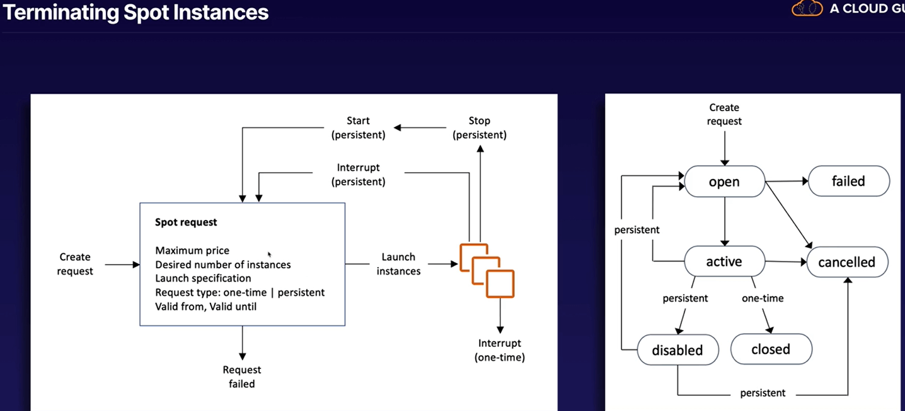

# Chapter 6. Elastic Compute Cloud (EC2)

<!-- TOC -->

- [Chapter 6. Elastic Compute Cloud EC2](#chapter-6-elastic-compute-cloud-ec2)
  - [EC2 Overview](#ec2-overview)
    - [EC2 Pricing Options](#ec2-pricing-options)
      - [On-Demand Instances](#on-demand-instances)
      - [Reserved Instances](#reserved-instances)
      - [When to Use Spot Instances](#when-to-use-spot-instances)
      - [Dedicated Hosts](#dedicated-hosts)
  - [Using Roles](#using-roles)
  - [Security Groups and Bootstrap Scripts](#security-groups-and-bootstrap-scripts)
    - [Exam Tips](#exam-tips)
  - [EC2 Metadata and User Data](#ec2-metadata-and-user-data)
  - [Networking with EC2](#networking-with-ec2)
    - [Elastic Network Interface ENI](#elastic-network-interface-eni)
    - [Enhanced Networking EN](#enhanced-networking-en)
    - [Elastic Fabric Adapter EFA](#elastic-fabric-adapter-efa)
    - [Exam Tips](#exam-tips)
  - [Optimizing with EC2 Placement Groups](#optimizing-with-ec2-placement-groups)
    - [Exam Tips](#exam-tips)
  - [Solving Licensing Issues with Dedicated Hosts](#solving-licensing-issues-with-dedicated-hosts)
    - [Exam Tips](#exam-tips)
  - [Timing Workloads with Spot Instances and Spot Fleets](#timing-workloads-with-spot-instances-and-spot-fleets)
    - [Spot Prices](#spot-prices)
    - [Spot Blocks](#spot-blocks)
    - [How to Terminate Spot Instances](#how-to-terminate-spot-instances)
    - [Spot Fleets](#spot-fleets)
    - [Launch Pools](#launch-pools)
    - [Strategies](#strategies)
    - [Exam Tips](#exam-tips)
  - [Lab 6.1. EC2 Instance Bootstrapping](#lab-61-ec2-instance-bootstrapping)
    - [Use a Bootstrap Script User Data to Build webserver](#use-a-bootstrap-script-user-data-to-build-webserver)
  - [Lab 6.2. Using EC2 Roles and Instance Profiles in AWS](#lab-62-using-ec2-roles-and-instance-profiles-in-aws)
    - [Introduction](#introduction)
    - [Log in to a Bastion Host and Configure AWS CLI](#log-in-to-a-bastion-host-and-configure-aws-cli)
    - [Create IAM Trust Policy for an EC2 Role](#create-iam-trust-policy-for-an-ec2-role)
    - [Create the DEV_ROLE IAM Role](#create-the-dev_role-iam-role)
    - [Create an IAM Policy Defining Read-Only Access Permissions to an S3 Bucket](#create-an-iam-policy-defining-read-only-access-permissions-to-an-s3-bucket)
    - [Create Instance Profile and Attach Role to an EC2 Instance](#create-instance-profile-and-attach-role-to-an-ec2-instance)
    - [Test S3 Permissions via the AWS CLI](#test-s3-permissions-via-the-aws-cli)

<!-- /TOC -->

---
## EC2 Overview

### EC2 Pricing Options

1. On-Demand Instances: Pay by the hour or the second, depending on the type of instance you run

2. Reserved Instances: Contract for 1 or 3 years, up to 72% discount (longer period and higher upfront payment, a higher discount)

3. Spot Instances: Purchase unused capacity, up to 90% discount (prices fluctuate based on supply and demand)

4. Dedicated Host: Physical server for your use, most expensive option

> Exam Tip: For each scenario, what is the best EC2 pricing option?

#### On-Demand Instances

* Flexible: Low cost and flexibility of instances without any upfront payment or long-term contract
* Short-Term: Applications with short-term, spiky, or unpredictable workloads that cannot be interrupted
* Testing the Water: Applications being developed or tested on instances for the first time

#### Reserved Instances

* Regional Level: Reserved instances operate at a regional level

* Predictable Usage: Applications with steady state or predictable usage

* Specific Capacity Requirements: Applications that require reserved capacity

* Pay up Front: You can make upfront payments to reduce the total computing coss even further

* Standard Reserved Instances: Up to 72% off the on-demand price (highest discount if paid in full upfront with a 3-year contract)

* Convertible Reserved Instances: Up to 54% off the on-demand price (has the option to change to a different Reserved Instance type of equal or greater value)

* Scheduled Reserved Instances: Launch within the time window you define. Match your capacity reservation to a predictable recurring schedule that only requires a fraction of a day, week, or month.

* Super Flexible: Not only EC2, but this includes serverless like Lambda and Fargate as well

#### When to Use Spot Instances

* Flexible: Applications that have flexible start and end times, i.e. you should not use Spot instances for a 24/7 web server

* Urgent Capacity: Urgent need for large amount of additional computing capacity, e.g. image rendering, algo trading

* Cost Sensitive: Applications that are only feasible at very low compute prices, e.g. batch jobs executed during non-working hours

#### Dedicated Hosts

* Compliance: Regulatory requirements that may not support multi-tenant virtualization

* Licensing: Licensing that does not support multi-tenancy or cloud deployments

* On-Demand Host: Can be purchased on-demand (hourly)

* Reserved Host: Can be purchased as a Reserved Host, up to 70% off the on-demand price

## Using Roles

A role is an identity you can create in IAM that has specific permissions. A role is similar to a user, as it is an AWS identity with permission policies.

However, instead of being uniquely associated with one person, a role is intended to be assumable by anyone who needs it. Roles can be assumed by people, AWS architecture, or other system-level accounts.

A role does not have standard long-term credentials the same way as passwords or access keys do. Instead, when you assume a role, it provides you with temporary security credentials for your role session.

Roles can allow cross-account access. This allows one AWS account the ability to interact with resources in other AWS accounts.

Roles are preferred from a security perspective. Roles allow you to provide access without the use of access key IDs and secret access keys.

## Security Groups and Bootstrap Scripts

Security groups are virtual firewalls for your EC2 instance. By default, everything is blocked.

In order to be able to communicate to you EC2 instances via SSH/RDP/HTTP/HTTPS, you will need to open up the correct ports.

Bootstrap script, also called User Data, is a script that runs when the instance first runs. Adding tasks at boot time adds to the amount of time it takes to boot the instance. However, it allows you to automate the installation of applications.

### Exam Tips

* Changes to security groups take effect immediately.
* You can have any number of EC2 instances within a security group.
* You can have multiple security groups attached to EC2 instances.
* All inbound traffic is blocked by default.
* All outbound traffic is allowed.

## EC2 Metadata and User Data

EC2 metadata is simply data about your EC2 instance, such as private IP address, hostname, security groups, etc.

Using the `curl` command, we can retrieve and save our instance metadata during the bootstrapping. For example:

```sh
#!/bin/bash
yum update -y
yum install httpd -y
service httpd start
cd /var/www/html
echo "<html><body><h1>My IP is" > index.html
curl http://169.254.169.254/latest/meta-data/public-ipv4 >> index.html
echo "</h1></body></html>" >> index.html
```

> Note: The `169.254.169.254` IP address is a *magic* IP in AWS that is used to retrieve instance metadata. It can only be accessed locally from instances and available without encryption or authentication.

Using `curl` to retrieve the user data and instance metadata, when connected to an EC2 instance:

```sh
curl http://169.254.169.254/latest/meta-data/
ami-id
ami-launch-index
ami-manifest-path
block-device-mapping/
hostname
iam/
instance-action
instance-id
instance-type
local-hostname
local-ipv4
mac
metrics/
network/
placement/
profile
public-hostname
public-ipv4
public-keys/
reservation-id
security-groups
services/
```

## Networking with EC2

You can attach three different types of virtual networking cards to your instances.

* Elastic Network Interface (ENI): For basic, day-to-day networking

* Enhanced Networking (EN): Uses single root I/O virtualization (SR-IOV) to provide high performance

* Elastic Fabric Adapter (EFA): Accelerates High Performance Computing (HPC) and machine learning applications

### Elastic Network Interface (ENI)

ENI is simply a virtual network card that allows:
* Private IPv4 address
* Public IPv4 address
* Many IPv6 addresses
* MAC address
* One or more security groups

Common ENI use cases:
* Create a management network
* Use network and security appliances in your VPC
* Create dual-homed instances with workloads/roles on distinct subnets
* Create a low-budget, high-availability solution
* Default networking for a new instance

### Enhanced Networking (EN)

EN allows for high-performance networking between 10 Gbps and 100 Gbps:
* SR-IOV provides higher I/O performance and lower CPU utilization
* Provides higher bandwidth, higher packet per second (PPS) performance, and consistently lower inter-instance latencies

Depending on your instance type, EN can be enabled using:

* Elastic Network Adapter (ENA): Supports network speeds of up to 100 Gbps

* Intel 82599 Virtual Function (VF) Interface: Supports network speeds of up to 10 Gbps (typically used on older instances)

> Exam tip: Choose ENA over VF interface.

### Elastic Fabric Adapter (EFA)

EFA is a network device that allows:
* attach to your instance to accelerate High Performance Computing (HPC) and machine learning applications
* provides lower and more consistent latency and higher throughput than the TCP transport traditionally used in cloud-based HPC systems
* can use OS-bypass, with much lower latency, enables HPC and machine learning applications to bypass operating system kernel and communicate directly with the EFA device (currently supported on Linux only)

### Exam Tips

For different scenarios on the exam, choose the correct networking device.

* ENI: For basic networking. Perhaps you need a separate management network from your production network or a separate logging network, and you need to do this at a low cost. In this scenario, use multiple ENIs for each network.

* EN: For when you need speeds between 10 Gbps and 100 Gbps. Anywhere you need reliable, high throughput.

* EFA: For when you need to accelerate HPC and machine learning applications or if you need to do an OS-bypass. If you see a scenario question mentioning HPC or ML and asking what network adapter you want, choose EFA.

## Optimizing with EC2 Placement Groups

The three types of EC2 placement groups are:

* Cluster: Grouping of instances within a single AZ. Recommended for applications that need low network latency, high network throughput, or both (applies only to certain type of instances).

* Spread: Group of instances that are each placed on distinct underlying hardware. Recommended for applications that have a small number of critical instances that should be kept separate from each other.

* Partition: A logical segment that has its own set of racks. Each rack has its own network and power source. No two partitions within a placement group share the same racks, allowing you to isolate the impact of hardware failure within your application.

### Exam Tips

Three types of placement groups:

* Cluster Placement Groups: Low network latency, high network throughput

* Spread Placement Groups: Individual critical EC2 instances

* Partition Placement Groups: Multiple EC2 instances; HDFS, HBase, and Cassandra

Properties of placement groups:

* A cluster placement group cannot span multiple AZs, whereas both spread and partition groups can.

* Only certain types of instances can be launced in a placement group (compute optimized, GPU, memory optimized, storage optimized).

* AWS recommends homogenous instances within cluster placement groups.

* You cannot merge placement groups.

* You can move an existing instance into a placement group. Before you move the instance, the instance must be stopped. You can move or remove it using AWS CLI or AWS SDK, but not via the console yet.

## Solving Licensing Issues with Dedicated Hosts

Use cases for Dedicated Hosts:

* Compliance: Regulatory requirements that may not support multi-tenant virtualization

* Licensing: Licensing that does not support multi-tenancy or cloud deployments

Types of Dedicated Hosts:
* Can be purchased on-demand (hourly)
* Can be purchased as a reservation for up to 70% off the on-demand price

### Exam Tips

Any question that talks about special licensing requirements, consider Dedicated Hosts.

An EC2 Dedicated Host is a physical server with EC2 instance capacity fully dedicated to your use. Dedicated Hosts allow you to use your existing per-socket, per-core, or per-VM software licenses, including Windows Server, Microsoft SQL Server, and SUSE Linux Enterprise Server.

## Timing Workloads with Spot Instances and Spot Fleets

AWS EC2 spot instances let you take advantage of unused EC2 capacity in the AWS Cloud. Spot instances are available up to a 90% discount compared to On-Demand prices.

When to use spot instances:
* Stateless, fault-tolerant, or flexible applications
* Examples: big data, containerized workloads, CI/CD, high-performance computing (HPC), image and media rendering, and other test and development workloads.

When NOT to use spot instances:
* Persistent workloads, critical jobs, or databases

### Spot Prices

You must first decide on your maximum spot price. The instance will be provisioned so long as the spot price is **BELOW** your maximum spot price. 

The hourly spot price varies depending on capacity and region. You can view pricing history in the console to determine which region has the cheapest spot prices.

If the spot price goes above your maximum, you have *two minutes* to choose whether to stop or terminate your instances.

### Spot Blocks

You may use a spot block to stop your instances from being terminated even if the spot price goes over your maximum spot price. You can set spot blocks for between 1 and 6 hours currently.

### How to Terminate Spot Instances

First terminate your spot request, then navigate to your EC2 and terminate each instance individually.



### Spot Fleets

A spot fleet is a collection of spot instances and (optionally) on-demand instances. The spot fleet attempts to launch the number of instances to meet the target capacity you specified in the spot request.

The request for spot instances is fulfilled if there is available capacity and the maximum spot price you specified in the request exceeds the current spot price. The spot fleet also attempts to maintain its target capacity fleet if your spot instances are interrupted.

### Launch Pools

Set up different launch pools:
* Define things like EC2 instance type, operating system, and AZ.
* You can have multiple pools, and the spot fleet will choose the best way to implement depending on the strategy you define.
* Spot fleets will stop launching instances once you reach your price threshold or capacity desire.

### Strategies

You can have the following strategies with spot fleets:

* `capacityOptimized`: The spot instances come from the pool with optimal capacity for the number of instances launching.

* `lowestPrice`: The spot instances come from the pool with the lowest price. This is the default strategy.

* `diversified`: The spot instances are distributed across all pools.

* `InstancePoolsToUseCount`: The spot instances are distributed across the number of spot instance pools you specify. This parameter is valid only when used in combination with `lowestPrice`.

### Exam Tips

* Spot instances can save up to 90% of the cost of On-Demand instances.

* Useful for any type of computing where you don't need persistent storage.

* You can block Spot instances from terminating by using a Spot block.

* A Spot Fleet is a collection of spot instances and (optionally) On-Demand instances.

---
## Lab 6.1. EC2 Instance Bootstrapping

### Use a Bootstrap Script (User Data) to Build webserver

1. In AWS Management Console, navigate to EC2 > Launch instances.

2. Enter the instance details:
  - Name: `webserver-02`
  - Application and OS: `Ubuntu`
  - AMI: `Ubuntu 20.04 LTS`
  - Instance Type: `t2.micro`
  - Key pair: `Proceed without a key pair`

3. Under Network settings, click Edit:
  - Auto-assign public IP: `Enable`
  - Firewall (security group): `Select existing security group`
  - Security group: `EC2SecurityGroup`

4. Under Advanced details, scroll down to User data, and paste the following bash script:

```sh
#!/bin/bash
sudo apt-get update -y
sudo apt-get install apache2 unzip -y
sudo systemctl enable apache2
curl "https://awscli.amazonaws.com/awscli-exe-linux-x86_64.zip" -o "awscliv2.zip"
unzip awscliv2.zip
sudo ./aws/install
echo '<html><h1>Bootstrap Demo</h1><h3>Availability Zone: ' > /var/www/html/index.html
curl http://169.254.169.254/latest/meta-data/placement/availability-zone >> /var/www/html/index.html
echo '</h3> <h3>Instance Id: ' >> /var/www/html/index.html
curl http://169.254.169.254/latest/meta-data/instance-id >> /var/www/html/index.html
echo '</h3> <h3>Public IP: ' >> /var/www/html/index.html
curl http://169.254.169.254/latest/meta-data/public-ipv4 >> /var/www/html/index.html
echo '</h3> <h3>Local IP: ' >> /var/www/html/index.html
curl http://169.254.169.254/latest/meta-data/local-ipv4 >> /var/www/html/index.html
echo '</h3></html> ' >> /var/www/html/index.html
sudo apt-get install mysql-server -y
sudo systemctl enable mysql
```

5. Click Launch instance.

6. Under EC2 instance details page, copy the public IP address and browse to the IP in a new tab.

---
## Lab 6.2. Using EC2 Roles and Instance Profiles in AWS

### Introduction

AWS IAM roles for EC2 provide the ability to grant instances temporary credentials. These temporary credentials can then be used by hosted applications to access permissions configured within the role.

IAM roles eliminate the need for managing credentials, help mitigate long-term security risks, and simplify permissions management.

### Log in to a Bastion Host and Configure AWS CLI

1. Navigate to EC2 > Instances. Connect to the Bastion Host instance.

2. In the EC2 terminal, run the command `aws configure`.
  - Press `Enter` twice to leave the AWS Access Key ID and AWS Secret Access Key blank.
  - Enter `us-east-1` as the default region name.
  - Enter `json` as the default output format.

### Create IAM Trust Policy for an EC2 Role

1. Create a file called `trust_policy_ec2.json` with `vi`.

2. Type `:set paste` and then `i` to enter Insert mode.

3. Paste in the following content:

```json
{
  "Version": "2012-10-17",
  "Statement": [
    {
      "Effect": "Allow",
      "Principal": {"Service": "ec2.amazonaws.com"},
      "Action": "sts:AssumeRole"
    }
  ]
}
```

4. Save and quit the file by pressing Escape followed by typing `:wq!`.

### Create the `DEV_ROLE` IAM Role

1. Run the following AWS CLI command:

```json
aws iam create-role --role-name DEV_ROLE --assume-role-policy-document file://trust_policy_ec2.json
{
    "Role": {
        "AssumeRolePolicyDocument": {
            "Version": "2012-10-17", 
            "Statement": [
                {
                    "Action": "sts:AssumeRole", 
                    "Effect": "Allow", 
                    "Principal": {
                        "Service": "ec2.amazonaws.com"
                    }
                }
            ]
        }, 
        "RoleId": "AROA3A4LG7SAY6PLIHGTS", 
        "CreateDate": "2022-08-22T09:11:41Z", 
        "RoleName": "DEV_ROLE", 
        "Path": "/", 
        "Arn": "arn:aws:iam::757816818817:role/DEV_ROLE"
    }
}
```

### Create an IAM Policy Defining Read-Only Access Permissions to an S3 Bucket

1. Create a file called `dev_s3_read_access.json` with `vi`. Paste in the following content:

```json
{
    "Version": "2012-10-17",
    "Statement": [
        {
          "Sid": "AllowUserToSeeBucketListInTheConsole",
          "Action": ["s3:ListAllMyBuckets", "s3:GetBucketLocation"],
          "Effect": "Allow",
          "Resource": ["arn:aws:s3:::*"]
        },
        {
            "Effect": "Allow",
            "Action": [
                "s3:Get*",
                "s3:List*"
            ],
            "Resource": [
                "arn:aws:s3:::<DEV_S3_BUCKET_NAME>/*",
                "arn:aws:s3:::<DEV_S3_BUCKET_NAME>"
            ]
        }
    ]
}
```

2. Create the managed policy called `DevS3ReadAccess`:

```json
aws iam create-policy --policy-name DevS3ReadAccess --policy-document file://dev_s3_read_access.json
{
    "Policy": {
        "PolicyName": "DevS3ReadAccess", 
        "PermissionsBoundaryUsageCount": 0, 
        "CreateDate": "2022-08-22T09:14:26Z", 
        "AttachmentCount": 0, 
        "IsAttachable": true, 
        "PolicyId": "ANPA3A4LG7SAUROBO3KCJ", 
        "DefaultVersionId": "v1", 
        "Path": "/", 
        "Arn": "arn:aws:iam::757816818817:policy/DevS3ReadAccess", 
        "UpdateDate": "2022-08-22T09:14:26Z"
    }
}
```

3. Copy the policy ARN, as we'll need it later.

### Create Instance Profile and Attach Role to an EC2 Instance

1. Attach the managed policy to the role, replacing `<POLICY_ARN>` with the ARN you just copied:

```sh
aws iam attach-role-policy --role-name DEV_ROLE --policy-arn "<POLICY_ARN>"
```

2. Verify the managed policy was attached:

```json
aws iam list-attached-role-policies --role-name DEV_ROLE
{
    "AttachedPolicies": [
        {
            "PolicyName": "DevS3ReadAccess", 
            "PolicyArn": "arn:aws:iam::757816818817:policy/DevS3ReadAccess"
        }
    ]
}
```

3. Create instance profile named `DEV_PROFILE`:

```json
aws iam create-instance-profile --instance-profile-name DEV_PROFILE
{
    "InstanceProfile": {
        "InstanceProfileId": "AIPA3A4LG7SAVCVTTHXR4", 
        "Roles": [], 
        "CreateDate": "2022-08-22T09:18:27Z", 
        "InstanceProfileName": "DEV_PROFILE", 
        "Path": "/", 
        "Arn": "arn:aws:iam::757816818817:instance-profile/DEV_PROFILE"
    }
}
```

4. Add role to the `DEV_PROFILE` called `DEV_ROLE`:

```sh
aws iam add-role-to-instance-profile --instance-profile-name DEV_PROFILE --role-name DEV_ROLE
```

5. Verify the configuration:

```json
aws iam get-instance-profile --instance-profile-name DEV_PROFILE
{
    "InstanceProfile": {
        "InstanceProfileId": "AIPA3A4LG7SAVCVTTHXR4", 
        "Roles": [
            {
                "AssumeRolePolicyDocument": {
                    "Version": "2012-10-17", 
                    "Statement": [
                        {
                            "Action": "sts:AssumeRole", 
                            "Effect": "Allow", 
                            "Principal": {
                                "Service": "ec2.amazonaws.com"
                            }
                        }
                    ]
                }, 
                "RoleId": "AROA3A4LG7SAY6PLIHGTS", 
                "CreateDate": "2022-08-22T09:11:41Z", 
                "RoleName": "DEV_ROLE", 
                "Path": "/", 
                "Arn": "arn:aws:iam::757816818817:role/DEV_ROLE"
            }
        ], 
        "CreateDate": "2022-08-22T09:18:27Z", 
        "InstanceProfileName": "DEV_PROFILE", 
        "Path": "/", 
        "Arn": "arn:aws:iam::757816818817:instance-profile/DEV_PROFILE"
    }
}
```

6. In the AWS console, navigate to EC2 > Instances. Copy the instance ID of the instance that you want to attach the `DEV_PROFILE` to, as we'll need it later.

7. In the terminal, replace `<INSTANCE_ID>` with the instance ID that you just copied:

```json
aws ec2 associate-iam-instance-profile --instance-id <INSTANCE_ID> --iam-instance-profile Name="DEV_PROFILE"
{
    "IamInstanceProfileAssociation": {
        "InstanceId": "i-001ed829bb9c53c9d", 
        "State": "associating", 
        "AssociationId": "iip-assoc-061fd65a7e73dce1c", 
        "IamInstanceProfile": {
            "Id": "AIPA3A4LG7SAVCVTTHXR4", 
            "Arn": "arn:aws:iam::757816818817:instance-profile/DEV_PROFILE"
        }
    }
}
```

8. Verify the configuration with the instance ID that you copied:

```json
aws ec2 describe-instances --instance-ids <INSTANCE_ID> | grep DEV_PROFILE
                        "Arn": "arn:aws:iam::757816818817:instance-profile/DEV_PROFILE"
```

### Test S3 Permissions via the AWS CLI

1. Navigate to EC2 > Instances. Connect to the your instance.

2. In the EC2 terminal, verify the instance is assuming the `DEV_ROLE` role:

```json
aws sts get-caller-identity
{
    "Account": "757816818817", 
    "UserId": "AROA3A4LG7SAY6PLIHGTS:i-001ed829bb9c53c9d", 
    "Arn": "arn:aws:sts::757816818817:assumed-role/DEV_ROLE/i-001ed829bb9c53c9d"
}
```