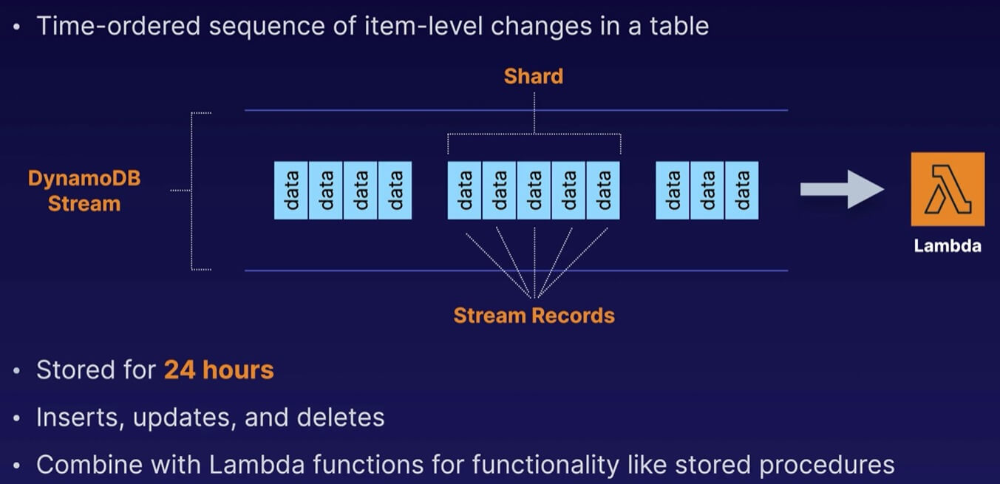

# Chapter 7. Databases

<!-- TOC -->

- [Chapter 7. Databases](#chapter-7-databases)
  - [RDS Overview](#rds-overview)
    - [OLTP vs. OLAP](#oltp-vs-olap)
    - [What is Multi-AZ?](#what-is-multi-az)
    - [Unplanned Failure or Maintenance](#unplanned-failure-or-maintenance)
  - [Increasing Read Performance with Read Replicas](#increasing-read-performance-with-read-replicas)
    - [Exam Tips](#exam-tips)
  - [What is Amazon Aurora?](#what-is-amazon-aurora)
    - [Basics](#basics)
    - [Aurora Replicas](#aurora-replicas)
    - [Aurora Serverless](#aurora-serverless)
  - [DynamoDB Overview](#dynamodb-overview)
    - [High-Level DynamoDB](#high-level-dynamodb)
    - [DynamoDB Accelerator DAX](#dynamodb-accelerator-dax)
    - [On-Demand Capacity](#on-demand-capacity)
    - [Security](#security)
  - [When Do We Use DynamoDB Transactions?](#when-do-we-use-dynamodb-transactions)
    - [ACID for Databases](#acid-for-databases)
    - [ACID with DynamoDB](#acid-with-dynamodb)
    - [Use Cases](#use-cases)
    - [Transactions](#transactions)
  - [Saving Your Data with DynamoDB Backups](#saving-your-data-with-dynamodb-backups)
    - [On-Demand Backup and Restore](#on-demand-backup-and-restore)
    - [Point-in-Time Recovery PITR](#point-in-time-recovery-pitr)
  - [Taking Your Data Global with DynamoDB Streams and Global Tables](#taking-your-data-global-with-dynamodb-streams-and-global-tables)
    - [DynamoDB Streams](#dynamodb-streams)
    - [Global Tables](#global-tables)
  - [Operating MongoDB-Compatible Databases in Amazon DocumentDB](#operating-mongodb-compatible-databases-in-amazon-documentdb)
    - [MongoDB](#mongodb)
    - [Amazon DocumentDB](#amazon-documentdb)
  - [Running Apache Cassandra Workloads with Amazon Keyspaces](#running-apache-cassandra-workloads-with-amazon-keyspaces)
    - [Amazon Keyspaces](#amazon-keyspaces)
  - [Implementing Graph Databases Using Amazon Neptune](#implementing-graph-databases-using-amazon-neptune)
    - [Amazon Neptune Use Cases](#amazon-neptune-use-cases)
  - [Leveraging Amazon Quantum Ledger Database QLDB for Ledger Databases](#leveraging-amazon-quantum-ledger-database-qldb-for-ledger-databases)
    - [Amazon Quantum Ledger Database QLDB Use Cases](#amazon-quantum-ledger-database-qldb-use-cases)
  - [Analyzing Time-Series Data with with Amazon Timestream](#analyzing-time-series-data-with-with-amazon-timestream)
    - [Amazon Timestream Use Cases](#amazon-timestream-use-cases)
  - [Lab 7. Set Up a WordPress Site Using EC2 and RDS](#lab-7-set-up-a-wordpress-site-using-ec2-and-rds)
    - [Introduction](#introduction)
    - [Runbooks](#runbooks)
      - [Create RDS Database](#create-rds-database)
      - [Install Apache and Dependencies](#install-apache-and-dependencies)
      - [Configure WordPress](#configure-wordpress)
      - [Modify Security Groups](#modify-security-groups)
      - [Complete Wordpress Installation and Test](#complete-wordpress-installation-and-test)

<!-- /TOC -->

---
## RDS Overview

Relational Database System (RDS) is generally used for Online Transaction Processing (OLTP) workloads, but not suitable for analyzing large amounts of data or Online Analytical Processing (OLAP). Use a data warehouse like **RedShift**, which is optimized for OLAP.

### OLTP vs. OLAP

* Online Transaction Processing (OLTP):
  - **Processes data from transactions in real time**, e.g. customer orders, banking transactions, payments, and booking systems.
  - All about data processing and completing large numbers of small transactions in real time.

* Online Analytical Processing (OLAP):
  - **Processes complex queries to analyze historical data**, e.g. analyzing net profit figures from the past 3 years and sales forecasting.
  - All about data analysis using large amounts of data, as well as complex queries that take a long time to complete.

### What is Multi-AZ?

With Multi-AZ, RDS creates an exact copy of your production database in another AZ in real-time. Which RDS types can be configured as Multi-AZ?
* SQL Server
* MySQL
* MariaDB
* Oracle
* PostgreSQL
* Amazon Aurora (always Multi-AZ)

**Multi-AZ is for disaster recovery**, not for improving performance, so you cannot connect to the standby when the primary database is active.

### Unplanned Failure or Maintenance

If there is an unplanned failure, AWS will automatically detects the unhealthy RDS primary database. Keeping the same RDS endpoint, AWS will route new transactions to the RDS secondary database (DNS fail over).

The standby RDS will be automatically promoted as the primary database so database operations can resume quickly without administrative intervention.

---
## Increasing Read Performance with Read Replicas

A read replica is a read-only copy of your primary database. It is useful for read-heavy workloads and takes the load-off your primary database.

> Exam Tip: Read replicas complement Multi-AZ deployments. The **main purpose of read replicas is scalability**, whereas the main purpose of Multi-AZ deployments is availability. However, you may **use a read replica for disaster recovery** of the source DB instance either in the same AWS region or in another region.

Each read replica has its own DNS endpoint. **Read replicas can be promoted to be their own databases**, however this breaks the replication to the primary database.

Key Facts:

* Scaling Read Performance: Primarily used for scaling, not for disaster recovery.

* Requires Automatic Backup: Automatic backups must be enabled in order to deploy a read replica.

* Multiple Read Replicas are Supported: MySQL, MariaDB, PostgreSQL, Oracle, and SQL Server allow you to add up to 5 read replicas to each DB instance.

### Exam Tips

* Multi-AZ
  - An exact copy of your production database in another AZ
  - Used for disaster recovery
  - In the event of a failure, RDS will automatically fail over to the standby instance.

* Read Replica
  - A read-only copy of your primary database in the same AZ, cross-AZ, or cross-region.
  - Used to increase or scale read performance.
  - Great for read-heavy workloads and takes the load off your primary database for read-only workloads, e.g. business intelligence reporting jobs.

---
## What is Amazon Aurora?

AWS Aurora is a MySQL and PostgreSQL-compatible RDS that was developed by Amazon. Aurora provides up to 5x and 3x **better performance than MySQL and PostgreSQL databases** respectively, at a much lower price point.

### Basics

* Starts with 10 GB data storage, and scales in 10 GB increments to 128 TB (storage auto scaling).

* Compute resources can scale up to 96 vCPUs and 768 GB of memory.

* Two copies of your data are contained in each AZ, with a minimum of three AZs, i.e. minimum of 6 copies of your data in HA.

* Loss of up to 2 copies of data without affecting database write availability, and up to 3 copies without affecting read availability.

* Aurora is also self-healing, where **data blocks and disks are continuously scanned for errors** and repaired automatically.

### Aurora Replicas

Three types of read replicas:

* Aurora Replicas - You can have up to 15 read replicas (in-region) with automated failover.

* MySQL Replicas - You can have up to 5 read replicas (cross-region), but without automated failover.

* PostgreSQL Replicas - You can have up to 5 read replicas (cross-region), but without automated failover.

### Aurora Serverless

AWS Aurora Serverless is an on-demand, auto-scaling configuration for the MySQL-compatible and PostgreSQL-compatible editions of Aurora. An **Aurora Serverless DB cluster automatically starts up, shuts down, and scales capacity up or down** based on your application's needs.

Aurora Serverless provides a relatively simple, cost-effective option for infrequent, intermittent, or unpredictable workloads.

---
## DynamoDB Overview

AWS DynamoDB is a proprietary NoSQL database service for all applications that need consistent, single-digit millisecond latency at any scale. It is a fully managed database and supports both document and key-value data models.

Its flexible data model and reliable performance make it a great fit for mobile, web, gaming, ad-tech, IoT, etc.

### High-Level DynamoDB

* Data stored on SSD storage.

* Spread across three geographically distinct data centres.

**Read Consistency**

* Eventually consistent reads (default) - copies of data usually reached within 1 second for best read performance.

* Strongly consistent reads - returns a result that reflects all writes that received a successful response prior to a read.

### DynamoDB Accelerator (DAX)

* Fully managed, HA, in-memory cache

* 10x performance improvement

* Reduces request time from milliseconds to microseconds

* Compatible with DynamoDB API calls

### On-Demand Capacity

* Pay-per-request pricing

* No minimum capacity

* Pay more per request than with provisioned capacity

* Use for new product launches

### Security

* Encryption at rest using KMS

* Site-to-site VPN

* Direct Connect (DX)

* IAM policies and roles

* Fine-grained access

* CloudWatch and CloudTrail

* VPC endpoints to directly communicate with DynamoDB within a Amazon network layer

---
## When Do We Use DynamoDB Transactions?

### ACID for Databases

* **Atomic** - All changes to the data must be performed successfully or not at all.

* **Consistent** - Data must be in a consistent state before and after the transaction.

* **Isolated** - No other processes can change the data while the transaction is running.

* **Durable** - The changes made by a transaction must persist.

### ACID with DynamoDB

DynamoDB transactions provide developers ACID across one or more tables within a single AWS account and region.

You can use transactions building applications that require coordinated inserts, deletes, or updates to multiple items as part of a single logical business operation.

### Use Cases

* Processing financial transactions.

* Fulfilling and managing orders.

* Building multiplayer game engines.

* Coordinating actions across distributed components and services.

### Transactions

* Read options - 3 options: eventual consistency, strong consistency and transactional.

* Write options - 2 options: standard and transaction.

* Up to 25 items or 4 MB of data.

---
## Saving Your Data with DynamoDB Backups

### On-Demand Backup and Restore

* On-Demand - Full backups at any time with zero impact on table performance or availability.

* Retention - Consistent within seconds and retained until deleted.

* Region - Operates within same region as the source table.

### Point-in-Time Recovery (PITR)

* Protects against accidental writes or deletes.

* Restores to any point in the last 35 days.

* Incremental backups.

* Not enabled by default.

* Latest restorable is 5 minutes in the past.

---
## Taking Your Data Global with DynamoDB Streams and Global Tables

### DynamoDB Streams

* FIFO - Time-ordered sequence of item-level changes in a table.

* Retention - Stored for 24 hours.

* Shards - Inserts, updates, and deletes.

* Lambda - Combines with Lambda functions for functionality like stored procedures.



### Global Tables

DynamoDB Global Tables are AWS managed multi-master, multi-region replication.

* Globally distributed applications.

* Need to enable DynamoDB streams.

* Multi-region redundancy for disaster recovery or high availability.

* No application coding required.

* Replication latency under 1 second.

---
## Operating MongoDB-Compatible Databases in Amazon DocumentDB

### MongoDB

MongoDB is a NoSQL document database that allows for scalability and flexibility with your data as well as robust querying and indexing features.

### Amazon DocumentDB

Amazon DocumentDB allows you to manage MongoDB on the AWS cloud. It's a managed database service that scales with your workloads and safely and durably stores your database information.

* Managed - No manual tasks such as cluster management, configuration backups, or monitoring production workloads.

* Migration - Use AWS Database Migration Services to migrate on-premises MongoDB to DocumentDB.

---
## Running Apache Cassandra Workloads with Amazon Keyspaces

Apache Cassandra is a distributed NoSQL database primarily used for big data solutions. For example, Netflix uses Cassandra on their backend.

### Amazon Keyspaces

Amazon Keyspaces is a fully managed Cassandra service.

- Managed - No manual tasks such as managing servers, software patching etc.

- Serverless - Only pay for resources you consume, and the service can automatically scale tables up and down in response to your applications.

- Migration - Use AWS Database Migration Services to migrate on-premises Cassandra to Keyspaces.

---
## Implementing Graph Databases Using Amazon Neptune

Graph database is stored just like you might sketch relationships on a whiteboard. A graph database stores nodes and relationships instead of tables or documents.

### Amazon Neptune Use Cases

Amazon Neptune is a fast, reliable, fully managed graph database service that makes it easy to build and run applications.

* Identity Graph - Build identity graphs such as social graphs, and accelerate updates for ad targeting, personalization, and analytics.

* Knowledge Graph - Build product graphs with topical data, model general information, and help users quickly navigate highly connected datasets.

* Fraud Patterns - Build graph queries for near real-time identity fraud detection in financial and purchase transactions.

* Security Graph - Proactively detect and investigate IT infrastructure using a layered security approach. Visualize all infrastructure to plan, predict, and mitigate risk.

---
## Leveraging Amazon Quantum Ledger Database (QLDB) for Ledger Databases

Ledger database is a NoSQL database that is immutable, transparent, and has a cryptographically verifiable transaction log that is owned by one authority.

You cannot update a record in a ledger database. Instead, an update adds a new record to the database.

### Amazon Quantum Ledger Database (QLDB) Use Cases

Amazon QLDB is a fully managed ledger database.

* Cryptocurrency - create an immutable database for crytocurrency transactions.

* Financial - create a complete and accurate record of all financial transactions.

* Supply Chain - record a history of each transaction, and provide details of every batch manufactured, shipped, stored, and sold.

* Prevent Fraud or Accidental - track a claim over its lifetime, and cryptographically verify data integrity to make the application resilient against data entry errors and manipulation.

* Centralize Digital Records - Implement a system-of-record application to create a complete, centralized record of employee details, such as payroll, bonus and benefits.

---
## Analyzing Time-Series Data with with Amazon Timestream

Time series data are data points that are logged over a series of time, allowing you to track your data over time.

### Amazon Timestream Use Cases

Amazon Timestream is a fully managed time-series database. You can analyze trillions of events per day up to 1,000 times faster and 1/10th the cost of traditional relational databases.

* IOT - used primarily to collect data over time for many industries.

* Analytics - Large web sites need to analyze incoming and outgoing web traffic.

* DevOps - Applications that change in response to users may need to be monitored continuously so they can scale correctly.

---
## Lab 7. Set Up a WordPress Site Using EC2 and RDS

### Introduction

You will create an RDS database, install a web server and configure WordPress to connect to the RDS database. You will then run the final configuration through the web browser and will be presented with a working WordPress blog.

### Runbooks

1. Create RDS Database.

2. Install Apache and Dependencies.

3. Configure WordPress.

4. Modify Security Groups.

5. Complete Wordpress Installation and Test.

<details>
<summary>Click here to start Lab 7.</summary>

#### 1. Create RDS Database

1. Navigate to the AWS console > RDS > click **Create database** > select Standard create.

2. Set the following parameters:
  - Under Engine options, select **MySQL**.
  - Under Templates, select **Free Tier**.
  - For **DB instance identifier**, enter `wordpress`.
  - Enter `wordpress` for both Master username and password.
  - Under VPC security group, ensure **Choose existing**.
  - Under Existing VPC security group, select the non-default security group from the dropdown and remove the default security group.
  - Under Availability zone, select `us-east-1a`.
  - Expand Additional configuration, and for **Initial database name**, enter `wordpress`.
  - Under Backups, uncheck **Enable automatic backups option**.
  - Click **Create database**.

#### 2. Install Apache and Dependencies

1. In a new browser tab > navigate to EC2 > click Instances (running) > click the checkbox next to `webserver-01` > click Connect > click Connect.

2. In the terminal:
  - Install the Apache2 web server and libraries
  - View the newly created directory
  - Move the wordpress folder and view the contents of the wordpress folder
  - Move the Apache configuration file
  - Restart the Apache2 web server

```sh
sudo apt install apache2 libapache2-mod-php php-mysql
cd /var/www/
ls
sudo mv /wordpress .
ls
cd wordpress
ls
sudo mv 000-default.conf /etc/apache2/sites-enabled/
sudo apache2ctl restart
```

#### 3. Configure WordPress

1. In the terminal:
  - Open the WordPress config file for editing.

```sh
sudo nano wp-config.php
```

2. Return to the RDS tab > click `wordpress` database.
  - In the **Connectivity & security** tab, copy the Endpoint.

3. Return to the terminal:
  - Change the line `define('DB_HOST', 'localhost');`
  - Replace `localhost` with the RDS endpoint.
  - Ensure the endpoint is wrapped in quotes.

4. Save and exit by pressing Ctrl-X > Enter `Y` > Press **Enter**.

#### 4. Modify Security Groups

1. Return to EC2 tab, under **Networks & Security**, click Security Groups.
  - Click the checkmark next to the non-default security group.
  - Click the Inbound rules tab > click Edit inbound rules > click **Add rule**.

2. For the new rule:
  - For **Type**, select `MYSQL/Aurora`.
  - In the dropdown menu to the right of the Source column, find and select the non-default security group.
  - Click **Save rules**.

#### 5. Complete Wordpress Installation and Test

1. Return to the EC2 tab > copy the public IP > in a new browser tab, paste the IP address.

2. On the WordPress installation page, enter the following information:
  - **Site Title**: `A Cloud Guru`.
  - **Username**: `guru`.
  - **Password**: select a strong password.
  - **Your Email**: `test@test.com`.
  - Click **Install WordPress**
  - Click **Log in**
  - Enter the username and password that you just created.

3. To view the website you just created, click home icon in the top menu bar > click **Visit Site** to visit your new site.

</details>