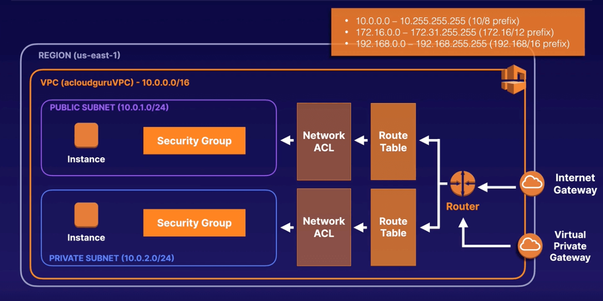
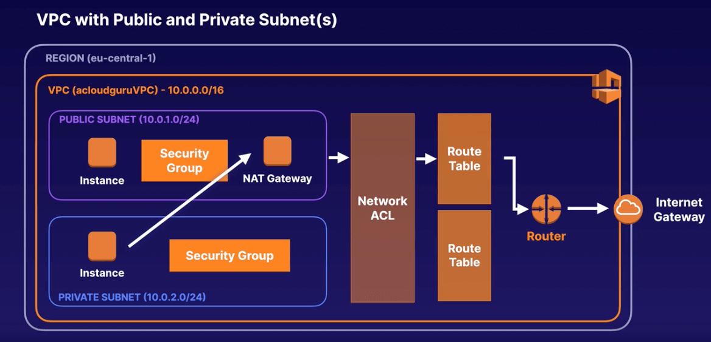
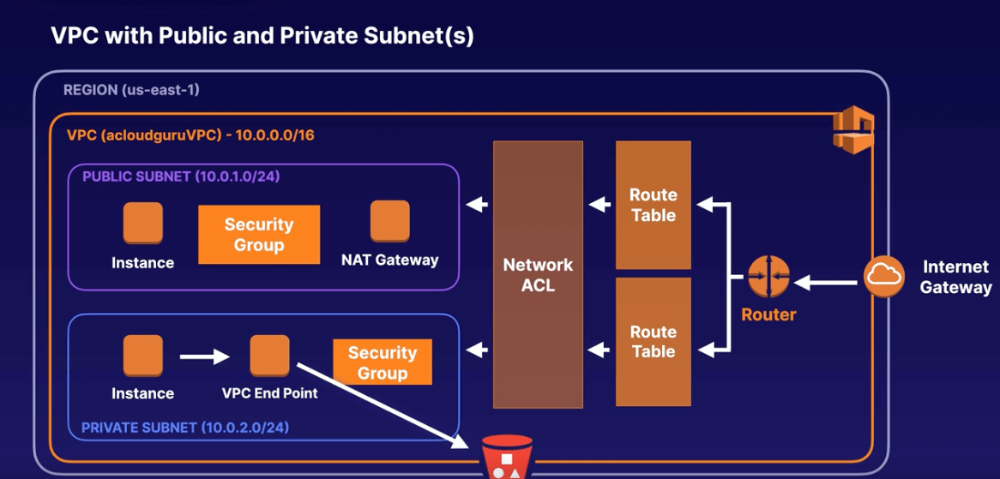
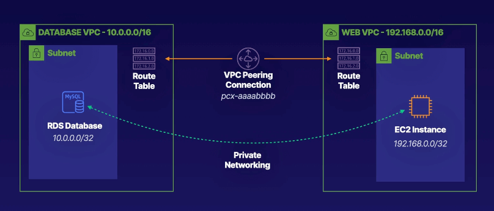

# Chapter 8. Virtual Private Cloud (VPC) Networking

<!-- TOC -->

- [Chapter 8. Virtual Private Cloud VPC Networking](#chapter-8-virtual-private-cloud-vpc-networking)
  - [VPC Overview](#vpc-overview)
    - [Default VPC vs Custom VPC](#default-vpc-vs-custom-vpc)
  - [Using NAT Gateways for Internet Access](#using-nat-gateways-for-internet-access)
    - [NAT Gateway Tips](#nat-gateway-tips)
  - [Security Group vs NACL](#security-group-vs-nacl)
  - [Private Communication Using VPC Endpoints](#private-communication-using-vpc-endpoints)
    - [Endpoint Types](#endpoint-types)
    - [Endpoint vs NAT Gateway](#endpoint-vs-nat-gateway)
  - [Building Solutions across VPCs with Peering](#building-solutions-across-vpcs-with-peering)
  - [Network Privacy with AWS PrivateLink](#network-privacy-with-aws-privatelink)
    - [Peering vs PrivateLink](#peering-vs-privatelink)
  - [Securing Your Network with AWS VPN CloudHub](#securing-your-network-with-aws-vpn-cloudhub)
  - [Connecting On-Premises with AWS Direct Connect](#connecting-on-premises-with-aws-direct-connect)
    - [Direct Connect Types](#direct-connect-types)
  - [Simplifying Networks with Transit Gateway](#simplifying-networks-with-transit-gateway)
    - [Transit Gateway Facts](#transit-gateway-facts)
  - [G Networking with AWS Wavelength](#g-networking-with-aws-wavelength)
  - [Lab 8. Building Solutions across VPCs with Peering](#lab-8-building-solutions-across-vpcs-with-peering)
    - [Introduction](#introduction)
    - [Runbooks](#runbooks)
      - [Create Web_VPC Subnets and Attach a New Internet Gateway](#create-web_vpc-subnets-and-attach-a-new-internet-gateway)
      - [Create a Peering Connection](#create-a-peering-connection)
      - [Create an EC2 Instance and Configure WordPress](#create-an-ec2-instance-and-configure-wordpress)
      - [Modify the RDS Security Groups to Allow Connections from the WebVPC VPC](#modify-the-rds-security-groups-to-allow-connections-from-the-webvpc-vpc)

<!-- /TOC -->

---
## VPC Overview

AWS VPC is a fully customizable network, where you can **leverage multiple layers of security**, including security groups, network access control lists (NACLs) etc., to help control access to EC2 instances in each subnet.

* **Launch instances into a subnet** of your choosing.

* **Assign custom IP address ranges in each subnet**.

* **Configure route tables between subnets** (default VPC has a route table created).

* **Create an internet gateway** (IG) and attach it to our VPC for public access.

* **Create a virtual private gateway** (VPN) and attach it to our VPC for corporate access.

* **Create a NAT gateway** within a public subnet to enable instances in a private subnet to connect to the Internet.

* **Configure subnet NACLs** to block specific IP addresses (default VPC has a NACL created).



### Default VPC vs Custom VPC

|                        Default VPC                         |      Custom VPC      |
|:----------------------------------------------------------:|:--------------------:|
|                       User-friendly                        |  Fully customizable  |
|        All subnets have a route out to the Internet        | Takes time to set up |
| Each EC2 instance has both a public and private IP address |                      |

When you **create a custom VPC**, AWS will create three resources for you:

* Security group

* NACL

* Main route table (AWS will implicitly associate any custom subnets with it)
  - If you do not **explicitly associate a custom subnet with a custom route table**, AWS will implicitly associate it with the main route table.
  - It is recommended DON'T use the main route table to allow traffic from IG, so that any custom subnets that are not explicitly associated with a route table does not have public access to the Internet.

When you **create a custom subnet** per availability zone (AZ), AWS will reserve five IP addresses as follows:

* x.x.x.0: Network address
* x.x.x.1: Reserved for the VPC router
* x.x.x.2: Reserved for DNS server
* x.x.x.3: Reserved for future use
* x.x.x.255: Reserved to prevent broadcast in a VPC

---
## Using NAT Gateways for Internet Access

You can **use a Network Address Translation (NAT) gateway to enable instances in a private subnet to connect to the Internet** via a public subnet, while preventing the Internet from initiating a connection with those instances.

* Configure the main route table to allow one-way traffic to the Internet via NAT gateway.
  - Any custom subnets that are not explicitly associated with a route table will have access to the Internet.
  - NAT gateway will disallow the Internet from initiating a connection to instances within your private subnets.



### NAT Gateway Tips

* Redundant inside the AZ.

* Starts at 5 Gbps and scales to 45 Gbps.

* No need to patch.

* Not associated with security groups.

* Automatically assigned a public IP address.

---
## Security Group vs NACL

When troubleshooting network connectivity issues, always start from the external traffic:

* Internet Gateway / Virtual Private Gateway / NAT Gateway (for egress traffic only)

* Route Table (subnet associations)

* Network ACL (subnet associations)
  - Stateless virtual firewall.
  - VPC default NACL allows all traffic, while custom NACL disallows all traffic.
  - Network ACLs are stateless if you send a request from your instance, the response traffic is blocked according to your rules.
  - If you don't explicitly associate a subnet with a NACL, the subnet is implicitly associated with the main NACL.
  - Associate a NACL with multiple subnets, but a subnet can only be associated with one NACL.
  - Contain a numbered list of rules that have the lowest number evaluated first, if matches skip all remaining rules.
  - Consists of separate inbound and outbound rules that can either allow or deny traffic.
  - Block specific IP addresses, before all other rules.
  - Inadvertantly blocks ephemeral ports, such as NAT gateway, if not explicitly allowed i.e. ports 1024-65535.

* Security Group
  - Stateful virtual firewall.
  - VPC default SG disallows all traffic.
  - SGs are stateful if you send a request from your instance, the response traffic is allowed regardless of your rules.

---
## Private Communication Using VPC Endpoints

A VPC Endpoint enables you to **privately connect your VPC to supported AWS services via PrivateLink**, which is an AWS network layer. Instances in your VPC do not require public IP addresses.

VPC Endpoints are virtual devices, that are horizontally scalled, redundant, and highly available VPC components that allow communication between instances in your VPC and services without bandwidth constraints (as opposed to NAT gateways)

### Endpoint Types

* Interface Endpoint - Elastic Network Interface (ENI) with a private IP address that serves as an entry point for traffic headed to a supported service and supports a large number of AWS services.

* Gateway Endpoint - Similar to NAT gateway, where a virtual device you provisioned that serves as an entry point to S3 or DynamoDB.

### Endpoint vs NAT Gateway

|                             VPC Endpoint                              |                           NAT Gateway                           |
|:---------------------------------------------------------------------:|:---------------------------------------------------------------:|
| Enable instances in a private subnet to connect to other AWS services | Enable instances in a private subnet to connect to the Internet |
|   Provisioned in the route table associated with the private subnet   |   Provisioned in the public subnet regardless of the instance   |
|                     PrivateLink AWS network layer                     |                                                                 |



---
## Building Solutions across VPCs with Peering

* Connects multiple VPCs with each other via a direct network route using private IP addresses.

* Each VPC must have a direct peering with another VPC (hub and spoke model)

* Cannot indirectly connect via another VPC as transitive peering is not supported (distributed model).

* Peer VPCs with other AWS accounts as well as in the same account.

* Cannot have overlapping CIDR address ranges.

* Instances behave as if they were on the same private network.

---
## Network Privacy with AWS PrivateLink

### Peering vs PrivateLink

|                 Peering                  |                     PrivateLink                      |
|:----------------------------------------:|:----------------------------------------------------:|
|    Manage route tables, gateways etc     |            No route tables, gateways etc             |
|   Manage multiple peering connections    | Requires a Network Load Balancer on the instance VPC |
| All instances within VPCs are accessible |          Requires an ENI on the client VPC           |

---
## Securing Your Network with AWS VPN CloudHub

AWS VPN CloudHub can **connect multiple sites, each with its own VPN connection**, together.

* Hub-and-spoke model (similar to VPC peering).

* Low cost and easy to manage.

* Operates over the public Internet, but all traffic is encrypted.

---
## Connecting On-Premises with AWS Direct Connect

AWS Direct Connect allows you to **establish a dedicated network connection from your premises to AWS**.

### Direct Connect Types

* Dedicated Connection - a physical Ethernet connection associated with a single customer.

* Hosted Connection - a physical Ethernet connection that a AWS partner provisions on behalf of a customer.

|            VPN            |         Direct Connect         |
|:-------------------------:|:------------------------------:|
|   Using public Internet   |   Direct physical connection   |
|     Slow, unreliable      |         Fast, reliable         |
| Security using encryption | Security using private channel |

---
## Simplifying Networks with Transit Gateway

AWS Transit Gateway simplifies hub-and-spoke models e.g. Peering, VPN CloudHub, Direct Connect etc, by connecting VPCs and on-premises networks through a central hub. It acts as a private cloud router where each new connection is only made once.

### Transit Gateway Facts

* Allows you to have transitive peering between multiple VPCs and on-premises.

* Works on a hub-and-spoke model.

* Works on a regional basis, but it allows multiple regions.

* Use it across multiple AWS accounts using Resource Access Manager (RAM).

* Use route tables to limit how VPCs access each other.

* Supports IP multicast (not supported by any other AWS services).

---
## 5G Networking with AWS Wavelength

5G provides mobile devices with higher speed, lower latency and greater capacity than 4G.

AWS Wavelength **embeds AWS compute and storage services within 5G networks**, providing mobile computing infrastructure for developing, deploying and scaling mobile applications.

---
## Lab 8. Building Solutions across VPCs with Peering

### Introduction

You will create a new VPC for your WordPress blog to run from. You will then create a VPC peering connection between the new VPC and an existing database VPC.

### Runbooks

1. Create Web_VPC Subnets and Attach a New Internet Gateway.

2. Create a Peering Connection.

3. Create an EC2 Instance and Configure WordPress.

4. Modify the RDS Security Groups to Allow Connections from the Web_VPC VPC.



<details>
<summary>Click here to start Lab 8.</summary>

#### 1. Create Web_VPC Subnets and Attach a New Internet Gateway

**Create a VPC**

1. Navigate to the AWS Console > VPC > Click **Create VPC** > Select **VPC only** option.

2. Set the following values:
  - **Name tag**: Enter `WebVPC`.
  - **IPv4 CIDR block**: Enter `192.168.0.0/16`.

3. Leave the rest of the settings as their defaults, and click **Create VPC**.

**Create a Subnet**

4. Navigate to Subnets > Click **Create subnet**.

5. For **VPC ID**, select the newly created `Web_VPC`.

6. Under Subnet settings, set the following values:
  - **Subnet name**: Enter `WebPublic`.
  - **Availability Zone**: Select `us-east-1a`.
  - **IPv4 CIDR block**: Enter `192.168.0.0/24`.

7. Click **Create subnet**.

**Create an Internet Gateway**

8. Navigate to Internet Gateways > Click **Create internet gateway**.

9. For **Name tag**, enter `WebIG`.

10. Click **Create internet gateway*.

11. Click **Attach to a VPC**, select `Web_VPC` and click **Attach internet gateway**.

12. Select **Route Tables**, select the checkbox for `Web_VPC`.

13. Select the Routes tab > Click **Edit routes** > Click **Add route**.

14. Set the following values:
  - **Destination**: Enter `0.0.0.0/0`
  - **Target**: Select **Internet Gateway**, and select the internet gateway that appears in the list.

15. Click **Save changes**.

#### 2. Create a Peering Connection

1. Navigate to AWS Console > VPC > Peering Connections > Click **Create peering connection**.

2. Set the following values:
  - **Name**: Enter `DBtoWeb`.
  - **VPC (Requester)**: Select the `DB_VPC`.
  - **VPC (Accepter)**: Select the `WebVPC`.

3. Click **Create peering connection**.

4. At the top of the page, click Actions > **Accept request** > Click **Accept request**.

5. Navigate to Routes Tables, select the checkbox for `WebVPC` > select the Routes tab > click **Edit routes** > Click **Add route**.

6. Set the following values:
  - **Destination**: Enter `10.0.0.0/16`.
  - **Target**: Select **Peering Connection**, and select the peering connection that appears in the list.

7. Click **Save changes**.

8. Navigate to Routes Tables, select the checkbox for `DB_VPC` with a **Main** column value of `Yes` > select the Routes tab.

9. Click Edit routes > click **Add route**.

10. Set the following values:
  - **Destination**: Enter `192.168.0.0/16`.
  - **Target**: Select **Peering Connection**, and select the peering connection that appears in the list.

11. Click **Save changes**.

#### 3. Create an EC2 Instance and Configure WordPress

1. Navigate to the AWS Console > EC2 > Click **Launch instance**.

2. Set the following values:
  - Under **Quick Start**, select the **Ubuntu** image box.
  - Under **AMI**, select the **Ubuntu Server 20.04 LTS**.
  - Under **Instance type**, select `t2.micro`.
  - For **Key pair**, select **Proceed without a key pair**.

3. In the Network settings section > click **Edit** > set the following values:
  - **VPC**: Select the `WebVPC`.
  - **Subnet**: Select the `WebPublic`.
  - **Auto-assign public IP**: Select **Enable**.

4. Under **Firewall (security groups)**, select **Create security group** > click **Add security group rule**.

5. Set the following values for the new rule:
  - **Type**: Select `HTTP`.
  - **Source**: Select `0.0.0.0/0`.

6. Expand Advanced details, and under **User data**, copy and paste the following bootstrap script:

```sh
#!/bin/bash
sudo apt update -y
sudo apt install php-curl php-gd php-mbstring php-xml php-xmlrpc php-soap php-intl php-zip perl mysql-server apache2 libapache2-mod-php php-mysql -y
wget https://github.com/ACloudGuru-Resources/course-aws-certified-solutions-architect-associate/raw/main/lab/5/wordpress.tar.gz
tar zxvf wordpress.tar.gz
cd wordpress
wget https://raw.githubusercontent.com/ACloudGuru-Resources/course-aws-certified-solutions-architect-associate/main/lab/5/000-default.conf
cp wp-config-sample.php wp-config.php
perl -pi -e "s/database_name_here/wordpress/g" wp-config.php
perl -pi -e "s/username_here/wordpress/g" wp-config.php
perl -pi -e "s/password_here/wordpress/g" wp-config.php
perl -i -pe'
  BEGIN {
    @chars = ("a" .. "z", "A" .. "Z", 0 .. 9);
    push @chars, split //, "!@#$%^&*()-_ []{}<>~\`+=,.;:/?|";
    sub salt { join "", map $chars[ rand @chars ], 1 .. 64 }
  }
  s/put your unique phrase here/salt()/ge
' wp-config.php
mkdir wp-content/uploads
chmod 775 wp-content/uploads
mv 000-default.conf /etc/apache2/sites-enabled/
mv /wordpress /var/www/
apache2ctl restart
```

7. Click **Launch instance**.

8. After the Instance state is **Running**, select the instance > click **Connect**.

9. To confirm WordPress installed correctly, view the configuration files:

```sh
cd /var/www/wordpress
ls
```

10. To configure Wordpress, open `wp-config.php` file:

```sh
sudo vim wp-config.php
```

11. Scroll down to `/** MySQL hostname */` > Key `i` to enter Insert mode > Replace `localhost` with the RDS endpoint you copied, and ensure it remains wrapped in single quotes.

12. Press **Esc** followed by `:wq`, and press **Enter**.

#### 4. Modify the RDS Security Groups to Allow Connections from the `WebVPC` VPC

1. Navigate to the AWS Console > RDS > select the RDS instance > Connectivity & security > click the active link under **VPC security groups**.

2. Select the Inbound rules tab > click Edit inbound rules > Click **Add rule**.

3. Set the following values for the new rule:
  - **Type**: Select **MYSQL/Aurora**.
  - **Source**: Select `192.168.0.0/16`.

4. Click **Save rules**.

5. Open a new browser tab and navigate to the public IP address of your EC2 instance, and you should see the WordPress installation page.

6. Set the follwoing values:
  - **Site Title**: Enter **A Blog Guru**.
  - **Username**: Enter `guru`.
  - **Your Email**: Enter `test@test.com`.

7. Click **Install WordPress**, and reload the public IP address in the address bar to view your newly created WordPress blog.

</details>