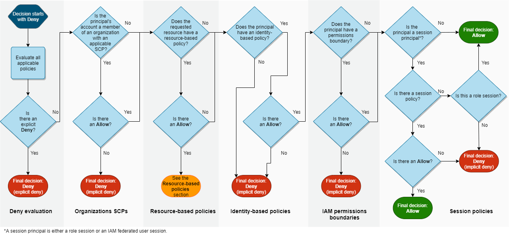

# Chapter 4. IAM & AWS CLI

<!-- TOC -->

- [Chapter 4. IAM & AWS CLI](#chapter-4-iam--aws-cli)
        - [Identity-based Policies with Boundaries](#identity-based-policies-with-boundaries)
        - [Resource-based Policies for IAM Users](#resource-based-policies-for-iam-users)
        - [Resource-based Policies for IAM Roles](#resource-based-policies-for-iam-roles)
        - [Resource-based Policies for IAM Role Sessions](#resource-based-policies-for-iam-role-sessions)
        - [Resource-based Policies for IAM Federated User Sessions](#resource-based-policies-for-iam-federated-user-sessions)
        - [Organisations SCPs](#organisations-scps)
        - [Session Policies](#session-policies)
        - [Policy Evaluation Logic](#policy-evaluation-logic)
    - [Using an IAM Role to Gran Permissions to Applications Running on EC2](#using-an-iam-role-to-gran-permissions-to-applications-running-on-ec2)
        - [How Do Roles for EC2 Instances Work?](#how-do-roles-for-ec2-instances-work)
    - [References](#references)

<!-- /TOC -->

Within an account, the permissions for an entity can be affected by identity-based policies, resource-based policies, permissions boundaries, Organizations SCPs, or session policies. If any one of these policy types explicitly denies access for an operation, then the request is denied.

### Identity-based Policies with Boundaries

Identity-based policies are inline or managed policies that are attached to a user, group of users, or role. The effective permissions are the intersection of both the identity-based policies and the permissions boundaries. An explicity deny in either of these policies overrides the allow.

### Resource-based Policies for IAM Users

Resource-based policies control how the specified principal can access the resource to which the policy is attached. Resource-based policies that grant permissions to an IAM user are not limited by an implicit deny in an identity-based policy or permissions boundary.

The effective permissions are the union of the resource-based policy and the effective permissions of both the identity-based policies and the permissions boundaries.

### Resource-based Policies for IAM Roles

Resource-based policies that grant permissions to an IAM role are limited by an implicit deny in a permissions boundary or session policy. The effective permissions are the intersection of the resource-based policy and the effective permissions of both the identity-based policies and the permissions boundaries.

### Resource-based Policies for IAM Role Sessions

Resource-based policies that grant permissions to an IAM role session grant permissions directly to the assumed role session. Permissions granted directly to a session are not limited by an implicit deny in an identity-based policy, a permissions boundary, or session policy.

The effective permissions are the union of the resource-based policy and the effective permissions of both the identity-based policies and the permissions boundaries.

### Resource-based Policies for IAM Federated User Sessions

The effective permissions for IAM federated user sessions are the same as IAM role sessions.

### Organisations SCPs

SCPs are applied to an entire AWS account. They limit permissions for every request made by a principal within the same account.

The effective permissions are the intersection of SCPs, identity-based policies and the permissions boundaries.

### Session Policies

Session policies are advanced policies that you pass as a parameter when you programmatically create a temporary session for a role or federated user. The permissions for a session come from the IAM entity (user or role) used to create the session and from the session policy.

The effective permissions are the intersection of session policies, identity-based policies and the permissions boundaries.

### Policy Evaluation Logic

---
## Using an IAM Role to Gran Permissions to Applications Running on EC2

You can use an IAM role to manage temporary credentials for applications that run on an EC2 instance. When you use a role, you don't have to distribute long-term credentials, such as sign-in credentials or access keys, to an EC2 instance.

When you launch an EC2 instance, you can specify an IAM role to associate with the instance. Applications that run on the instance can then use the temporary credentials to make calls to other AWS resources.

You need an additional step to assign an AWS role and its associated permissions to an EC2 instance and make them available to its application. This extra step is the creation of an instance profile attached to the instance.

Only one role can be assigned to an EC2 instance at a time, and all applications on the instance share the same role and permissions. When you leverage ECS to manage your EC2 instances, you can assign roles to ECS tasks, hence allowing for greater granular control over actions and resources.

### How Do Roles for EC2 Instances Work?

1. The admin uses IAM to create the `Get-Pics` role. In the role's trust policy, the admin specifies that only EC2 instances can assume the role. In the role's permission policy, the admin specifies read-only permissions for the `photos` bucket.

2. The admin launches an EC2 instance and assigns the `Get-Pics` role to that instance.

3. When the application runs, it obtains temporary credentials from EC2 instance metadata. Credentials and related values are available from the `iam/security-credentials/ROLE-NAME` category, e.g. `iam/security-credentials/Get-Pics`, of the metadata.

4. Using the retrieved temporary credentials, the application accesses the `photos` bucket. The temporary credentials available on the instance automatically update before they expire so that a valid set is always available.

---
## References

* [Permission boundaries for IAM entities](https://docs.aws.amazon.com/IAM/latest/UserGuide/access_policies_boundaries.html)
* [Policy evaluation logic](https://docs.aws.amazon.com/IAM/latest/UserGuide/reference_policies_evaluation-logic.html)
* [Using an IAM role to grant permissions to applications running on Amazon EC2 instances](https://docs.aws.amazon.com/IAM/latest/UserGuide/id_roles_use_switch-role-ec2.html)