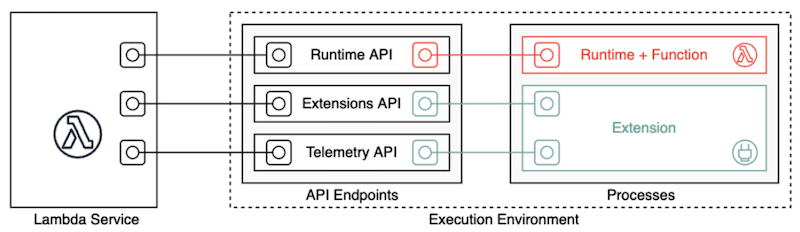
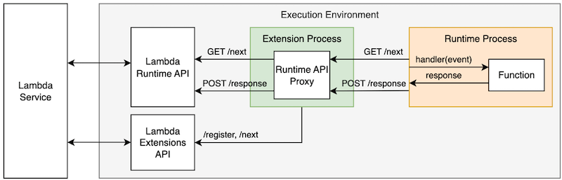

# Chapter 19. Serverless Overviews from a Solution Architect Perspective

---
## Lambda Runtimes

You can use managed runtimes, or build your own. However since AWS cannot guarantee backward compatibility between major versions, this is a customer-driven operation.

For a Lambda function defined as a container image, you choose a runtime and the Linux distribution when you create the container image. To change the runtime, you create a new container image.

### Managed runtime deprecation policy

Deprecation (end of support) for a runtime occurs in two phases:

* Phase 1 - cannot create.
  - AWS no longer applies security patches or other updates to the runtime.
  - You cannot create functions that use the runtime, but you can continue to update existing functions.
  - Functions that use a deprecated runtime are not eligible for technical support.

* Phase 2 - cannot update or create.
  - You cannot update or create functions that use the runtime.
  - Phase 2 starts at least 30 days after the start of Phase 1.
  - Functions that use a deprecated runtime can still be invoked.

* Notification of Deprecation (end of support) for a runtime:
  - 120 days notice by AWS Trusted Advisor.
  - 60 days notice by email if you have functions using the runtime (to be deprecated).

### Managed runtime updates

* By default, Lambda applies runtime updates automatically using a two-phase rollout.
  - In the first phase, AWS applies the new runtime version whenever you create or update a function.
  - In the second phase, for any function that has Auto enabled and hasn't been updated, AWS applies the new runtime version.
  - The overall duration of the rollout process varies according to the severity of any patches.

* You can configure to use update manually, and set the runtime to a specific version.
  - In the event that a new runtime version is incompatible with your existing function, you can roll back to an earlier runtime version.
  - There is no time limit on how long you can use any runtime version, however do note that deprecated runtimes are not patched.

* AWS publishes each new runtime version as a container image.

* To update your own container image, you must create a new container image from the AWS published container image and redeploy your function.

---
## Best Practices for AWS Lambda

* By default, Lambda operates in a public AWS-owned VPC, that can reach any public internet address. You should only enable your VPC for Lambda if you need to interact with a private resource located in a private subnet, such as RDS.

* Deploy common code to a Lambda layer, e.g. logging etc.

* The bigger your deployment package, the slower your function will cold-start. Remove all unnecessary items, including documentation and unused libraries.

* Monitor your concurrencies by setting a CloudWatch alarm to notify your team when the number of invocations exceed your threshold. You should also set up an AWS Budget to monitor costs on a daily basis.

* Over-provision your memory in order to run your functions faster and potentially reduce costs. But do not over-provision your function time out settings as it will lead to longer than expected running costs.

---
## Lambda Runtime API Proxy Extension

AWS Lambda runtimes use the Lambda Runtime API to communicate with the Lambda service. Runtimes use it to retrieve inbound events to be processed by the function handler, return successful handler responses to the Lambda service, and report failures. Lambda Extensions enable you to integrate Lambda functions with your preferred tools for monitoring, observability, security, and governance without changing function code, using the Runtime API proxy pattern.

Lambda Extensions are packaged as Lambda layers and run as a separate process in the execution environment. When you register your extension with the Lambda service, you can specify you want to receive the INVOKE event. The Lambda service sends this event to the extension asynchronously when a function is invoked.

The information supplied contains the function invocation metadata, but not the event payload. This makes the event useful for observability, but limited for application security and governance use cases.

### Runtime API Proxy Pattern

The Lambda Runtime API proxy is a pattern that enables you to hook into the function invocation request and response lifecycle. It proxies requests and responses, allowing you to augment them, and control the workflow.

There are several important considerations:

* You must implement proxying for all Runtime API endpoints and handle potential runtime failures.

* Allow your extension consumers to configure the extension via environment variables using at least two parameters - the port your proxy listens on and the Runtime API endpoint your proxy forwards requests to.

* Proxying API requests with default buffered responses requires additional work to support functions with response payload streaming.

* Proxying API requests adds latency. AWS recommends you implement extensions using a programming language that compiles to a binary executable, such as Golang or Rust. Apart from keeing your extension lightweight and optimized, this also allows you to use the extension with any Lambda runtime. Extensions implemented in interpreted langauges or require VMs, such as JavaScript or Java, can only be used with that specific runtime.

### Extensions Security

Extensions run within the same execution environment as the function, so they have the same level of access to resources. IAM permissions assigned to the function are shared with extensions.

---
## Reference

* [Best Practices for Developing on AWS Lambda](https://aws.amazon.com/blogs/architecture/best-practices-for-developing-on-aws-lambda/)

* [Lambda runtimes](https://docs.aws.amazon.com/lambda/latest/dg/lambda-runtimes.html)

* [Enhancing runtime security and governance with the AWS Lambda Runtime API proxy extension](https://aws.amazon.com/blogs/compute/enhancing-runtime-security-and-governance-with-the-aws-lambda-runtime-api-proxy-extension)