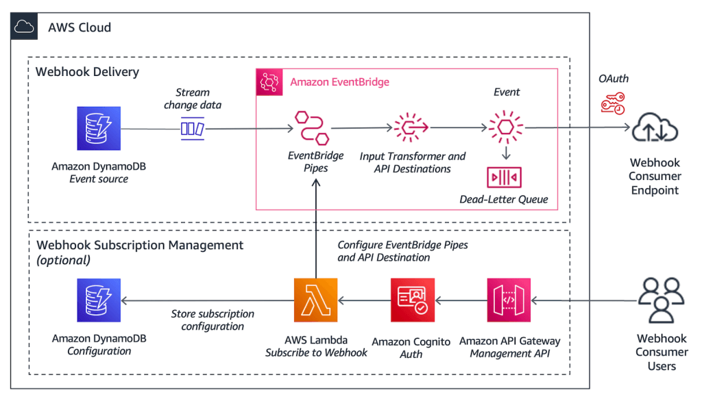
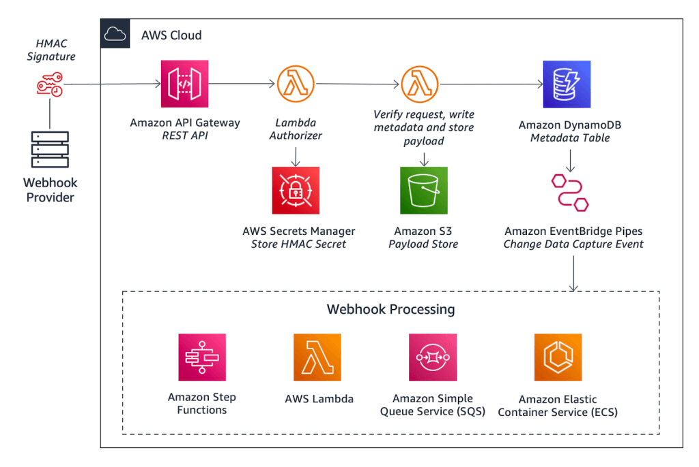
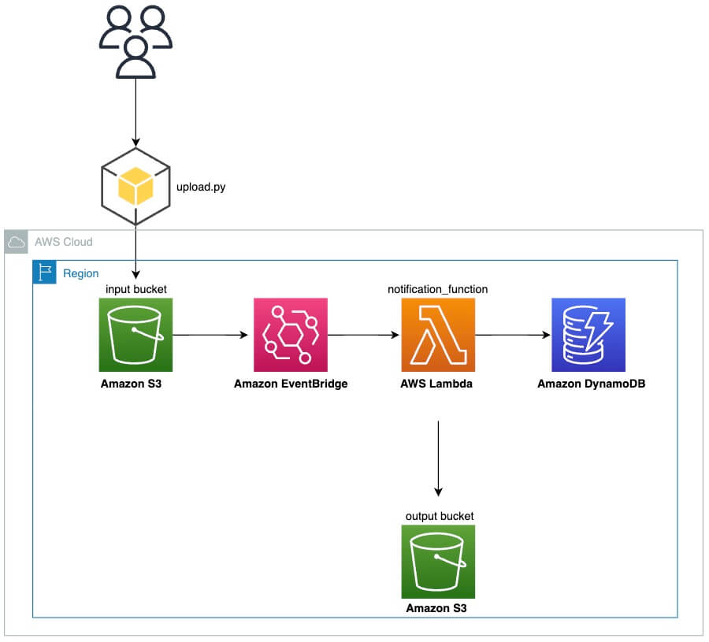

# More Solution Architectures

<!-- TOC -->

- [More Solution Architectures](#more-solution-architectures)
    - [Event Processing in AWS](#event-processing-in-aws)
        - [SQS and Lambda](#sqs-and-lambda)
        - [SNS and Lambda](#sns-and-lambda)
        - [Fan Out with SNS and SQS](#fan-out-with-sns-and-sqs)
        - [S3 Event Notification](#s3-event-notification)
        - [External Event Notification](#external-event-notification)
    - [High Performance Computing HPC](#high-performance-computing-hpc)
        - [Data Management and Transfer](#data-management-and-transfer)
        - [Compute and Networking](#compute-and-networking)
        - [Storage](#storage)
        - [Automation and Orchestration](#automation-and-orchestration)
    - [AWS Prescriptive Guidance Patterns](#aws-prescriptive-guidance-patterns)
    - [Reference](#reference)

<!-- /TOC -->

---
## Event Processing in AWS

### SQS and Lambda

* Lambda polls SQS and retries a defined number of times to retrieve the message from SQS before it fails.
* Set up a Dead Letter Queue to allow failed messages to be removed from main queue to prevent blocking.

### SNS and Lambda

* SNS pushes a message asynchronously to Lambda.
* Lambda retries within its function before sending an error.
* Alternatively, Lambda can push the failed message to an SQS DLQ.

### Fan Out with SNS and SQS

* SNS pushes a message to multiple SQS queues.

### S3 Event Notification

* S3 Events can be sent to Lambda, EventBridge etc.
* EventBridge can then trigger multople destinations, such as Step Functions, Kinesis Data Streams etc.
  - Advanced filtering options with JSON rules.
  - Archive, replay events, reliable delivery.
  - Intercept any AWS API event via CloudTrail integration.

### External Event Notification

* API Gateway to receive external events.
* Send to Kinesis Data Stream and Data Firehose for processing and storing.
* Store events in S3 buckets as JSON files.

---
## High Performance Computing (HPC)

* Use cases are genomics, computational chemistry, financial risk modeling, weather prediction, ML, Deep Learning, autonomous driving etc.

### Data Management and Transfer

* Direct Connect.
  - Move data over a private secure network.
* Snowball and Snowmobile.
  - Move PBs of data to the cloud.
* DataSync
  - Move big data between On-Premises and S3, EFS, FSx for Windows.

### Compute and Networking

* EC2 Instances.
  - CPU optimized, GPU optimized.
  - Spot Instances / Fleets.
  - ASG.
* EC2 Placement Groups.
  - Cluster for good network performance.
* EC2 Enhanced Networking (SR-IOV).
  - Higher bandwidth, higher packer per second (PPS), lower latency.
  - Elastic Network Adapter (ENA) up to 100 GBps.
  - Intel 82599VF up to 10 GBps (legacy).
* EC2 Elastic Fabric Adapter (EFA).
  - Improved ENA for HPC, only works for Linux.
  - Great for inter-node communications, tightly coupled workloads.
  - Leverages Message Passing Interface (MPI) standard.
  - Bypasses the underlying Linux OS to provide low-latency, reliable transport.

### Storage

* Instance-attached Storage.
  - EBS scales up to 256,000 IOPS with `io2` Block Express.
  - Instance Store to scale to millions of IOPS, linked to EC2 instance, low latency.
* Network Storage.
  - S3 large blog, not a file system.
  - EFS scale IOPS based on total size, or use provisioned IOPS.
  - FSx for Lustre, HPC optimized distributed file system, millions of IOPS, backed by S3.

### Automation and Orchestration

* AWS Batch.
  - Supports multi-node parallel jobs, run single jobs that span multiple EC2 instances.
  - Easily schedule jobs and launch EC2 instances accordingly.
* AWS ParallelCluster.
  - Open-source cluster management tool to deploy HPC on AWS.
  - Configure with text files.
  - Automate creation of VPC, subnet, cluster type and instance types.
  - Ability to enable EFS on the cluster, improves network performance.

---
## AWS Prescriptive Guidance Patterns

AWS Prescriptive Guidance patterns provide step-by-step instructions, architecture, tools, and code for implementing specific cloud migration, modernization, and deployment scenarios.

You can use these patterns to move your on-premises or cloud workloads to AWS, regardless of whether you're in the proof of concept, planning, or implementation phase of your project.

The list of patterns by technical domain are not exhaustive below:

* Analytics
  - Build an ETL service pipeline to load data incrementally from S3 to Redshift using AWS Glue.
  - Generate test data using an AWS Glue job and Python.
  - Migrate Apache Cassandra workloads to Amazon Keyspaces using AWS Glue.
  - Migrate an on-premises Apache Kafka cluster to Amazon MSK by using MirrorMaker.
  - Orchestrate an ETL pipeline with validation, transformation, and partitioning using AWS Step Functions.
  - Access, query, and join DynamoDB tables using AWS Athena.
  - Subscribe a Lambda function to event notifications from S3 buckets in different AWS Regions.
  - Three AWS Glue ETL job types for converting data to Apache Parquet (to facilitate queries from AWS Athena).
  - Visualize Redshift audit logs using AWS Athena and QuickSight.
  - Visualize IAM credential reports for all AWS accounts using AWS QuickSight.
* Cloud-native
  - Build a video processing pipeline by using Kinesis Video Streams and Fargate.
  - Copy data from an S3 bucket to another account and Region by using the AWS CLI.
* Containers & Microservices
  - Access container applications privately on ECS by using AWS PrivateLink and a NLB.
  - Automate backups for RDS for PostgreSQL DB instances by using AWS Batch.
* Content Delivery
  - Send AWS WAF logs to Splunk by using AWS Firewall Manager and Kinesis Data Firehose.
  - Serve static content in an S3 bucket through a VPC by using CloudFront.
* Data Lakes
  - Configure cross-account access to a shared AWS Glue Data Catalog using AWS Athena.
* Databases
  - Block public access to RDS by using Cloud Custodian.
  - Copy DynamoDB tables across accounts by using AWS Backup.
  - Export RDS for SQL Server tables to an S3 bucket by using AWS DMS.
  - Implement cross-Region disaster recovery with AWS DMS and Amazon Aurora.
* Infrastructure
  - Check EC2 instances for mandatory tags at launch.
* Machine Learning & AI
  - Aggregate data in DynamoDB for ML forecasting in Athena.
  - Automatically extract content from PDF files using AWS Textract.

---
## Sending and Receiving Webhooks

Commonly known as reverse APIs or push APIs, webhooks provide a way for applications to integrate to each other and communicate in near real-time. There are two scenarios when building with webhooks:

* Webhook Provider: An application that sends webhooks to an external API.

* Webhook Consumer: An API that receives webhooks with capacity to handle large payloads.

### Webhook Provider

A provider generate events and deliver them to third-party APIs. For example, a payment provider can send notifications for payment status.

The architecture for a webhook provider consists of two services:

* Webhook delivery: An application that delivers webhooks to an external endpoint specified by the consumer.

* Subscription management: A management API enabling the consumer to manage their configuration, including specifying endpoints for delivery, and which events for subscription.

There are several important considerations:

* Event generation: This example uses DynamoDB streams to generate events and sent to EventBridge pipes. You then simplify the DynamoDB response format by using an input transformer. To generate events from other data sources, consider using S3 Event Notifications or Kinesis.

* Near real-time: With EventBridge, you can send events in near real time. If events are not time-sensitive, you can send multiple events in a batch. This can be done by polling for new events at a specified frequency using EventBridge Scheduler.

* Filtering: EventBridge Pipes support filtering by matching event patterns, before the event is routed to the target destination.

* Delivery: EventBridge API Destinations deliver events outside of AWS using REST API calls. To protect external endpoint from surges in traffic, you set an invocation rate limit. An SQS dead-letter queue retains messages that cannot be delivered.

* Security and Authorization: To deliver events securely, you establish a connection using an authorization method such as OAuth. The connection stores the credentials in Secrets Manager.

* Subscription Management: This example uses DynamoDB to store user configurations, such as specifying HTTPS endpoints and event types to subscribe. API Gateway, Cognito and Lambda provide a management API for operations.

### Webhook Consumer

A consumer requires an API to provide to the webhook provider. For example, an ecommerce consumer may rely on notifications provided by their payment platform to ensure goods are shipped in a timely manner.

The architecture of a webhook consumer consists of three services:

* API: An endpoint to receive webhooks. An event-driven system that authorizes and processes the received webhooks.

* Payload Store: S3 storage for large payloads.

* Webhook Processing: EventBridge Pipes provide an extensible architecture for processing. It can batch, filter, enrich, and send events to a range of processing services.

There are several important considerations:

* Authorization and Verification: Providers can support different authorization methods. If the provider supports OAuth, consider securing the API with Cognito.

* Payload Size: Events can be batched to a single larger request, or they may contain significant information. API Gateway and Lambda have limits of 10 MB and 6 Mb. However, DynamoDB and SQS are limited to 400 kb and 256 kb which can represent a bottleneck. Instead of processing the entire payload, S3 stores the payload. It is then referenced in DymamoDB, this is known as claim-check pattern. With this approach, the architecture supports payloads of up to 6 Mb, as per the Lambda invocation payload quota.

* Idempotency: For reliability, many providers prioritize delivering at-least-once, event if it means not guaranteeing exactly-once delivery. To handle this, a Lambda function checks against the event's unique identifier against previous records in DynamoDB.

* Ordering: As most providers prioritize at-least-once delivery, events can be out of order. To indicate order, events may include a timestamp or a sequence identifier in the payload.

* Flexible Processing: You can route events to different targets, e.g. Lambda, SQS etc, based on filters using EventBridge Pipes.

* Scalability: API Gateway provides a scalable managed endpoint to receive events. Throttling requests at the entry point mitigates impact on downstream services, where each service has its own quotas and limits. Providers typically send events at a threshold rate limit, up to 500 transactions per second (TPS).

---
## Manage Event Ordering and Duplicate Events

Using an architecture built with S3, EventBridge, Lambda and DynamoDB, we will manage event ordering and avoid processing duplicate events.

### Problem Statement

S3 Event Notifications is designed to deliver notifications at least once, but they aren't guaranteed to arrive in the same order that the events occurred. On occasions, S3's retry mechanism might cause duplicate S3 Event Notifications for the same object event.

You can use the sequencer in the S3 Event Notifiction JSON object to identify the event sequence for the same object. Specifically, duplicate events have the same value for the object key, versionid, operation, and sequencer.

### Solution

When an image is uploaded into S3, it sends an S3 Event Notification to Lambda via EventBridge. Then, the lambda function adds an item to a DynamoDB table, along with state information of the event such as the sequencer.

This item contains the newest sequencer received, and is not updated if we receive an S3 Event Notification with an older sequencer.

The lambda function then transforms the image by inverting its colors if the notification was not a duplicate or out of order. Once transformed, it uploads the result to an output bucket.

---
## Reference

* [AWS Prescriptive Guidance Patterns](https://docs.aws.amazon.com/prescriptive-guidance/latest/patterns/welcome.html)

* [Sending and receiving webhooks on AWS](https://aws.amazon.com/blogs/compute/sending-and-receiving-webhooks-on-aws-innovate-with-event-notifications)

* [Manage event ordering and duplicate events with Amazon S3 Event Notifications](https://aws.amazon.com/blogs/storage/manage-event-ordering-and-duplicate-events-with-amazon-s3-event-notifications)